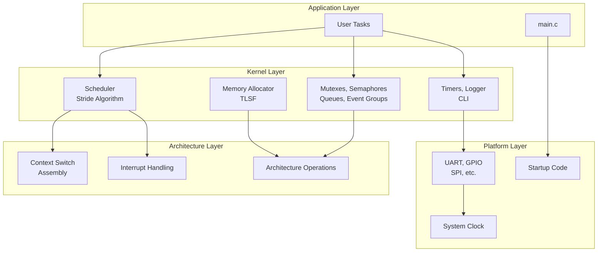

# soRTOS

**A lightweight, preemptive Real-Time Operating System written from scratch.**


## Table of Contents

- [Overview](#overview)
- [Key Features](#key-features)
- [Architecture](#architecture)
- [Kernel Components](#kernel-components)
  - [Scheduler](#scheduler)
  - [Memory Management](#memory-management)
  - [Inter-Process Communication](#inter-process-communication)
  - [System Services](#system-services)
- [Project Structure](#project-structure)
- [Getting Started](#getting-started)
  - [Prerequisites](#prerequisites)
  - [Building the Project](#building-the-project)
  - [Writing Your First Application](#writing-your-first-application)
- [Configuration](#configuration)
- [Documentation](#documentation)
- [License](#license)

---

## Overview

soRTOS is a real-time operating system kernel built from scratch in C. It was designed to deeply understand OS internals—scheduling algorithms, context switching, memory management, and synchronization primitives.

While the current implementation targets the **STM32L476RG (ARM Cortex-M4)**, the kernel itself is **platform-agnostic**. The architecture strictly separates core kernel logic from hardware-specific drivers and assembly code, making it straightforward to port to different architectures (RISC-V, AVR, etc.).

### Design Philosophy

*   **Deterministic Performance:** All kernel operations have guaranteed time complexity (typically O(1))
*   **Real-Time Ready:** Designed for systems requiring predictable timing behavior
*   **Memory Efficient:** Minimal overhead with configurable resource limits
*   **Modular Architecture:** Clean separation between kernel, architecture, and platform layers

---

## Key Features

### Scheduling
*   **Weighted Fair Scheduling:** Stride scheduler ensures proportional CPU time allocation
*   **O(1) Task Selection:** Min-heap based ready queue for constant-time scheduling
*   **Priority Inheritance:** Automatic priority boosting to prevent priority inversion
*   **Preemptive Multitasking:** Time-sliced execution with configurable tick frequency

### Memory Management
*   **TLSF Allocator:** Two-Level Segregated Fit algorithm with O(1) allocation/deallocation
*   **Stack Protection:** Canary-based overflow detection on every context switch
*   **Memory Pools:** Fixed-size allocator for deterministic memory operations
*   **Low Fragmentation:** Immediate coalescing and good-fit strategy

### Synchronization & IPC
*   **Mutexes:** With automatic priority inheritance
*   **Semaphores:** Counting semaphores with bounded limits
*   **Event Groups:** Bit-based event synchronization (32-bit event space)
*   **Queues:** Lock-free design, ISR-safe with fine-grained spinlocks
*   **Spinlocks:** Low-level synchronization primitive for short critical sections

### System Services
*   **Software Timers:** High-precision tick-based timers (one-shot and periodic)
*   **Logger:** Deferred, non-blocking logging system with history buffer
*   **CLI:** Full-featured command-line interface with history and VT100 support

---

## Architecture



**Layer Separation:**
*   **Kernel:** Platform-agnostic core logic
*   **Architecture:** CPU-specific assembly and operations
*   **Platform:** Board-specific drivers and configuration
*   **Application:** User code and tasks

---

## Kernel Components

### Scheduler

The scheduler implements a **Stride Scheduling** algorithm (also known as Weighted Fair Queuing) that provides proportional CPU time allocation based on task weights.

**Key Features:**
*   O(1) task selection using a min-heap
*   Virtual runtime (vruntime) for fairness
*   Automatic priority inheritance
*   Sleep/wake support with sorted sleep lists

📖 **[Read the full Scheduler documentation →](docs/kernel/scheduler.md)**

### Memory Management

#### TLSF Allocator

A high-performance memory allocator using the **Two-Level Segregated Fit (TLSF)** algorithm. Guarantees O(1) allocation and deallocation time, making it suitable for real-time systems.

**Key Features:**
*   Constant-time operations (O(1))
*   Low fragmentation through immediate coalescing
*   Good-fit allocation strategy
*   Thread-safe with fine-grained spinlocks

📖 **[Read the full Allocator documentation →](docs/kernel/allocator.md)**

#### Memory Pools

Fixed-size memory allocator for deterministic memory operations. Ideal for frequently allocated/deallocated objects of the same size.

**Key Features:**
*   O(1) allocation and deallocation
*   Zero fragmentation (all items same size)
*   Memory pool pre-allocation

📖 **[Read the full Memory Pool documentation →](docs/kernel/mempool.md)**

### Inter-Process Communication

#### Mutexes

Mutual exclusion locks with automatic priority inheritance to prevent priority inversion.

**Key Features:**
*   Recursive locking support
*   Direct handoff to next waiter
*   Priority inheritance

📖 **[Read the full Mutex documentation →](docs/kernel/mutex.md)**

#### Semaphores

Counting semaphores for resource management and task coordination.

**Key Features:**
*   Bounded count limits
*   FIFO wake-up order
*   Broadcast support

📖 **[Read the full Semaphore documentation →](docs/kernel/semaphore.md)**

#### Event Groups

Lightweight bit-based synchronization primitive for multi-event coordination.

**Key Features:**
*   32-bit event space
*   Wait for ANY or ALL bits
*   Auto-clear option
*   ISR-safe bit setting

📖 **[Read the full Event Group documentation →](docs/kernel/event_group.md)**

#### Queues

Lock-free queue implementation with fine-grained spinlocks for ISR-safe operations.

**Key Features:**
*   ISR-safe push/pop operations
*   Configurable queue size
*   Non-blocking operations

📖 **[Read the full Queue documentation →](docs/kernel/queue.md)**

#### Spinlocks

Low-level synchronization primitive for short critical sections.

**Key Features:**
*   Busy-wait locking
*   ISR-safe
*   SMP support

📖 **[Read the full Spinlock documentation →](docs/kernel/spinlock.md)**

### System Services

#### Software Timers

High-precision tick-based timer service with one-shot and periodic modes.

**Key Features:**
*   Daemon task management
*   Sorted timer list for efficient expiry checking
*   Memory pool allocation

📖 **[Read the full Timer documentation →](docs/kernel/timer.md)**

#### Logger

Deferred, non-blocking logging system with history buffer and live mode.

**Key Features:**
*   ISR-safe logging
*   Circular history buffer
*   CLI integration
*   Compile-time disable option

📖 **[Read the full Logger documentation →](docs/kernel/logger.md)**

#### CLI

Full-featured command-line interface running as a separate task.

**Key Features:**
*   Non-blocking UART queues
*   Command history
*   VT100 terminal support
*   Runtime system inspection

📖 **[Read the full CLI documentation →](docs/kernel/cli.md)**

#### Utilities

Collection of low-level helper functions for register polling, string manipulation, and memory operations.

📖 **[Read the full Utils documentation →](docs/kernel/utils.md)**

---

## Project Structure

```
soRTOS/
├── app/                    # Application code and main()
│   ├── main.c
│   └── app_commands.c
├── arch/                   # Architecture-specific code
│   ├── arm/
│   │   └── cortex_m4/     # ARM Cortex-M4 implementation
│   └── native/             # Native host simulation
├── config/                 # Configuration files
│   └── project_config.h
├── docs/                   # Documentation
│   ├── kernel/            # In-depth kernel documentation
│   └── data_sheets/       # Hardware reference manuals
├── drivers/                # Hardware drivers
│   ├── interface/         # Driver interfaces
│   ├── src/               # Generic driver implementations
│   └── stm32/             # STM32-specific drivers
├── kernel/                 # Core kernel (platform-agnostic)
│   ├── include/           # Public headers
│   └── src/               # Implementation
├── platform/               # Platform-specific setup
│   ├── native/            # Host simulation platform
│   └── stm32l476rg/       # STM32L476RG platform
└── tests/                  # Unit tests
```

**Key Directories:**

*   **`kernel/`**: The heart of the OS. Contains scheduler, allocator, IPC primitives, and system services. Platform-agnostic.
*   **`arch/`**: Low-level architecture code. Context switching assembly, interrupt handling, CPU-specific operations.
*   **`platform/`**: Board-specific setup. Clock configuration, linker scripts, startup code, memory maps.
*   **`drivers/`**: Hardware peripheral drivers. UART, GPIO, SPI, etc.
*   **`app/`**: User application code and `main()` function.

---

## Getting Started

### Prerequisites

*   **`arm-none-eabi-gcc`**: ARM cross-compiler for STM32 builds
*   **`gcc`**: Standard compiler for native host tests
*   **`openocd`**: On-Chip Debugger for flashing
*   **`make`**: Build system

### Building the Project

#### Build for Target (STM32)

Compiles the kernel, drivers, and application code into an ELF file for the STM32L476RG board:

```bash
make
```

#### Flash to Board

Flash the compiled binary to the target board:

```bash
make load
```

#### Run Unit Tests (Host)

Run unit tests on the native host platform:

```bash
make test
```

### Writing Your First Application

Creating tasks and using the OS is straightforward:

```c
#include "scheduler.h"
#include "cli.h"

void my_task(void *arg) {
    while (1) {
        cli_printf("Hello from soRTOS!\n");
        task_sleep_ticks(1000);  // Sleep for 1000 ticks (1 second)
    }
}

int main(void) {
    system_init();  // Setup clocks and drivers
    
    // Create a task with 1KB stack and normal priority
    task_create(my_task, NULL, STACK_SIZE_1KB, TASK_WEIGHT_NORMAL);
    
    scheduler_start();  // Hand over control to the kernel
    return 0;  // Never reached
}
```

**Key Concepts:**

*   **Tasks:** Functions that run concurrently
*   **Stack Size:** Memory allocated for task's local variables and call stack
*   **Weight:** Determines proportional CPU time (higher = more CPU time)
*   **Ticks:** System time unit (default: 1ms per tick)

For more examples and detailed API documentation, see the [kernel documentation](#documentation).

---

## Configuration

System behavior can be tuned via `config/project_config.h` without modifying core kernel code:

**Scheduler Configuration:**
*   `MAX_TASKS`: Maximum number of concurrent tasks
*   `SYSTICK_FREQ_HZ`: System tick frequency (default: 1000 Hz = 1ms per tick)
*   `BASE_SLICE_TICKS`: Base time slice per weight unit
*   Task weights: `TASK_WEIGHT_LOW`, `TASK_WEIGHT_NORMAL`, `TASK_WEIGHT_HIGH`

**Memory Configuration:**
*   `FL_INDEX_MAX`: Maximum block size for TLSF allocator
*   `SL_INDEX_COUNT_LOG2`: Second-level subdivisions for TLSF

**Stack Configuration:**
*   `STACK_MIN_SIZE_BYTES`: Minimum stack size
*   `STACK_MAX_SIZE_BYTES`: Maximum stack size
*   Predefined sizes: `STACK_SIZE_512B`, `STACK_SIZE_1KB`, `STACK_SIZE_2KB`, etc.

**System Services:**
*   `LOG_ENABLE`: Enable/disable logging system
*   `LOG_QUEUE_SIZE`: Logger queue size
*   `TIMER_DEFAULT_POOL_SIZE`: Default timer pool size

See individual component documentation for detailed configuration options.

---

## Documentation

Comprehensive documentation is available for all kernel components:

### Core Components

*   **[Scheduler](docs/kernel/scheduler.md)** - Stride scheduling algorithm, task lifecycle, priority inheritance
*   **[Memory Allocator](docs/kernel/allocator.md)** - TLSF algorithm, fragmentation analysis, performance
*   **[Memory Pool](docs/kernel/mempool.md)** - Fixed-size allocator for deterministic operations

### Synchronization Primitives

*   **[Mutex](docs/kernel/mutex.md)** - Mutual exclusion with priority inheritance
*   **[Semaphore](docs/kernel/semaphore.md)** - Counting semaphores for resource management
*   **[Event Group](docs/kernel/event_group.md)** - Bit-based event synchronization
*   **[Queue](docs/kernel/queue.md)** - Lock-free queue implementation
*   **[Spinlock](docs/kernel/spinlock.md)** - Low-level synchronization primitive

### System Services

*   **[Timer](docs/kernel/timer.md)** - Software timer service
*   **[Logger](docs/kernel/logger.md)** - Deferred logging system
*   **[CLI](docs/kernel/cli.md)** - Command-line interface
*   **[Utils](docs/kernel/utils.md)** - Utility functions

### Documentation Style

All documentation follows a consistent structure:
*   **Overview** with key features
*   **Architecture** diagrams (Mermaid)
*   **Algorithms** with detailed explanations
*   **Performance Analysis** (time/space complexity)
*   **Example Scenarios** with timelines
*   **API Reference** with function signatures
*   **Code Snippets** appendix

---

## License

This project is licensed under the MIT License. See the [LICENSE](LICENSE) file for details.

---

## Acknowledgments

soRTOS was built as a learning project to deeply understand operating system internals. It draws inspiration from:

*   Linux kernel's CFS (Completely Fair Scheduler)
*   FreeRTOS synchronization primitives
*   TLSF memory allocator research
*   Various RTOS implementations

Special thanks to the embedded systems and OS development communities for their excellent resources and documentation.
