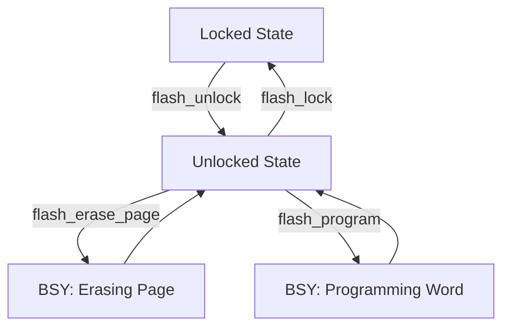

# Flash Driver

## Table of Contents

- [Overview](#overview)
- [Architecture](#architecture)
- [Protocol](#protocol)
- [Usage Examples](#usage-examples)
- [Configuration](#configuration)

---

## Overview

The Flash driver provides an interface for reading, writing, and erasing microcontroller flash memory. It handles the complexities of flash programming including unlock/lock operations and page-based erase.

### Key Features

- Flash memory unlock/lock protection
- Page-based erase operations
- Data programming with alignment requirements
- Error handling for flash operations

---

## Architecture

The flash driver provides direct access to the microcontroller's internal flash memory, implementing the necessary sequence for safe programming operations.

**Operation:**

1.  **Application:** Initiates a Program or Erase command.
2.  **Flash Driver:** Unlocks the Flash Control Register.
3.  **Flash Controller:** Executes the high-voltage operations to modify the Non-Volatile Memory (NVM) cells.
4.  **Flash Memory:** Stores the new data permanently.

---


---

## Protocol

Safe Flash programming requires a strict state machine flow:



1.  **Unlock:** Write keys to Flash Key Register to allow write access.
2.  **Erase:** Set Page Erase bit, select page, and start. Wait for Busy flag.
3.  **Program:** Write data to address. Hardware handles the high-voltage timer. Wait for Busy flag.
4.  **Lock:** Set Lock bit to protect memory.

---

## Usage Examples

### Writing Data to Flash
```c
#include "flash.h"

// Unlock flash
flash_unlock();

// Erase the page first
if (flash_erase_page(FLASH_USER_START_ADDR) == 0) {
    // Program data
    uint32_t data = 0x12345678;
    if (flash_program(FLASH_USER_START_ADDR, &data, sizeof(data)) == 0) {
        // Success
    }
}

// Lock flash
flash_lock();
```

---

## Configuration

Flash operations require knowledge of:
- Page size and alignment
- Memory addresses
- Programming word size
- Sector/page boundaries</content>
