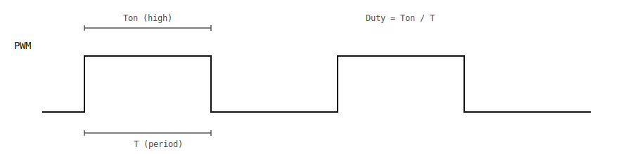

# PWM Driver

## Table of Contents

- [Overview](#overview)
- [Architecture](#architecture)
- [Usage Examples](#usage-examples)
- [Configuration](#configuration)

---

## Overview

The PWM (Pulse Width Modulation) driver provides an interface for generating PWM signals using hardware timers. It supports configurable frequency and duty cycle for applications like motor control, LED dimming, and signal generation.



### Key Features

- Configurable PWM frequency
- Variable duty cycle (0-100%)
- Hardware timer-based generation
- Start/stop control

---

## Architecture

The PWM driver utilizes hardware timers to generate PWM signals, providing precise timing control with minimal CPU overhead.

**Operation:**

1.  **Application:** Sets desired Frequency and Duty Cycle.
2.  **PWM Driver:** Calculates the required timer period and compare values.
3.  **Hardware Timer:** Increments a counter and compares it against the set values to toggle the output pin state automatically.

---


## Usage Examples

### LED Dimming
```c
#include "pwm.h"

// Create PWM for LED dimming at 1kHz
pwm_port_t pwm = pwm_create(&timer_peripheral, 1, 1000, 50); // 50% duty cycle
if (pwm != NULL) {
    pwm_start(pwm);
    
    // Adjust brightness
    pwm_set_duty(pwm, 25); // 25% brightness
    
    // Clean up
    pwm_stop(pwm);
    pwm_destroy(pwm);
}
```

### Motor Control
```c
#include "pwm.h"

// Create PWM for motor control
pwm_port_t motor_pwm = pwm_create(&timer_peripheral, 1, 20000, 0); // 20kHz, initially off
if (motor_pwm != NULL) {
    pwm_start(motor_pwm);
    
    // Ramp up motor speed
    for (int duty = 0; duty <= 100; duty += 10) {
        pwm_set_duty(motor_pwm, duty);
        // Delay
    }
}
```

---

## Configuration

PWM configuration requires:
- Hardware timer selection
- Channel number
- Desired frequency
- Initial duty cycle

The frequency is limited by the timer clock and counter resolution.
