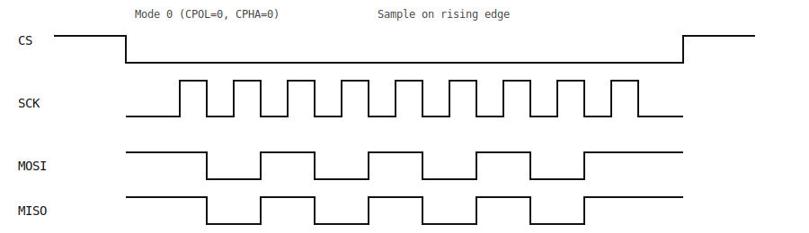
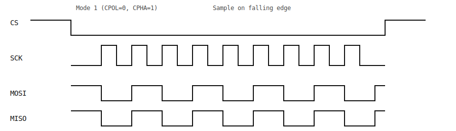
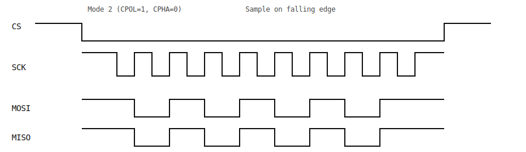
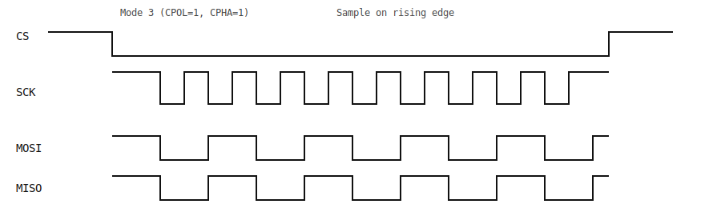

# SPI Driver

## Table of Contents

- [Overview](#overview)
- [Architecture](#architecture)
- [Protocol](#protocol)
- [Usage Examples](#usage-examples)

---

## Overview

The SPI (Serial Peripheral Interface) driver provides synchronous serial communication for connecting to SPI slave devices. It supports full-duplex data transfer with configurable parameters.

---

## Architecture

The SPI driver manages SPI bus communication as a master device, handling the protocol timing and data transfer operations through the HAL layer.

The SPI driver architecture:

1.  **Application:** Requests data transfer (Transmit/Receive).
2.  **SPI Driver:** Configures the peripheral (Clock, Mode, MSB/LSB).
3.  **SPI HAL:** Writes/Reads from the hardware data registers.
4.  **Hardware:** Generates the clock (SCK) and shifts data out (MOSI) while shifting data in (MISO) from the Slave Device.

---

## Protocol

SPI is a 4-wire, full-duplex synchronous serial interface.



1.  **Chip Select (CS):** Driven Low to select the device.
2.  **Clock (SCK):** Master toggles clock. Data is valid on edges.
3.  **MOSI/MISO:** Full-duplex data is shifted out on MOSI and sampled on MISO.
    *   **CPOL=0:** Clock idles Low.
    *   **CPHA=0:** Data sampled on rising edge.

---

Mode 1 (CPOL=0, CPHA=1) — sample on falling edge.



Mode 2 (CPOL=1, CPHA=0) — sample on falling edge.



Mode 3 (CPOL=1, CPHA=1) — sample on rising edge.



---


## Usage Examples

### Communicating with an SPI Device
```c
#include "spi.h"

// Create SPI instance
spi_port_t spi = spi_create(&spi_peripheral, &spi_config);
if (spi == NULL) {
    // Handle error
}

// Transmit and receive data (full-duplex)
uint8_t tx_data[] = {0x01, 0x02, 0x03};
uint8_t rx_data[3];
if (spi_transfer(spi, tx_data, rx_data, sizeof(tx_data)) == 0) {
    // Process received data
}

// Clean up
spi_destroy(spi);
```

---
