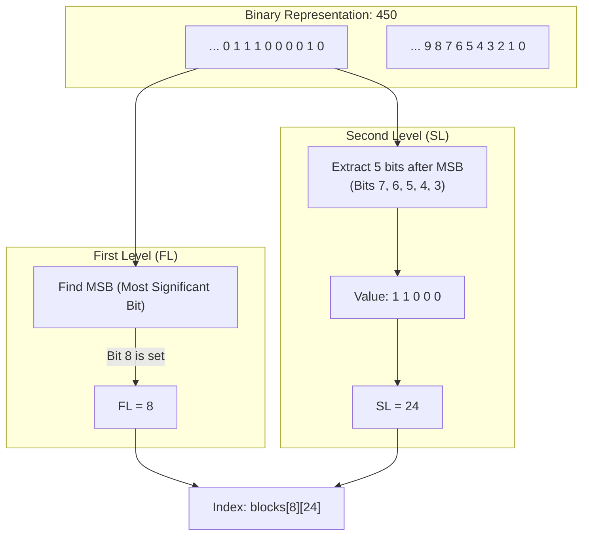
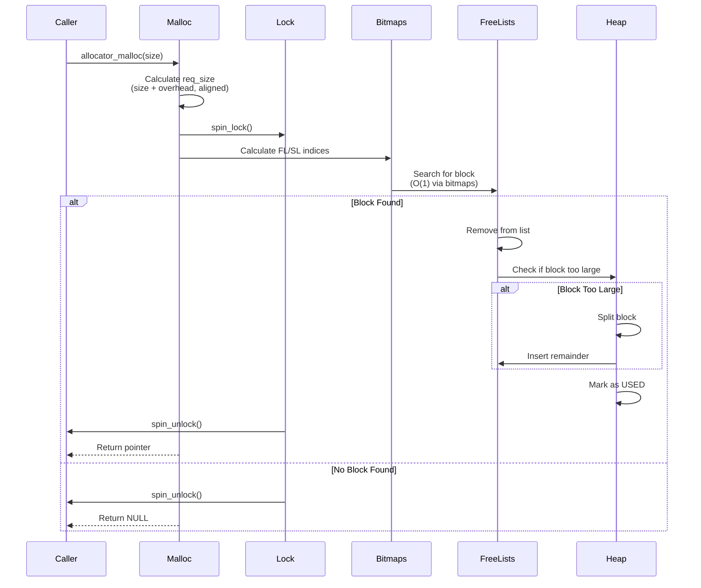
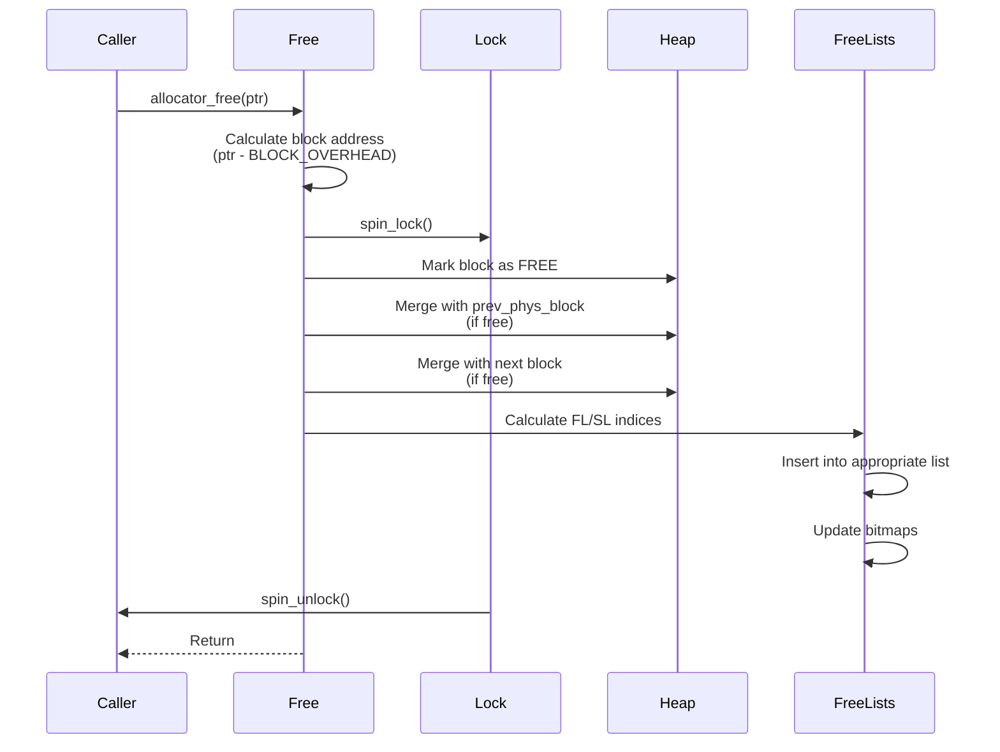
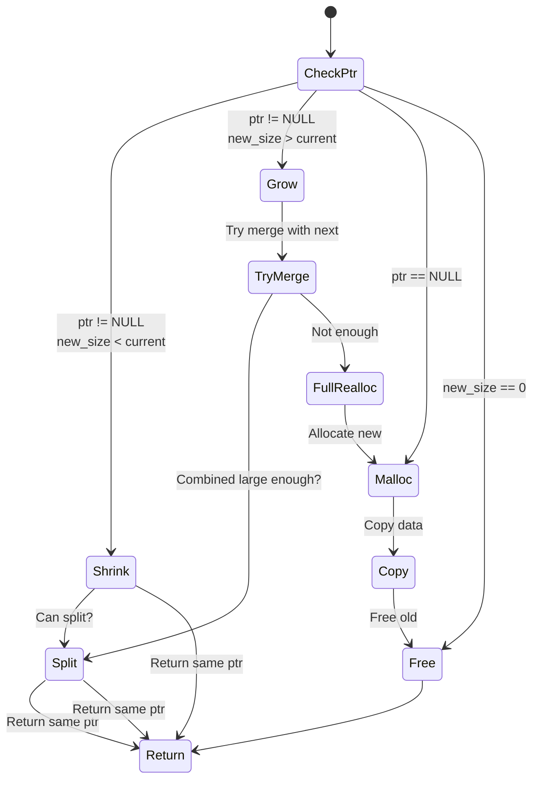

# Memory Allocator Architecture

## Table of Contents

- [Overview](#overview)
  - [Key Features](#key-features)
- [Architecture](#architecture)
- [Mathematical Foundation](#mathematical-foundation)
  - [TLSF Index Mapping](#tlsf-index-mapping)
  - [First Level (FL) Calculation](#first-level-fl-calculation)
  - [Second Level (SL) Calculation](#second-level-sl-calculation)
  - [Search Index Calculation](#search-index-calculation)
- [Data Structures](#data-structures)
  - [Block Header](#block-header)
  - [The Control Block](#the-control-block)
  - [Memory Layout](#memory-layout)
- [Algorithms](#algorithms)
  - [Allocation (malloc)](#allocation-malloc)
  - [Deallocation (free)](#deallocation-free)
  - [Reallocation (realloc)](#reallocation-realloc)
  - [Block Operations](#block-operations)
- [Concurrency & Thread Safety](#concurrency--thread-safety)
- [Performance Analysis](#performance-analysis)
  - [Time Complexity](#time-complexity)
  - [Space Complexity](#space-complexity)
  - [Fragmentation Analysis](#fragmentation-analysis)
- [Optimization Techniques](#optimization-techniques)
- [Configuration Parameters](#configuration-parameters)
  - [Tuning Guidelines](#tuning-guidelines)
- [Example Scenarios](#example-scenarios)
  - [Scenario 1: Sequential Allocation and Deallocation](#scenario-1-sequential-allocation-and-deallocation)
  - [Scenario 2: Fragmentation Prevention Through Coalescing](#scenario-2-fragmentation-prevention-through-coalescing)
  - [Scenario 3: Realloc Optimization](#scenario-3-realloc-optimization)
- [Debugging and Profiling](#debugging-and-profiling)
  - [Heap Integrity Checking](#heap-integrity-checking)
  - [Statistics Collection](#statistics-collection)
  - [Common Error Codes](#common-error-codes)
- [API Reference](#api-reference)
- [Appendix: Code Snippets](#appendix-code-snippets)

---

## Overview

The soRTOS memory allocator implements the **TLSF (Two-Level Segregated Fit)** algorithm, a high-performance memory allocation scheme designed specifically for real-time systems where **predictability** and **low fragmentation** are critical.

### Key Features

*   **Deterministic:** All operations execute in constant time $O(1)$.
*   **Low Fragmentation:** Uses "Good-Fit" strategy and immediate coalescing.
*   **Thread Safe:** Protected by a fine-grained spinlock.
*   **Overhead Efficient:** Metadata is minimized; free list pointers are stored inside free blocks.
*   **Real-Time Ready:** No unpredictable delays from heap walks or complex data structures.

---

## Architecture


---

## Mathematical Foundation

### TLSF Index Mapping

TLSF organizes free blocks into a two-dimensional matrix indexed by **First Level (FL)** and **Second Level (SL)** indices. This organization allows O(1) block location using bitwise operations.

#### First Level (FL) Calculation

The First Level index represents the **logarithmic category** of block sizes:

$$
\text{FL} = \lfloor \log_2(\text{size}) \rfloor
$$

**Implementation:**
```c
fl = find_msb_index(size);  // Uses CLZ instruction
```

**Size Ranges (example with FL_INDEX_MAX=30):**

| FL | Size Range (bytes) | Power of 2 |
|:---|:-------------------|:-----------|
| 0 | 0-1 | $2^0$ |
| 1 | 2-3 | $2^1$ |
| 2 | 4-7 | $2^2$ |
| 7 | 128-255 | $2^7$ |
| 8 | 256-511 | $2^8$ |
| 15 | 32KB-64KB | $2^{15}$ |
| 30 | 512MB-1GB | $2^{30}$ |

#### Second Level (SL) Calculation

The Second Level provides **linear subdivision** within each FL range. With `SL_INDEX_COUNT_LOG2 = 5`, we have 32 subdivisions per FL.

**For blocks where FL ≥ SL_INDEX_COUNT_LOG2:**

$$
\text{SL} = \left\lfloor \frac{\text{size} - 2^{\text{FL}}}{2^{\text{FL} - \text{SL\_INDEX\_COUNT\_LOG2}}} \right\rfloor
$$

**Implementation:**
```c
if (fl >= SL_INDEX_COUNT_LOG2) {
    shift_amount = fl - SL_INDEX_COUNT_LOG2;
    shifted = size >> shift_amount;
    sl = shifted ^ (1 << SL_INDEX_COUNT_LOG2);  // Strip MSB
}
```

**For small blocks (FL < SL_INDEX_COUNT_LOG2):**

To prevent underflow, a simplified mapping is used:

$$
\text{SL} = \left\lfloor \frac{\text{size}}{2} \right\rfloor
$$

**Example: FL 8 (256-511 bytes) with SL_INDEX_COUNT_LOG2=5:**

The range 256-511 is divided into 32 equal slices:
- **Slice width:** $256 / 32 = 8$ bytes
- **SL 0:** 256-263 bytes
- **SL 1:** 264-271 bytes
- **SL 15:** 376-383 bytes
- **SL 31:** 504-511 bytes

#### Visualizing Index Calculation

Let's calculate the indices for a block of **450 bytes** ($450 = 256 + 128 + 64 + 2$).
Assume `SL_INDEX_COUNT_LOG2 = 5` (32 subdivisions).



#### Search Index Calculation

When searching for a block of size `req_size`, we need to find the **smallest available block** that fits. The search algorithm:

1. Calculate the **minimum** FL/SL for `req_size`
2. Round up to the next available bucket if exact match not found
3. Use bitwise operations to find the first set bit in bitmaps

**Implementation:**
```c
void mapping_indices_search(size_t size, uint32_t *fl, uint32_t *sl) {
    uint32_t fl_temp = find_msb_index(size);
    
    // Round up to next SL bucket
    if (fl_temp >= SL_INDEX_COUNT_LOG2) {
        size += (1 << (fl_temp - SL_INDEX_COUNT_LOG2)) - 1;
    }
    
    mapping_indices_calc(size, fl, sl);
}
```

**Visual Example:**

```
Request: 300 bytes
├─ FL calculation: floor(log2(300)) = 8
├─ Range: 256-511 bytes
├─ Round up: 300 + (256/32 - 1) = 307
└─ SL calculation: (307 >> 3) ^ 32 = 6

Result: FL=8, SL=6 → searches blocks[8][6] and above
```

---

## Data Structures

### Block Header

Every memory block is prefixed with a header. To minimize overhead, the pointers used for the free list (`next_free`, `prev_free`) are stored **inside the user data area** when the block is free.

```c
typedef struct BlockHeader {
    /* 
     * size: Total size of block (including header).
     *       LSB (bit 0) is the FREE flag.
     *       Bits 1..N are the size (aligned, so bottom 2-3 bits are 0).
     */
    size_t size;
    
    /* Pointer to the physically previous block (for coalescing) */
    struct BlockHeader *prev_phys_block;

    /* 
     * User data starts here.
     * IF the block is FREE, this area is overlaid with:
     */
    struct BlockHeader *next_free;  /* Forward link in free list */
    struct BlockHeader *prev_free;  /* Backward link in free list */
} block_header_t;
```

**Key Properties:**

*   **`size`**: Stores the size of the block. Since blocks are aligned (e.g., 8 bytes), the least significant bits are always 0. We use bit 0 as the **FREE flag** (1 = Free, 0 = Used).
*   **`prev_phys_block`**: Points to the block immediately preceding this one in memory. This allows O(1) merging with the previous block during `free()`.
*   **`next_free` / `prev_free`**: These pointers exist *inside* the user data area. They are only used when the block is free to link it into the segregated free lists. When allocated, this memory is given to the user.

**Memory Overhead:**

```c
#define BLOCK_OVERHEAD  (offsetof(block_header_t, next_free))
// Typically: sizeof(size_t) + sizeof(void*) = 8 + 8 = 16 bytes on 64-bit
// On 32-bit: 4 + 4 = 8 bytes
```

### The Control Block

The control structure maintains the free list organization and bitmaps:

```c
typedef struct {
    /* Array of free lists: blocks[FL][SL] */
    block_header_t* blocks[FL_INDEX_MAX][SL_INDEX_COUNT];

    /* Bitmaps to quickly find non-empty free lists */
    uint32_t fl_bitmap;                    /* One bit per FL */
    uint32_t sl_bitmap[FL_INDEX_MAX];      /* One bitmap per FL */
} control_t;
```

**Bitmap Usage:**

*   **`fl_bitmap`**: A 32-bit word where bit `i` is set if *any* block exists in FL category `i`.
*   **`sl_bitmap[fl]`**: A 32-bit word where bit `j` is set if a block exists in FL `fl`, SL `j`.

**Finding a Free Block (O(1)):**

```c
// Find first FL with available blocks
uint32_t fl_map = control.fl_bitmap & (~0U << fl);
if (fl_map) {
    fl = find_lsb_index(fl_map);  // CTZ instruction
    
    // Find first SL with available blocks
    uint32_t sl_map = control.sl_bitmap[fl] & (~0U << sl);
    sl = find_lsb_index(sl_map);
    
    return control.blocks[fl][sl];  // First block in list
}
```

### Memory Layout

**Physical Layout:**

Blocks are stored contiguously in memory, forming a linked list via `prev_phys_block`:


**Logical Organization (Free Lists):**

Free blocks are organized into a matrix of doubly-linked lists:


**Block State Transitions:**


---

## Algorithms

### Allocation (malloc)

The allocation algorithm follows these steps:



**Detailed Steps:**

1. **Size Calculation:**
   ```c
   size_t adjust = size + BLOCK_OVERHEAD;
   size_t req_size = ALIGN(adjust);  // Align to platform boundary
   ```

2. **Block Search (O(1)):**
   ```c
   // Calculate search indices (rounds up)
   mapping_indices_search(req_size, &fl, &sl);
   
   // Find first available block using bitmaps
   block = block_locate_free(req_size);
   ```

3. **Block Removal:**
   ```c
   block_remove(block);  // Unlink from free list, update bitmaps
   ```

4. **Block Trimming:**
   ```c
   if (GET_SIZE(block) > req_size + BLOCK_MIN_SIZE) {
       block_trim(block, req_size);  // Split, insert remainder
   }
   ```

5. **Mark as Used:**
   ```c
   SET_USED(block);  // Clear FREE bit
   return (void*)((uint8_t*)block + BLOCK_OVERHEAD);
   ```

**Time Complexity:** $O(1)$ - Constant time regardless of heap state.

### Deallocation (free)

The deallocation algorithm performs immediate coalescing to prevent fragmentation:



**Detailed Steps:**

1. **Block Identification:**
   ```c
   block_header_t *block = (block_header_t*)((uint8_t*)ptr - BLOCK_OVERHEAD);
   ```

2. **Mark as Free:**
   ```c
   SET_FREE(block);  // Set FREE bit
   ```

3. **Coalesce with Previous Block:**
   ```c
   if (block->prev_phys_block && IS_FREE(block->prev_phys_block)) {
       block = block_merge_prev(block);
       // Removes prev from free list, extends prev to cover block
   }
   ```

4. **Coalesce with Next Block:**
   ```c
   block = block_merge_next(block);
   // Checks if next block is free, merges if so
   ```

5. **Insert into Free List:**
   ```c
   block_insert(block);  // Calculate FL/SL, insert, update bitmaps
   ```

**Coalescing Example:**

```
Before free():
[Used: 64B] [Free: 128B] [Used: 256B] [Free: 512B] [Used: 128B]
                ↑
          Free this block

After free():
[Used: 64B] [Free: 896B] [Used: 128B]
                ↑
          Merged with both neighbors!
```

**Time Complexity:** $O(1)$ - Constant time with immediate coalescing.

### Reallocation (realloc)

The reallocation algorithm attempts to optimize in-place resizing:



**Three Cases:**

1. **Shrinking (new_size < current_size):**
   ```c
   if (curr_size >= req_size) {
       if (curr_size - req_size >= BLOCK_MIN_SIZE) {
           block_trim(block, req_size);  // Split, free remainder
       }
       return ptr;  // Same pointer
   }
   ```

2. **Growing (new_size > current_size) - Try In-Place:**
   ```c
   block_header_t *next = (block_header_t*)((uint8_t*)block + curr_size);
   if (IS_FREE(next)) {
       size_t combined = curr_size + GET_SIZE(next);
       if (combined >= req_size) {
           // Merge with next, possibly trim
           return ptr;  // Same pointer!
       }
   }
   ```

3. **Full Realloc (must move):**
   ```c
   void* new_ptr = allocator_malloc(new_size);
   if (new_ptr) {
       utils_memcpy(new_ptr, ptr, curr_size - BLOCK_OVERHEAD);
       allocator_free(ptr);
   }
   return new_ptr;
   ```

**Time Complexity:**
- **Shrink:** $O(1)$ - In-place split
- **Grow (in-place):** $O(1)$ - Merge with next if free
- **Grow (move):** $O(N)$ - Copy data, where N is the old size

### Block Operations

#### Block Insertion

```c
static void block_insert(block_header_t *block) {
    uint32_t fl, sl;
    mapping_indices_calc(GET_SIZE(block), &fl, &sl);
    
    // Insert at head of list (LIFO for cache locality)
    block->next_free = control.blocks[fl][sl];
    block->prev_free = NULL;
    
    if (block->next_free) {
        block->next_free->prev_free = block;
    }
    
    control.blocks[fl][sl] = block;
    
    // Update bitmaps
    control.fl_bitmap |= (1 << fl);
    control.sl_bitmap[fl] |= (1 << sl);
}
```

#### Block Removal

```c
static void block_remove(block_header_t *block) {
    uint32_t fl, sl;
    mapping_indices_calc(GET_SIZE(block), &fl, &sl);
    
    // Unlink from doubly-linked list
    if (block->prev_free) {
        block->prev_free->next_free = block->next_free;
    } else {
        control.blocks[fl][sl] = block->next_free;  // Was head
    }
    
    if (block->next_free) {
        block->next_free->prev_free = block->prev_free;
    }
    
    // Clear bitmaps if list becomes empty
    if (control.blocks[fl][sl] == NULL) {
        control.sl_bitmap[fl] &= ~(1 << sl);
        if (control.sl_bitmap[fl] == 0) {
            control.fl_bitmap &= ~(1 << fl);
        }
    }
}
```

#### Block Merging

**Merge with Previous:**
```c
static block_header_t* block_merge_prev(block_header_t *block) {
    if (block->prev_phys_block && IS_FREE(block->prev_phys_block)) {
        block_header_t *prev = block->prev_phys_block;
        block_remove(prev);  // Remove from free list
        
        // Extend prev to cover block
        prev->size += GET_SIZE(block);
        
        // Update next block's prev_phys_block pointer
        block_header_t *next = (block_header_t*)((uint8_t*)prev + GET_SIZE(prev));
        if ((void*)next < heap_end_ptr) {
            next->prev_phys_block = prev;
        }
        
        return prev;  // Return merged block
    }
    return block;
}
```

**Merge with Next:**
```c
static block_header_t* block_merge_next(block_header_t *block) {
    block_header_t *next = (block_header_t*)((uint8_t*)block + GET_SIZE(block));
    
    if ((void*)next < heap_end_ptr && IS_FREE(next)) {
        block_remove(next);  // Remove from free list
        
        // Extend block to cover next
        block->size += GET_SIZE(next);
        
        // Update block after next
        block_header_t *next_next = (block_header_t*)((uint8_t*)block + GET_SIZE(block));
        if ((void*)next_next < heap_end_ptr) {
            next_next->prev_phys_block = block;
        }
    }
    
    return block;
}
```

#### Block Trimming

```c
static void block_trim(block_header_t *block, size_t size) {
    size_t remaining_size = GET_SIZE(block) - size;
    
    if (remaining_size >= BLOCK_MIN_SIZE) {
        // Create new free block from remainder
        block_header_t *remaining = (block_header_t*)((uint8_t*)block + size);
        remaining->size = remaining_size | BLOCK_FREE_BIT;
        remaining->prev_phys_block = block;
        
        // Update block size (mark as used)
        block->size = size;
        
        // Update next block's prev_phys_block
        block_header_t *next = (block_header_t*)((uint8_t*)remaining + GET_SIZE(remaining));
        if ((void*)next < heap_end_ptr) {
            next->prev_phys_block = remaining;
        }
        
        // Try to merge remainder with next block
        remaining = block_merge_next(remaining);
        
        // Insert remainder into free list
        block_insert(remaining);
    }
}
```

---

## Concurrency & Thread Safety

The allocator uses a **single global spinlock** to protect all operations:

```c
static spinlock_t allocator_lock;
```

**Locking Strategy:**

*   **Fine-grained:** Single lock protects entire allocator (simple, correct)
*   **Short critical sections:** All operations are O(1), minimizing lock hold time
*   **ISR Safe:** Spinlocks can be used from interrupt context (no sleeping)

**Critical Sections:**

```c
void* allocator_malloc(size_t size) {
    // ... size calculation (no lock needed) ...
    
    uint32_t flags = spin_lock(&allocator_lock);
    // All heap manipulation here
    spin_unlock(&allocator_lock, flags);
}

void allocator_free(void* ptr) {
    uint32_t flags = spin_lock(&allocator_lock);
    // All heap manipulation here
    spin_unlock(&allocator_lock, flags);
}
```

**Lock Ordering:**

The allocator lock should be acquired **before** any scheduler locks to prevent deadlock:

```
Lock Order:
1. Allocator lock (if needed)
2. Scheduler CPU lock
3. Resource locks (mutex, queue, etc.)
```

---

## Performance Analysis

### Time Complexity

| Operation | Complexity | Notes |
|:----------|:-----------|:------|
| `allocator_malloc` | $O(1)$ | Bitmap search + list removal |
| `allocator_free` | $O(1)$ | Coalescing + list insertion |
| `allocator_realloc` (shrink) | $O(1)$ | In-place split |
| `allocator_realloc` (grow, in-place) | $O(1)$ | Merge with next if free |
| `allocator_realloc` (grow, move) | $O(N)$ | Copy data, where N = old size |
| `allocator_get_stats` | $O(1)$ | Read cached statistics |
| `allocator_check_integrity` | $O(M + L)$ | M = heap blocks, L = free list nodes |

**Why O(1) for malloc/free?**

1. **Bitmap-based search:** Uses `CLZ`/`CTZ` CPU instructions to find first set bit in constant time
2. **No heap walks:** Free lists are pre-organized by size
3. **Immediate coalescing:** No deferred merging that requires scanning

### Space Complexity

| Structure | Space | Notes |
|:----------|:------|:------|
| Control block | $O(FL \times SL)$ | Array of pointers: `FL_INDEX_MAX × SL_INDEX_COUNT` |
| Block header | $O(1)$ per block | Fixed overhead: `BLOCK_OVERHEAD` bytes |
| Bitmaps | $O(FL)$ | `FL_INDEX_MAX` 32-bit words |
| **Total metadata** | $O(FL \times SL)$ | Static, independent of heap size |

**Example (FL_INDEX_MAX=30, SL_INDEX_COUNT=32):**

```
Control block size:
- Free lists: 30 × 32 × sizeof(void*) = 960 × 8 = 7,680 bytes (64-bit)
- Bitmaps: 30 × 4 + 4 = 124 bytes
- Total: ~7.8 KB metadata

Per-block overhead:
- BLOCK_OVERHEAD: 16 bytes (64-bit) or 8 bytes (32-bit)
```

### Fragmentation Analysis

**Internal Fragmentation:**

TLSF uses a "Good-Fit" strategy, meaning it selects a block that is close to the requested size but may be slightly larger:

$$
\text{Internal Fragmentation} = \frac{\text{Allocated Size} - \text{Requested Size}}{\text{Allocated Size}}
$$

**Worst Case:** A request for $(2^n + 1)$ bytes may get a block of $2^{n+1}$ bytes, resulting in up to ~50% internal fragmentation for that specific allocation. However, the SL subdivision reduces this significantly.

**External Fragmentation:**

Immediate coalescing prevents most external fragmentation:

*   **Adjacent free blocks are always merged** during `free()`
*   **No deferred coalescing** means fragmentation doesn't accumulate
*   **Good-Fit strategy** reduces the number of small leftover blocks

**Fragmentation Metrics:**

```c
typedef struct heap_stats {
    size_t free_blocks;      // Number of free fragments
    size_t free_size;         // Total free memory
    size_t largest_free_block; // Largest contiguous free block
} heap_stats_t;

// Fragmentation ratio
float frag_ratio = (float)free_blocks / (free_size > 0 ? free_size : 1);
// Lower is better (closer to 1.0 = less fragmented)
```

---

## Optimization Techniques

### 1. Bitmap-Based O(1) Search

Using CPU instructions for bit manipulation:

```c
// Find Most Significant Bit (FL index)
static inline uint32_t find_msb_index(uint32_t word) {
    return 31 - __builtin_clz(word);  // Count Leading Zeros
}

// Find Least Significant Bit (SL index)
static inline uint32_t find_lsb_index(uint32_t word) {
    return __builtin_ctz(word);  // Count Trailing Zeros
}
```

These compile to single CPU instructions on modern architectures.

### 2. Embedded Free List Pointers

Free list pointers are stored **inside** free blocks, eliminating separate metadata:

```c
// When FREE: next_free and prev_free are valid
// When USED: This memory belongs to the user
```

**Benefit:** Zero overhead for allocated blocks (only free blocks have the pointer overhead).

### 3. Immediate Coalescing

Blocks are merged **immediately** during `free()`, not deferred:

*   **Prevents fragmentation accumulation**
*   **Simplifies algorithms** (no periodic compaction needed)
*   **Maintains O(1) complexity** (coalescing is bounded by 2 neighbors)

### 4. LIFO Free List Insertion

Blocks are inserted at the **head** of free lists (LIFO):

*   **Cache locality:** Recently freed blocks are likely still in cache
*   **Faster allocation:** First block in list is often the best fit

### 5. Alignment Optimization

All blocks are aligned to platform word size:

```c
#define ALIGN(size) (((size) + (ALIGN_SIZE - 1)) & ~(ALIGN_SIZE - 1))
```

This ensures:
*   **Efficient memory access** (no unaligned loads/stores)
*   **Size field can use bottom bits** for flags (FREE bit)

---

## Configuration Parameters

Tunable parameters in `config/project_config.h`:

| Macro | Default | Description |
|:------|:--------|:------------|
| `FL_INDEX_MAX` | 30 | Maximum FL index (supports up to $2^{30}$ bytes = 1GB) |
| `SL_INDEX_COUNT_LOG2` | 5 | Second level subdivisions ($2^5 = 32$ lists per FL) |

### Tuning Guidelines

**For Small Memory Systems (e.g., 128KB RAM):**

```c
#define FL_INDEX_MAX 17  // Supports up to 128KB (2^17)
```

**Benefits:**
- Reduces control block size: `17 × 32 × 8 = 4,352 bytes` (vs 7,680 for FL_INDEX_MAX=30)
- Saves ~3.3 KB of RAM

**For Large Memory Systems:**

```c
#define FL_INDEX_MAX 30  // Supports up to 1GB
#define SL_INDEX_COUNT_LOG2 5  // 32 subdivisions (good balance)
```

**Increasing SL_INDEX_COUNT_LOG2:**

- **More precision:** Better fit, less internal fragmentation
- **Cost:** Larger control block: `FL_INDEX_MAX × 2^{SL_LOG2} × sizeof(void*)`
- **Trade-off:** `SL_LOG2=5` (32) is typically optimal

**Example Calculations:**

```
FL_INDEX_MAX = 30, SL_INDEX_COUNT_LOG2 = 5:
- Control block: 30 × 32 × 8 = 7,680 bytes (64-bit)
- Supports: 1GB blocks
- SL precision: 8 bytes per slice (for FL 8: 256/32 = 8)

FL_INDEX_MAX = 17, SL_INDEX_COUNT_LOG2 = 4:
- Control block: 17 × 16 × 8 = 2,176 bytes (64-bit)
- Supports: 128KB blocks
- SL precision: 16 bytes per slice (for FL 8: 256/16 = 16)
```

---

## Example Scenarios

### Scenario 1: Sequential Allocation and Deallocation

**Setup:**
- Heap: 1024 bytes
- Allocate: 64B, 128B, 256B
- Free: 128B, 64B, 256B

**Timeline:**

```
t=0: Initialization
[Free: 1024B]
└─ FL=10, SL=0

t=1: malloc(64)
[Used: 64B] [Free: 960B]
            └─ FL=10, SL=0

t=2: malloc(128)
[Used: 64B] [Used: 128B] [Free: 832B]
                        └─ FL=10, SL=0

t=3: malloc(256)
[Used: 64B] [Used: 128B] [Used: 256B] [Free: 576B]
                                    └─ FL=10, SL=0

t=4: free(128B block)
[Used: 64B] [Free: 128B] [Used: 256B] [Free: 576B]
            └─ FL=7, SL=0

t=5: free(64B block)
[Free: 192B] [Used: 256B] [Free: 576B]
└─ FL=8, SL=0  └─ FL=10, SL=0
(Coalesced: 64B + 128B = 192B)

t=6: free(256B block)
[Free: 1024B]
└─ FL=10, SL=0
(Coalesced: 192B + 256B + 576B = 1024B)
```

**Key Observations:**
1. Coalescing merges adjacent free blocks immediately
2. Heap returns to initial state after all frees
3. No fragmentation remains

### Scenario 2: Fragmentation Prevention Through Coalescing

**Problem:** Without coalescing, alternating allocate/free patterns create fragmentation.

**With Coalescing (TLSF):**

```
Pattern: malloc(100), malloc(200), free(100), malloc(150)

t=0: [Free: 1000B]

t=1: malloc(100)
[Used: 100B] [Free: 900B]

t=2: malloc(200)
[Used: 100B] [Used: 200B] [Free: 700B]

t=3: free(100B block)
[Free: 100B] [Used: 200B] [Free: 700B]
└─ FL=7, SL=0

t=4: malloc(150)
[Free: 50B] [Used: 150B] [Used: 200B] [Free: 700B]
└─ FL=6, SL=0
(Trimmed 100B block, allocated 150B, left 50B remainder)

t=5: free(150B), free(200B)
[Free: 1000B]
(Coalesced: 50B + 150B + 200B + 700B = 1000B)
```

**Without Coalescing (hypothetical):**

```
t=4: malloc(150) would FAIL!
[Free: 100B] [Used: 200B] [Free: 700B]
└─ Too small  └─ Too large
(No single block large enough, even though 800B total free!)
```

### Scenario 3: Realloc Optimization

**Setup:**
- Allocated block: 256 bytes
- Realloc to: 512 bytes (grow)

**Case A: Next block is free and large enough**

```
Before:
[Used: 256B] [Free: 512B] [Used: 128B]
             └─ Can merge!

After realloc (in-place):
[Used: 768B] [Used: 128B]
(Trimmed to 512B if needed, or kept at 768B)
```

**Case B: Next block is used or too small**

```
Before:
[Used: 256B] [Used: 128B] [Free: 256B]

After realloc (must move):
1. malloc(512) → new location
2. memcpy(256 bytes)
3. free(old 256B block)

Result:
[Free: 256B] [Used: 128B] [Free: 256B] [Used: 512B]
```

**Performance Comparison:**

| Scenario | Operation | Time Complexity |
|:---------|:----------|:----------------|
| Case A | In-place realloc | $O(1)$ |
| Case B | Move realloc | $O(N)$ where N=256 |

---

## Debugging and Profiling

### Heap Integrity Checking

The `allocator_check_integrity()` function performs comprehensive validation:

**Physical Walk:**
- Verifies block alignment
- Checks size validity
- Validates physical chain (`prev_phys_block` pointers)
- Detects overlapping blocks
- Ensures no adjacent free blocks (coalescing check)

**Logical Walk:**
- Verifies free list consistency
- Validates bitmap synchronization
- Checks block placement (correct FL/SL bucket)
- Detects wild pointers

**Return Codes:**

| Code | Meaning | Description |
|:-----|:--------|:-------------|
| 0 | Success | Heap is valid |
| -1 | Not initialized | `allocator_init()` not called |
| -2 | Alignment error | Block not properly aligned |
| -3 | Size too small | Block smaller than `BLOCK_MIN_SIZE` |
| -4 | Overflow | Block extends past heap end |
| -5 | Broken chain | `prev_phys_block` pointer mismatch |
| -6 | Missed merge | Adjacent free blocks (should be merged) |
| -7 | Size mismatch | Heap walk doesn't end at heap end |
| -8 | Bitmap desync | List has blocks but bitmap bit is 0 |
| -9 | Bitmap desync | List is empty but bitmap bit is 1 |
| -10 | Wrong state | Used block in free list |
| -11 | Corrupt list | `prev_free` pointer mismatch |
| -12 | Wrong bucket | Block in incorrect FL/SL list |
| -13 | Wild pointer | Free list pointer outside heap |
| -14 | Stats mismatch | Calculated stats != cached stats |
| -15 | Count mismatch | Physical free count != logical count |

### Statistics Collection

```c
typedef struct heap_stats {
    size_t total_size;         // Total heap capacity
    size_t used_size;          // Currently allocated
    size_t free_size;          // Currently free
    size_t largest_free_block;  // Largest contiguous free block
    size_t allocated_blocks;   // Number of allocated blocks
    size_t free_blocks;         // Number of free fragments
} heap_stats_t;

int allocator_get_stats(heap_stats_t *stats);
```

**Usage Example:**

```c
heap_stats_t stats;
if (allocator_get_stats(&stats) == 0) {
    float frag_ratio = (float)stats.free_blocks / 
                       (stats.free_size > 0 ? stats.free_size : 1);
    
    printf("Heap: %zu/%zu bytes used (%.1f%%)\n",
           stats.used_size, stats.total_size,
           100.0f * stats.used_size / stats.total_size);
    printf("Fragments: %zu (ratio: %.3f)\n",
           stats.free_blocks, frag_ratio);
    printf("Largest free: %zu bytes\n", stats.largest_free_block);
}
```

### Common Error Codes

**Integration with Logging:**

```c
int result = allocator_check_integrity();
if (result != 0) {
    logger_log("Heap integrity failed: %d", result, 0);
    // Handle error (panic, recovery, etc.)
}
```

**Periodic Health Checks:**

```c
void heap_health_check(void) {
    heap_stats_t stats;
    allocator_get_stats(&stats);
    
    // Warn if fragmentation is high
    if (stats.free_blocks > 10 && 
        (float)stats.free_blocks / stats.free_size > 0.01f) {
        logger_log("High fragmentation: %zu fragments", 
                   stats.free_blocks, 0);
    }
    
    // Warn if heap is nearly full
    if (stats.free_size < stats.total_size * 0.1f) {
        logger_log("Heap nearly full: %zu bytes free", 
                   stats.free_size, 0);
    }
}
```

---

## API Reference

| Function | Description | Thread Safe? | Time Complexity |
|:---------|:------------|:-------------|:----------------|
| `allocator_init` | Initialize heap from memory pool | No (call once at startup) | $O(1)$ |
| `allocator_malloc` | Allocate memory block | Yes | $O(1)$ |
| `allocator_free` | Free memory block | Yes | $O(1)$ |
| `allocator_realloc` | Resize memory block | Yes | $O(1)$ or $O(N)$ |
| `allocator_get_free_size` | Get total free memory | Yes | $O(1)$ |
| `allocator_get_fragment_count` | Get number of free blocks | Yes | $O(1)$ |
| `allocator_is_heap_pointer` | Check if pointer is in heap | Yes | $O(1)$ |
| `allocator_get_stats` | Get detailed heap statistics | Yes | $O(1)$ |
| `allocator_check_integrity` | Verify heap integrity | Yes | $O(M + L)$ |

**Function Signatures:**

```c
void allocator_init(uint8_t* pool, size_t size);
void* allocator_malloc(size_t size);
void allocator_free(void* ptr);
void* allocator_realloc(void* ptr, size_t new_size);
size_t allocator_get_free_size(void);
size_t allocator_get_fragment_count(void);
int allocator_is_heap_pointer(void *ptr);
int allocator_get_stats(heap_stats_t *stats);
int allocator_check_integrity(void);
```

---

## Appendix: Code Snippets

### Initialization

```c
void allocator_init(uint8_t* pool, size_t size) {
    spinlock_init(&allocator_lock);
    utils_memset(&control, 0, sizeof(control));
    
    // Align start address
    uintptr_t raw_addr = (uintptr_t)pool;
    uintptr_t aligned_addr = ALIGN(raw_addr);
    size -= (aligned_addr - raw_addr);
    
    heap_start_ptr = (void*)aligned_addr;
    heap_end_ptr = (void*)((uint8_t*)heap_start_ptr + size);
    
    // Create initial free block
    block_header_t *block = (block_header_t*)heap_start_ptr;
    block->size = size | BLOCK_FREE_BIT;
    block->prev_phys_block = NULL;
    
    block_insert(block);
}
```

### Malloc Implementation

```c
void* allocator_malloc(size_t size) {
    if (size == 0) return NULL;
    
    // Calculate required size (with overhead and alignment)
    size_t adjust = size + BLOCK_OVERHEAD;
    if (adjust < size) return NULL;  // Overflow check
    size_t req_size = (adjust < BLOCK_MIN_SIZE) ? 
                      BLOCK_MIN_SIZE : ALIGN(adjust);
    
    uint32_t flags = spin_lock(&allocator_lock);
    
    // Find suitable free block (O(1))
    block_header_t *block = block_locate_free(req_size);
    
    if (block) {
        block_remove(block);
        
        // Trim if too large
        block_trim(block, req_size);
        SET_USED(block);
        
        spin_unlock(&allocator_lock, flags);
        return (void*)((uint8_t*)block + BLOCK_OVERHEAD);
    }
    
    spin_unlock(&allocator_lock, flags);
    return NULL;
}
```

### Free Implementation

```c
void allocator_free(void* ptr) {
    if (!ptr) return;
    
    uint32_t flags = spin_lock(&allocator_lock);
    
    block_header_t *block = (block_header_t*)((uint8_t*)ptr - BLOCK_OVERHEAD);
    
    SET_FREE(block);
    
    // Coalesce with neighbors
    block = block_merge_prev(block);
    block = block_merge_next(block);
    
    // Insert into free list
    block_insert(block);
    
    spin_unlock(&allocator_lock, flags);
}
```

### Block Location (O(1) Search)

```c
static block_header_t* block_locate_free(size_t size) {
    uint32_t fl, sl;
    mapping_indices_search(size, &fl, &sl);
    
    // Check SL bitmap for available blocks at or above required size
    uint32_t sl_map = control.sl_bitmap[fl] & (~0U << sl);
    
    if (!sl_map) {
        // No block in this FL, check higher FLs
        uint32_t fl_map = control.fl_bitmap & (~0U << (fl + 1));
        if (!fl_map) {
            return NULL;  // No memory available
        }
        
        fl = find_lsb_index(fl_map);  // Find first available FL
        sl_map = control.sl_bitmap[fl];
    }
    
    sl = find_lsb_index(sl_map);  // Find first available SL
    return control.blocks[fl][sl];  // Return first block in list
}
```

### Index Mapping Calculation

```c
static void mapping_indices_calc(size_t size, uint32_t *fl, uint32_t *sl) {
    if (size < BLOCK_MIN_SIZE) {
        *fl = 0;
        *sl = 0;
        return;
    }
    
    // First Level: logarithmic category
    *fl = find_msb_index(size);
    
    // Second Level: linear subdivision
    if (*fl < SL_INDEX_COUNT_LOG2) {
        // Small blocks: simple mapping
        *sl = size >> 1;
    } else {
        // Extract precision bits after MSB
        uint32_t shift_amount = *fl - SL_INDEX_COUNT_LOG2;
        size_t shifted = size >> shift_amount;
        *sl = shifted ^ (1 << SL_INDEX_COUNT_LOG2);  // Strip MSB
    }
}
```
