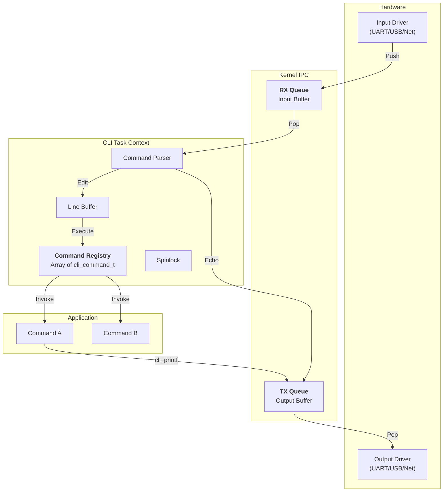
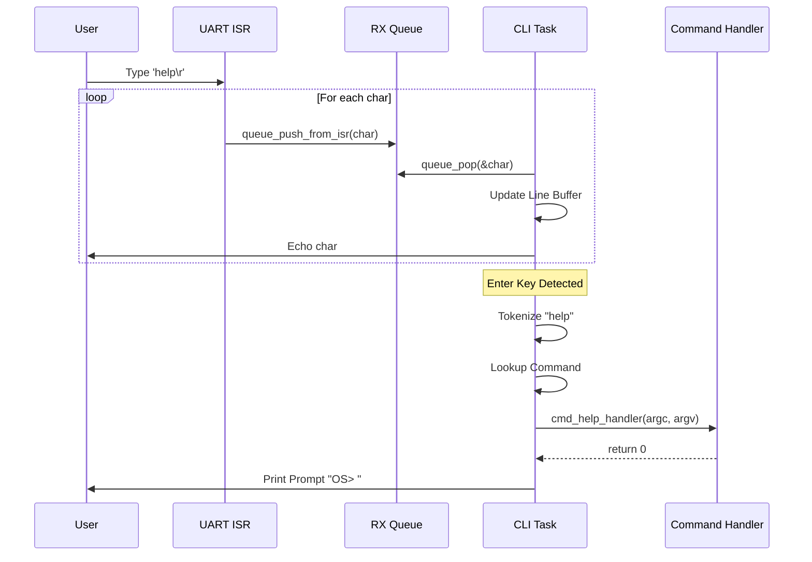

# Command Line Interface (CLI) Architecture

## Table of Contents

- [Overview](#overview)
  - [Key Features](#key-features)
- [Architecture](#architecture)
- [Data Structures](#data-structures)
  - [Command Definition](#command-definition)
  - [Internal Context](#internal-context)
- [CLI Operations](#cli-operations)
  - [High-Level Flow](#high-level-flow)
  - [Input Processing & Line Editing](#input-processing--line-editing)
  - [Command Execution](#command-execution)
  - [Output Handling](#output-handling)
- [Concurrency & Thread Safety](#concurrency--thread-safety)
  - [Command Registry Protection](#command-registry-protection)
  - [Thread-Safe Output](#thread-safe-output)
- [Performance Analysis](#performance-analysis)
  - [Time Complexity](#time-complexity)
  - [Space Complexity](#space-complexity)
- [Configuration Parameters](#configuration-parameters)
- [API Reference](#api-reference)
- [Example Scenarios](#example-scenarios)
  - [Scenario 1: Registering a Custom Command](#scenario-1-registering-a-custom-command)
  - [Scenario 2: Asynchronous Output from Tasks](#scenario-2-asynchronous-output-from-tasks)
- [Appendix: Code Snippets](#appendix-code-snippets)

---

## Overview

The soRTOS CLI provides a **lightweight, interactive shell** for the system. It allows developers to interact with the running kernel and applications via any character stream (UART, USB CDC, Semihosting, etc.), supporting dynamic command registration and VT100 line editing.

### Key Features
*   **Dynamic Registration:** Commands can be added or removed at runtime in a thread-safe manner.
*   **VT100 Support:** Handles arrow keys for cursor movement and backspace for editing.
*   **Non-Blocking I/O:** Integrates with kernel Queues for asynchronous operation.
*   **Thread-Safe Output:** `cli_printf` ensures atomic message delivery from multiple tasks.
*   **Zero-Malloc:** Uses static buffers and structures to ensure deterministic behavior.

---

## Architecture



---

## Data Structures

### Command Definition

Commands are defined using the `cli_command_t` structure.

```c
typedef struct {
    const char     *name;    /* Command name (no spaces) */
    const char     *help;    /* Short help string */
    cli_cmd_fn_t    handler; /* Function pointer: int handler(int argc, char **argv) */
} cli_command_t;
```

### Internal Context

The CLI maintains its state in a static structure, avoiding dynamic allocation.

```c
static struct {
    cli_getc_fn_t   getc;           /* Fallback polling input */
    cli_puts_fn_t   puts;           /* Fallback polling output */
    queue_t         *rx_queue;      /* Input Queue */
    queue_t         *tx_queue;      /* Output Queue */
    
    cli_command_t   commands[CLI_MAX_CMDS]; /* Registry */
    uint32_t        cmd_count;
    
    char            line_buffer[CLI_MAX_LINE_LEN];
    uint32_t        line_pos;       /* Current buffer length */
    uint32_t        cursor_pos;     /* Current cursor position */
    uint8_t         esc_state;      /* VT100 Escape sequence state */
    
    spinlock_t      lock;           /* Protects registry */
} cli_ctx;
```

---

## CLI Operations

### High-Level Flow



### Input Processing & Line Editing

The CLI task runs a state machine to handle incoming characters:

1.  **Normal Characters:** Inserted into `line_buffer` at `cursor_pos`.
2.  **Escape Sequences (`\033[`):**
    *   `[D` (Left Arrow): Decrement `cursor_pos`.
    *   `[C` (Right Arrow): Increment `cursor_pos`.
3.  **Backspace (`\b` or `0x7F`):** Removes character at cursor, shifts remaining buffer left, and updates terminal display.
4.  **Enter (`\r` or `\n`):** Triggers command execution.

### Command Execution

1.  **Tokenization:** The line buffer is split into arguments by replacing spaces with null terminators.
    *   `"led set 1"` $\rightarrow$ `argv=["led", "set", "1"]`, `argc=3`.
2.  **Lookup:** Linear search through `cli_ctx.commands` matching `argv[0]`.
3.  **Invocation:** Calls `handler(argc, argv)`.

### Output Handling

`cli_printf` provides thread-safe output formatting.

1.  **Format:** Uses `va_list` to format string into a local stack buffer.
2.  **Send:**
    *   If `tx_queue` is set: Uses `queue_push_arr` to write the entire string atomically.
    *   If `puts` callback is set: Calls the callback directly.

---

## Concurrency & Thread Safety

### Command Registry Protection

The command registry array is protected by a **spinlock**. This allows tasks to register or unregister commands safely at runtime without corrupting the list or racing with the CLI task's lookup process.

### Thread-Safe Output

Since `cli_printf` formats into a local buffer and pushes to the queue in one go, output from different tasks does not get interleaved character-by-character.

---

## Performance Analysis

### Time Complexity

| Operation | Complexity | Notes |
|:----------|:-----------|:------|
| Input Processing | $O(1)$ | Per character |
| Command Lookup | $O(N)$ | N = Number of registered commands |
| Tokenization | $O(L)$ | L = Line length |
| Output (`cli_printf`) | $O(L)$ | Formatting + Copying |

### Space Complexity

*   **Static Overhead:** `sizeof(cli_ctx)` + Buffers.
*   **Per-Command:** `sizeof(cli_command_t)` (pointer storage).
*   **Stack Usage:** `cli_printf` uses a stack buffer (`CLI_MAX_LINE_LEN`) to avoid malloc.

---

## Configuration Parameters

Defined in `project_config.h`:

| Macro | Description | Default |
|:------|:------------|:--------|
| `CLI_MAX_LINE_LEN` | Max characters in command line | 128 |
| `CLI_MAX_ARGS` | Max tokens (argc) | 16 |
| `CLI_MAX_CMDS` | Max registered commands | 32 |

---

## API Reference

| Function | Description | Thread Safe? |
|:---|:---|:---|
| `cli_init` | Initialize CLI subsystem | No |
| `cli_register_command` | Register a new command | **Yes** |
| `cli_unregister_command` | Remove a command | **Yes** |
| `cli_set_rx_queue` | Set input queue | No |
| `cli_set_tx_queue` | Set output queue | No |
| `cli_printf` | Print formatted string | **Yes** |
| `cli_task_entry` | Main task loop | N/A |

---

## Example Scenarios

### Scenario 1: Registering a Custom Command

```c
/* Command Handler */
int cmd_led(int argc, char **argv) {
    if (argc < 2) {
        cli_printf("Usage: led <on|off>\r\n");
        return -1;
    }
    
    if (strcmp(argv[1], "on") == 0) {
        led_on();
    } else {
        led_off();
    }
    return 0;
}

/* Registration */
const cli_command_t led_cmd = {
    .name = "led",
    .help = "Control LED",
    .handler = cmd_led
};

void app_init(void) {
    cli_register_command(&led_cmd);
}
```

### Scenario 2: Asynchronous Output from Tasks

Any task can safely print to the CLI console, useful for logging or status updates.

```c
void sensor_task(void *arg) {
    while(1) {
        int temp = read_temp();
        /* Safe to call from any task */
        cli_printf("Sensor: Temp is %d C\r\n", temp);
        task_sleep_ticks(1000);
    }
}
```

---

## Appendix: Code Snippets

### Command Processing Loop
```c
/* Inside cli_task_entry */
if (c == '\r' || c == '\n') { 
    cli_puts("\r\n");
    cli_ctx.line_buffer[cli_ctx.line_pos] = '\0';
    cli_process_cmd();
    cli_ctx.line_pos = 0;
    cli_ctx.cursor_pos = 0;
}
```

### Thread-Safe Printf
```c
uint32_t cli_printf(const char *text, ...) {
    char buff[CLI_MAX_LINE_LEN];
    /* ... va_list formatting ... */
    
    if (cli_ctx.tx_queue) {
        /* Atomic push of entire string */
        queue_push_arr(cli_ctx.tx_queue, buff, len);
    } else if (cli_ctx.puts) {
        cli_ctx.puts(buff);
    }
}
```