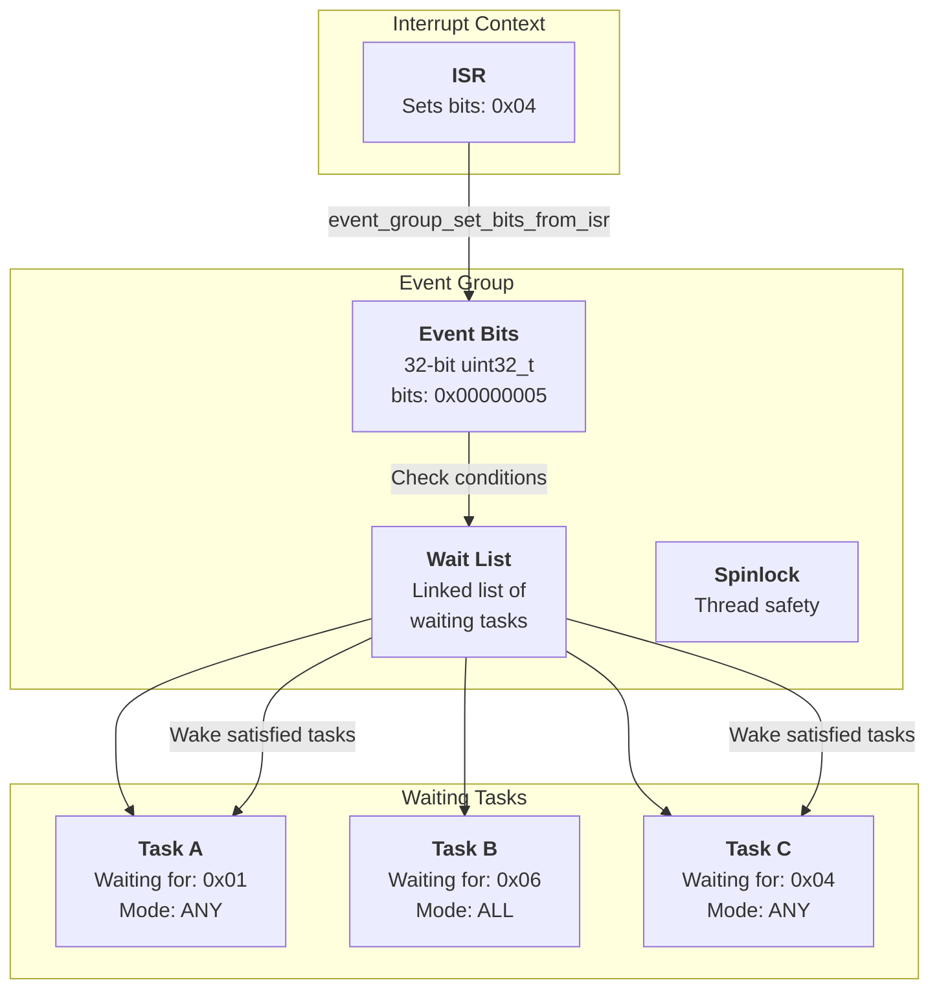
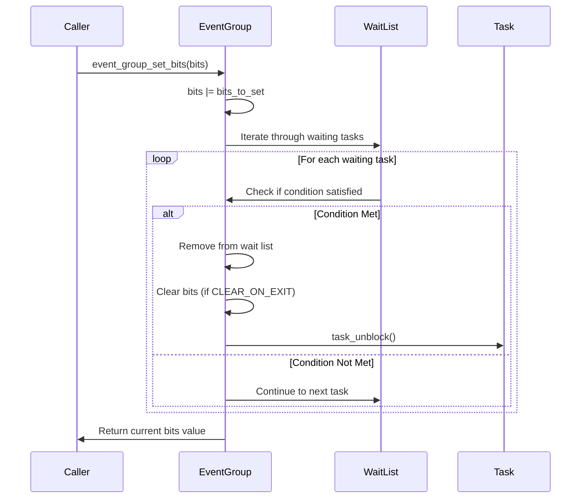
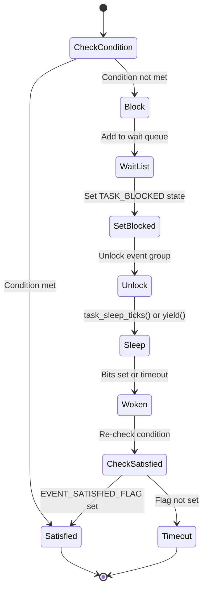

# Event Group Architecture

## Table of Contents

- [Overview](#overview)
  - [Key Features](#key-features)
- [Architecture](#architecture)
- [Data Structures](#data-structures)
  - [Event Group Structure](#event-group-structure)
  - [Wait Node Integration](#wait-node-integration)
- [Algorithms](#algorithms)
  - [Setting Bits](#setting-bits)
  - [Waiting for Bits](#waiting-for-bits)
  - [Wake-up Condition Evaluation](#wake-up-condition-evaluation)
- [Concurrency & Thread Safety](#concurrency--thread-safety)
- [Performance Analysis](#performance-analysis)
  - [Time Complexity](#time-complexity)
  - [Space Complexity](#space-complexity)
- [Configuration Parameters](#configuration-parameters)
- [Example Scenarios](#example-scenarios)
  - [Scenario 1: Multiple Tasks Waiting for Different Events](#scenario-1-multiple-tasks-waiting-for-different-events)
  - [Scenario 2: Task Waiting for All Bits](#scenario-2-task-waiting-for-all-bits)
  - [Scenario 3: Event Group with Timeout](#scenario-3-event-group-with-timeout)
- [API Reference](#api-reference)
- [Appendix: Code Snippets](#appendix-code-snippets)

---

## Overview

The soRTOS event group provides a **lightweight synchronization primitive** that allows tasks to wait for one or more event bits to be set. It's similar to FreeRTOS event groups and provides efficient multi-event synchronization without the overhead of multiple semaphores or condition variables.

Event groups are particularly useful for:
*   **Task Coordination:** Multiple tasks can wait for different combinations of events
*   **State Machines:** Tasks can wait for specific state transitions
*   **ISR-to-Task Communication:** ISRs can set bits that tasks are waiting for
*   **Multi-Event Synchronization:** Wait for "any" or "all" of a set of events

### Key Features

*   **32-bit Event Space:** Each event group supports 32 independent event bits
*   **Flexible Wait Modes:** Wait for ANY bit or ALL bits
*   **Auto-Clear Option:** Automatically clear bits when task wakes
*   **ISR Safe:** Can set bits from interrupt context
*   **Zero-Malloc Blocking:** Uses embedded wait nodes
*   **Timeout Support:** Tasks can wait with a timeout

---

## Architecture



---

## Data Structures

### Event Group Structure

```c
struct event_group {
    wait_node_t     *wait_head;     /* Head of waiting tasks list */
    wait_node_t     *wait_tail;     /* Tail of waiting tasks list */
    uint32_t        bits;           /* Current event bits (32 flags) */
    spinlock_t      lock;           /* Protection lock */
};
```

**Key Fields:**

*   **`bits`**: 32-bit value where each bit represents an event flag (bit 0 = event 0, bit 1 = event 1, etc.)
*   **`wait_head` / `wait_tail`**: Linked list of tasks waiting for events
*   **`lock`**: Spinlock protecting the event group state

### Wait Node Integration

Tasks use their embedded `wait_node_t` to block on event groups:

```c
typedef struct wait_node {
    void *task;              /* Backpointer to owning task */
    struct wait_node *next;  /* Link for wait queues */
} wait_node_t;
```

**Wait Parameters Stored in Task:**

Each waiting task stores:
*   **`bits_to_wait`**: Which bits the task is waiting for
*   **`flags`**: Wait mode (ANY/ALL) and auto-clear option

**Flag Definitions:**

```c
#define EVENT_WAIT_ANY      0x00  /* Wait for any specified bit */
#define EVENT_WAIT_ALL      0x01  /* Wait for all specified bits */
#define EVENT_CLEAR_ON_EXIT 0x02  /* Clear bits after waking */
#define EVENT_SATISFIED_FLAG 0x80 /* Internal: condition met */
```

---

## Algorithms

### Setting Bits

When bits are set, the event group checks all waiting tasks to see if their conditions are satisfied:



**Implementation:**

```c
uint32_t event_group_set_bits(event_group_t *eg, uint32_t bits_to_set) {
    uint32_t flags = spin_lock(&eg->lock);
    
    eg->bits |= bits_to_set;
    uint32_t result = eg->bits;
    
    /* Check if any waiting tasks can be woken */
    _check_and_wake_tasks(eg);
    
    spin_unlock(&eg->lock, flags);
    return result;
}
```

### Waiting for Bits

Tasks can wait for bits with different modes:



**Wait Modes:**

1. **EVENT_WAIT_ANY:** Task wakes when **any** of the specified bits are set
   ```c
   if (eg->bits & bits_to_wait) {
       satisfied = 1;
   }
   ```

2. **EVENT_WAIT_ALL:** Task wakes when **all** of the specified bits are set
   ```c
   if ((eg->bits & bits_to_wait) == bits_to_wait) {
       satisfied = 1;
   }
   ```

**Implementation:**

```c
uint32_t event_group_wait_bits(event_group_t *eg, 
                               uint32_t bits_to_wait, 
                               uint8_t flags_param, 
                               uint32_t timeout_ticks) {
    task_t *current = task_get_current();
    wait_node_t *node = task_get_wait_node(current);
    
    /* Store wait parameters in task */
    task_set_event_wait(current, bits_to_wait, flags_param);
    
    uint32_t flags = spin_lock(&eg->lock);
    
    /* Check if condition already satisfied */
    uint8_t satisfied = 0;
    if (flags_param & EVENT_WAIT_ALL) {
        if ((eg->bits & bits_to_wait) == bits_to_wait) {
            satisfied = 1;
        }
    } else {
        if (eg->bits & bits_to_wait) {
            satisfied = 1;
        }
    }
    
    if (satisfied) {
        /* Condition met, clear bits if requested */
        if (flags_param & EVENT_CLEAR_ON_EXIT) {
            eg->bits &= ~bits_to_wait;
        }
        spin_unlock(&eg->lock, flags);
        return eg->bits;
    }
    
    /* Not satisfied, add to wait list */
    _add_waiter(&eg->wait_head, &eg->wait_tail, node);
    
    /* Handle timeout */
    if (timeout_ticks == 0) {
        /* Non-blocking check */
        spin_unlock(&eg->lock, flags);
        return eg->bits;
    }
    
    /* Mark as blocked BEFORE unlocking to prevent lost wake-ups.
     * If an ISR fires immediately after unlock and sets bits, the task
     * must be in TASK_BLOCKED state so task_unblock() can wake it. */
    task_set_state(current, TASK_BLOCKED);
    spin_unlock(&eg->lock, flags);
    
    if (timeout_ticks > 0 && timeout_ticks != UINT32_MAX) {
        /* Finite timeout: task_sleep_ticks will change state to TASK_SLEEPING */
        task_sleep_ticks(timeout_ticks);
    } else {
        /* Infinite wait: already in TASK_BLOCKED state */
        platform_yield();
    }
    
    /* Woken up, check result */
    flags = spin_lock(&eg->lock);
    uint32_t result = 0;
    
    uint8_t out_flags = task_get_event_flags(current);
    if (out_flags & EVENT_SATISFIED_FLAG) {
        result = task_get_event_bits(current);
    } else {
        /* Timed out, remove from wait list */
        _remove_waiter(&eg->wait_head, &eg->wait_tail, current);
    }
    
    spin_unlock(&eg->lock, flags);
    return result;
}
```

### Wake-up Condition Evaluation

When bits are set, the event group iterates through the wait list and evaluates each task's condition:

```c
static void _check_and_wake_tasks(event_group_t *eg) {
    wait_node_t *curr = eg->wait_head;
    wait_node_t *prev = NULL;
    
    while (curr) {
        task_t *task = (task_t*)curr->task;
        uint32_t bits_to_wait = task_get_event_bits(task);
        uint8_t flags = task_get_event_flags(task);
        uint8_t wait_all = (flags & EVENT_WAIT_ALL);
        
        uint8_t satisfied = 0;
        
        if (wait_all) {
            /* All bits must be set */
            if ((eg->bits & bits_to_wait) == bits_to_wait) {
                satisfied = 1;
            }
        } else {
            /* Any bit can satisfy */
            if (eg->bits & bits_to_wait) {
                satisfied = 1;
            }
        }
        
        if (satisfied) {
            /* Remove from list */
            wait_node_t *to_wake = curr;
            curr = curr->next;
            
            if (prev) {
                prev->next = to_wake->next;
            } else {
                eg->wait_head = to_wake->next;
            }
            
            if (to_wake == eg->wait_tail) {
                eg->wait_tail = prev;
            }
            
            /* Clear bits if requested */
            if (flags & EVENT_CLEAR_ON_EXIT) {
                eg->bits &= ~bits_to_wait;
            }
            
            /* Mark as satisfied and wake */
            task_set_event_wait(task, eg->bits, flags | EVENT_SATISFIED_FLAG);
            task_unblock(task);
        } else {
            prev = curr;
            curr = curr->next;
        }
    }
}
```

**Key Points:**

*   **O(N) evaluation:** Checks all waiting tasks when bits are set
*   **Immediate wake-up:** Tasks are woken as soon as their condition is met
*   **Auto-clear:** Bits can be automatically cleared when a task wakes
*   **Multiple wake-ups:** Multiple tasks can be woken by a single `set_bits()` call

---

## Concurrency & Thread Safety

The event group is protected by a **spinlock**:

```c
struct event_group {
    spinlock_t lock;  /* Protects all operations */
    /* ... */
};
```

**Critical Sections:**

*   **Setting bits:** Locked to prevent race conditions with waiters
*   **Waiting:** Locked to atomically check condition and add to wait list
*   **Wake-up evaluation:** Locked to prevent lost wake-ups

**ISR Safety:**

The `event_group_set_bits_from_isr()` function is safe to call from interrupt context:

```c
uint32_t event_group_set_bits_from_isr(event_group_t *eg, uint32_t bits_to_set) {
    uint32_t flags = spin_lock(&eg->lock);
    eg->bits |= bits_to_set;
    _check_and_wake_tasks(eg);  /* Safe: task_unblock() is ISR-safe */
    spin_unlock(&eg->lock, flags);
    return eg->bits;
}
```

**Lost Wake-up Prevention:**

The wait operation uses careful locking to prevent lost wake-ups. The critical issue is ensuring the task state is set to `TASK_BLOCKED` **before** unlocking the event group lock:

```c
/* Mark as blocked BEFORE unlocking */
task_set_state(current, TASK_BLOCKED);
spin_unlock(&eg->lock, flags);

if (timeout_ticks > 0 && timeout_ticks != UINT32_MAX) {
    task_sleep_ticks(timeout_ticks);  /* Changes state to TASK_SLEEPING */
} else {
    platform_yield();  /* Already in TASK_BLOCKED state */
}
```

**Why this matters:**

If the task state is not set before unlocking, there's a race condition window:

1. **Problematic sequence (without fix):**
   ```
   t=0: Task unlocks event group lock
   t=1: ISR fires, sets bits, calls _check_and_wake_tasks()
   t=2: ISR calls task_unblock() - but task is still TASK_RUNNING!
   t=3: Task calls task_sleep_ticks() - sets state to TASK_SLEEPING
   Result: Task missed the wake-up and will sleep unnecessarily
   ```

2. **Correct sequence (with fix):**
   ```
   t=0: Task sets state to TASK_BLOCKED (while holding lock)
   t=1: Task unlocks event group lock
   t=2: ISR fires, sets bits, calls _check_and_wake_tasks()
   t=3: ISR calls task_unblock() - sees TASK_BLOCKED, wakes task correctly
   Result: Task is woken immediately when bits are set
   ```

This ensures that if an ISR sets bits immediately after unlock, the task is already in a blockable state (`TASK_BLOCKED`) and `task_unblock()` can wake it correctly. For finite timeouts, `task_sleep_ticks()` will later change the state to `TASK_SLEEPING`, but by then the task may have already been woken if the condition was satisfied.

---

## Performance Analysis

### Time Complexity

| Operation | Complexity | Notes |
|:----------|:-----------|:------|
| `event_group_set_bits` | $O(N)$ | N = number of waiting tasks (must check all) |
| `event_group_wait_bits` | $O(1)$ | Constant time to add to wait list |
| `event_group_clear_bits` | $O(1)$ | Simple bitwise operation |
| `event_group_get_bits` | $O(1)$ | Simple read operation |

**Note:** The $O(N)$ complexity of `set_bits` is acceptable because:
*   Typically, few tasks wait on a single event group
*   The operation is still fast (just pointer chasing)
*   Multiple tasks can be woken in a single pass

### Space Complexity

| Structure | Space | Notes |
|:----------|:------|:------|
| Event group | $O(1)$ | Fixed size structure |
| Per waiting task | $O(1)$ | Uses embedded wait node |
| Total | $O(1)$ | No dynamic allocation |

---

## Configuration Parameters

Event groups use the standard scheduler wait node mechanism, so no special configuration is required. The 32-bit event space is fixed by the `uint32_t` type.

---

## Example Scenarios

### Scenario 1: Multiple Tasks Waiting for Different Events

**Setup:**
- Event Group with bits: `0x00` (all clear)
- Task A: Waiting for bit 0 (ANY mode)
- Task B: Waiting for bits 1 and 2 (ALL mode)
- Task C: Waiting for bit 3 (ANY mode)

**Timeline:**

```
t=0: Initial state
    Event bits: 0x00
    Wait list: [Task A, Task B, Task C]

t=1: ISR sets bit 0
    event_group_set_bits_from_isr(eg, 0x01)
    → Event bits: 0x01
    → Check Task A: (0x01 & 0x01) != 0 → WAKE
    → Check Task B: (0x01 & 0x06) != 0x06 → Continue waiting
    → Check Task C: (0x01 & 0x08) == 0 → Continue waiting
    → Wait list: [Task B, Task C]

t=2: Task sets bits 1 and 2
    event_group_set_bits(eg, 0x06)
    → Event bits: 0x07
    → Check Task B: (0x07 & 0x06) == 0x06 → WAKE
    → Check Task C: (0x07 & 0x08) == 0 → Continue waiting
    → Wait list: [Task C]

t=3: Task sets bit 3
    event_group_set_bits(eg, 0x08)
    → Event bits: 0x0F
    → Check Task C: (0x0F & 0x08) != 0 → WAKE
    → Wait list: []
```

### Scenario 2: Task Waiting for All Bits

**Setup:**
- Event Group: `0x00`
- Task: Waiting for bits 0x07 (bits 0, 1, 2) in ALL mode

**Timeline:**

```
t=0: Task waits
    event_group_wait_bits(eg, 0x07, EVENT_WAIT_ALL, UINT32_MAX)
    → Condition: (bits & 0x07) == 0x07
    → Current: (0x00 & 0x07) != 0x07 → BLOCK

t=1: Set bit 0
    event_group_set_bits(eg, 0x01)
    → Event bits: 0x01
    → Condition: (0x01 & 0x07) != 0x07 → Still waiting

t=2: Set bit 1
    event_group_set_bits(eg, 0x02)
    → Event bits: 0x03
    → Condition: (0x03 & 0x07) != 0x07 → Still waiting

t=3: Set bit 2
    event_group_set_bits(eg, 0x04)
    → Event bits: 0x07
    → Condition: (0x07 & 0x07) == 0x07 → WAKE!
```

### Scenario 3: Event Group with Timeout

**Setup:**
- Task waits for bit 0 with 100-tick timeout
- No one sets the bit

**Timeline:**

```
t=0: Task waits
    event_group_wait_bits(eg, 0x01, EVENT_WAIT_ANY, 100)
    → Condition not met → BLOCK
    → Sleep for 100 ticks

t=100: Timeout expires
    → Task wakes up
    → Check EVENT_SATISFIED_FLAG: Not set
    → Remove from wait list
    → Return 0 (timeout)
```

---

## API Reference

| Function | Description | Thread Safe? | ISR Safe? |
|:---------|:------------|:-------------|:----------|
| `event_group_create` | Create new event group | No (call at init) | No |
| `event_group_delete` | Delete event group | Yes | No |
| `event_group_set_bits` | Set event bits | Yes | No |
| `event_group_set_bits_from_isr` | Set bits from ISR | Yes | **Yes** |
| `event_group_clear_bits` | Clear event bits | Yes | No |
| `event_group_wait_bits` | Wait for bits | Yes | No |
| `event_group_get_bits` | Get current bits | Yes | No |

**Function Signatures:**

```c
event_group_t* event_group_create(void);
void event_group_delete(event_group_t *eg);
uint32_t event_group_set_bits(event_group_t *eg, uint32_t bits_to_set);
uint32_t event_group_set_bits_from_isr(event_group_t *eg, uint32_t bits_to_set);
uint32_t event_group_clear_bits(event_group_t *eg, uint32_t bits_to_clear);
uint32_t event_group_wait_bits(event_group_t *eg, uint32_t bits_to_wait, 
                               uint8_t flags, uint32_t timeout_ticks);
uint32_t event_group_get_bits(event_group_t *eg);
```

**Wait Flags:**

```c
#define EVENT_WAIT_ANY      0x00  /* Wake on any bit */
#define EVENT_WAIT_ALL      0x01  /* Wake on all bits */
#define EVENT_CLEAR_ON_EXIT 0x02  /* Auto-clear on wake */
```

---

## Appendix: Code Snippets

### Creating and Using an Event Group

```c
/* Create event group */
event_group_t *eg = event_group_create();

/* Task 1: Wait for any of bits 0x03 (bits 0 or 1) */
void task1(void *arg) {
    uint32_t result = event_group_wait_bits(eg, 0x03, EVENT_WAIT_ANY, UINT32_MAX);
    printf("Task 1 woke with bits: 0x%08X\n", result);
}

/* Task 2: Wait for all of bits 0x06 (bits 1 and 2) */
void task2(void *arg) {
    uint32_t result = event_group_wait_bits(eg, 0x06, EVENT_WAIT_ALL, UINT32_MAX);
    printf("Task 2 woke with bits: 0x%08X\n", result);
}

/* ISR: Set bits */
void uart_isr(void) {
    event_group_set_bits_from_isr(eg, 0x01);  /* Set bit 0 */
}
```

### Wait with Auto-Clear

```c
/* Wait for bit 0, auto-clear when waking */
uint32_t result = event_group_wait_bits(eg, 0x01, 
                                        EVENT_WAIT_ANY | EVENT_CLEAR_ON_EXIT,
                                        UINT32_MAX);

/* When task wakes, bit 0 is automatically cleared */
```

### Non-Blocking Check

```c
/* Check if bits are set without blocking */
uint32_t current = event_group_wait_bits(eg, 0x01, EVENT_WAIT_ANY, 0);
if (current & 0x01) {
    printf("Bit 0 is set!\n");
} else {
    printf("Bit 0 is not set\n");
}
```
