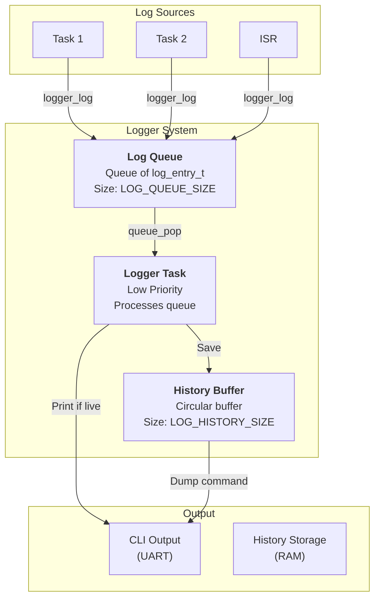
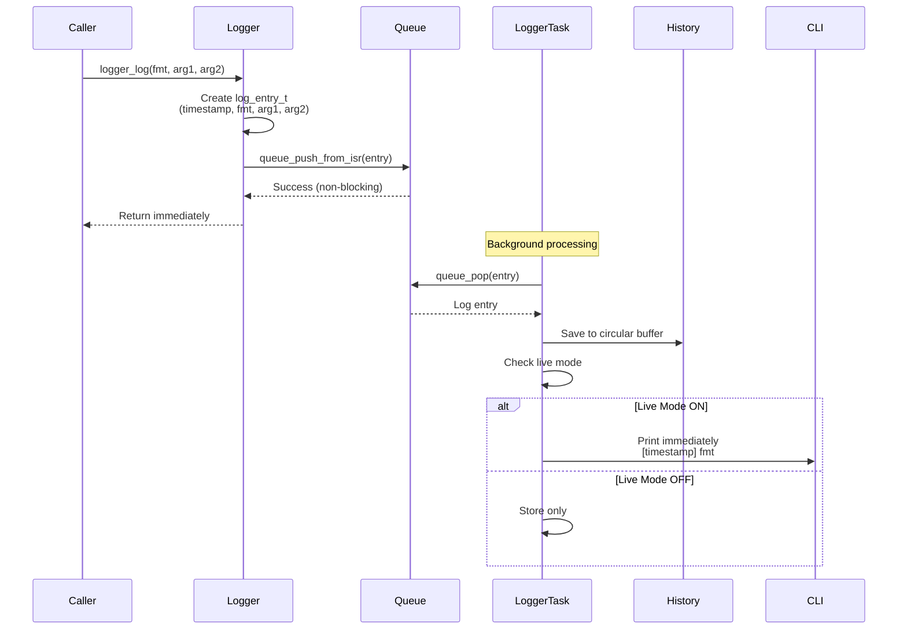

# Logger Architecture

## Table of Contents

- [Overview](#overview)
  - [Key Features](#key-features)
- [Architecture](#architecture)
- [Data Structures](#data-structures)
  - [Log Entry Structure](#log-entry-structure)
  - [History Buffer](#history-buffer)
- [Algorithms](#algorithms)
  - [Logging Flow](#logging-flow)
  - [History Management](#history-management)
- [Concurrency & Thread Safety](#concurrency--thread-safety)
- [Performance Analysis](#performance-analysis)
  - [Time Complexity](#time-complexity)
  - [Space Complexity](#space-complexity)
- [Configuration Parameters](#configuration-parameters)
- [Example Scenarios](#example-scenarios)
  - [Scenario 1: Basic Logging](#scenario-1-basic-logging)
  - [Scenario 2: Live Logging Mode](#scenario-2-live-logging-mode)
  - [Scenario 3: Log History Dump](#scenario-3-log-history-dump)
- [CLI Integration](#cli-integration)
- [API Reference](#api-reference)
- [Appendix: Code Snippets](#appendix-code-snippets)

---

## Overview

The soRTOS logger provides a **deferred, non-blocking logging system** designed for real-time embedded systems. Log entries are queued and processed by a background task, ensuring that logging operations never block the calling task or interrupt service routine.

The logger is particularly useful for:
*   **Debugging:** Track system events and state changes
*   **Diagnostics:** Monitor system health and performance
*   **Audit Trails:** Maintain a history of important events
*   **ISR Logging:** Safe logging from interrupt context

### Key Features

*   **Non-Blocking:** Logging never blocks the caller
*   **ISR Safe:** Can be called from interrupt context
*   **Deferred Processing:** Background task handles formatting and output
*   **History Buffer:** Maintains a circular buffer of recent log entries
*   **Live Mode:** Optional immediate printing of log entries
*   **CLI Integration:** Built-in commands for log management
*   **Compile-Time Disable:** Can be completely removed when `LOG_ENABLE=0`

---

## Architecture



---

## Data Structures

### Log Entry Structure

```c
typedef struct {
    uint32_t timestamp;      /* System tick when logged */
    const char *fmt;         /* Format string pointer */
    uintptr_t arg1;          /* First argument */
    uintptr_t arg2;          /* Second argument */
} log_entry_t;
```

**Key Fields:**

*   **`timestamp`**: System tick count when the log entry was created
*   **`fmt`**: Pointer to format string (stored as pointer, not copied)
*   **`arg1` / `arg2`**: Two arguments that can be inserted into the format string

**Note:** The format string is stored as a pointer, so it must remain valid (typically a string literal).

### History Buffer

The logger maintains a circular buffer of recent log entries:

```c
static log_entry_t log_history[LOG_HISTORY_SIZE];
static uint32_t log_head = 0;   /* Write index */
static uint32_t log_count = 0;  /* Total items in buffer */
```

**Circular Buffer Properties:**

*   **Fixed Size:** `LOG_HISTORY_SIZE` entries (default 128)
*   **Overwrite Behavior:** When full, oldest entries are overwritten
*   **Head Pointer:** Points to the next write location
*   **Count:** Tracks how many entries are currently stored

---

## Algorithms

### Logging Flow



**Implementation:**

```c
void logger_log(const char *fmt, uintptr_t arg1, uintptr_t arg2) {
    if (!log_queue) return;

    log_entry_t entry;
    entry.timestamp = (uint32_t)platform_get_ticks();
    entry.fmt = fmt;
    entry.arg1 = arg1;
    entry.arg2 = arg2;

    /* Use ISR version to avoid blocking */
    queue_push_from_isr(log_queue, &entry);
}
```

### History Management

The logger task saves every log entry to the history buffer:

```c
static void logger_task_entry(void *arg) {
    log_entry_t entry;

    while (1) {
        /* Block until a log entry arrives */
        if (queue_pop(log_queue, &entry) == 0) {
            
            /* Save to history buffer */
            log_history[log_head] = entry;
            log_head = (log_head + 1) % LOG_HISTORY_SIZE;
            if (log_count < LOG_HISTORY_SIZE) {
                log_count++;
            }

            /* If live mode is enabled, print immediately */
            if (log_live) {
                uint32_t time_sec = entry.timestamp / 1000;
                uint32_t time_ms = entry.timestamp % 1000;
                
                cli_printf("[%u.%03u] ", time_sec, time_ms);
                cli_printf(entry.fmt, entry.arg1, entry.arg2);
                cli_printf("\r\n");
            }
        }
    }
}
```

**Circular Buffer Logic:**

```
Initial state: head=0, count=0
[Empty buffer]

After 3 entries: head=3, count=3
[Entry 0] [Entry 1] [Entry 2] [Empty] ...
  ↑head

After LOG_HISTORY_SIZE entries: head=0, count=LOG_HISTORY_SIZE
[Oldest] [Entry 1] ... [Newest] [Entry 0]
  ↑head (wrapped around)

When full, new entries overwrite oldest:
[New Entry] [Entry 1] ... [Entry N-1] [Entry 0]
  ↑head
```

---

## Concurrency & Thread Safety

The logger uses a **queue** for thread-safe communication:

*   **Producer Side (logger_log):** Uses `queue_push_from_isr()` which is non-blocking and ISR-safe
*   **Consumer Side (logger_task):** Uses `queue_pop()` which blocks when the queue is empty

**Safety Guarantees:**

*   **ISR Safe:** `logger_log()` can be called from any interrupt
*   **Task Safe:** Multiple tasks can log simultaneously
*   **Non-Blocking:** Logging never blocks the caller
*   **Queue Protection:** The underlying queue provides spinlock protection

**Potential Issues:**

*   **Queue Full:** If the queue fills up, new log entries are dropped (non-blocking push fails silently)
*   **Format String Lifetime:** Format strings must remain valid (use string literals)

---

## Performance Analysis

### Time Complexity

| Operation | Complexity | Notes |
|:----------|:-----------|:------|
| `logger_log` | $O(1)$ | Queue push (non-blocking) |
| History save | $O(1)$ | Array write with modulo |
| History dump | $O(N)$ | N = number of entries in history |
| Live printing | $O(M)$ | M = length of formatted string |

### Space Complexity

| Structure | Space | Notes |
|:----------|:------|:------|
| Log queue | $O(Q)$ | Q = `LOG_QUEUE_SIZE` entries |
| History buffer | $O(H)$ | H = `LOG_HISTORY_SIZE` entries |
| Per log entry | 16 bytes | `sizeof(log_entry_t)` |
| Total | $O(Q + H)$ | Static allocation |

**Example (default config):**
- Queue: 64 entries × 16 bytes = 1,024 bytes
- History: 128 entries × 16 bytes = 2,048 bytes
- **Total: ~3 KB**

---

## Configuration Parameters

Tunable parameters in `config/project_config.h`:

| Macro | Default | Description |
|:------|:--------|:------------|
| `LOG_ENABLE` | 1 | Enable/disable logging (0 removes all code) |
| `LOG_QUEUE_SIZE` | 64 | Number of log entries in the queue |
| `LOG_HISTORY_SIZE` | 128 | Number of entries in history buffer |

**Tuning Guidelines:**

**For Memory-Constrained Systems:**
```c
#define LOG_QUEUE_SIZE 32      /* Reduce queue size */
#define LOG_HISTORY_SIZE 64    /* Reduce history */
```

**For High-Volume Logging:**
```c
#define LOG_QUEUE_SIZE 128     /* Larger queue */
#define LOG_HISTORY_SIZE 256   /* More history */
```

**To Disable Logging Completely:**
```c
#define LOG_ENABLE 0           /* Removes all logging code */
```

---

## Example Scenarios

### Scenario 1: Basic Logging

**Setup:**
- Logger initialized
- Live mode: OFF
- Tasks logging events

**Code:**

```c
void sensor_task(void *arg) {
    int value = read_sensor();
    logger_log("Sensor value: %d", value, 0);
}

void control_task(void *arg) {
    logger_log("Control loop iteration", 0, 0);
}
```

**Result:**
- Log entries are queued
- Logger task saves them to history
- No immediate output (live mode off)
- Entries can be viewed later with `log dump` command

### Scenario 2: Live Logging Mode

**Setup:**
- Logger initialized
- User enables live mode via CLI: `log live on`

**Timeline:**

```
t=0: User enables live mode
    CLI> log live on
    → log_live = 1

t=1: Task logs event
    logger_log("Task started", 0, 0)
    → Entry queued
    → Logger task processes entry
    → Prints: [1.234] Task started

t=2: ISR logs event
    logger_log("ISR fired: %d", count, 0)
    → Entry queued
    → Logger task processes entry
    → Prints: [1.567] ISR fired: 42
```

**Output:**
```
[1.234] Task started
[1.567] ISR fired: 42
[2.100] Control loop iteration
```

### Scenario 3: Log History Dump

**Setup:**
- History buffer contains 50 entries
- User runs: `log dump`

**Process:**

```c
/* CLI command handler */
static int cmd_log_handler(int argc, char **argv) {
    if (utils_strcmp(argv[1], "dump") == 0) {
        cli_printf("--- Log History (%u entries) ---\r\n", log_count);
        
        /* Calculate start index (oldest entry) */
        uint32_t idx = (log_head + LOG_HISTORY_SIZE - log_count) % LOG_HISTORY_SIZE;
        
        for (uint32_t i = 0; i < log_count; i++) {
            log_entry_t *e = &log_history[idx];
            
            uint32_t time_sec = e->timestamp / 1000;
            uint32_t time_ms = e->timestamp % 1000;
            
            cli_printf("[%u.%03u] ", time_sec, time_ms);
            cli_printf(e->fmt, e->arg1, e->arg2);
            cli_printf("\r\n");
            
            idx = (idx + 1) % LOG_HISTORY_SIZE;
        }
        cli_printf("--- End ---\r\n");
    }
}
```

**Output:**
```
--- Log History (50 entries) ---
[0.123] System initialized
[0.456] Task 1 started
[0.789] Sensor value: 42
[1.012] ISR fired: 5
...
[5.678] Control loop iteration
--- End ---
```

---

## CLI Integration

The logger provides built-in CLI commands:

**Commands:**

| Command | Description |
|:--------|:------------|
| `log dump` | Display all entries in history buffer |
| `log live on` | Enable live logging (print immediately) |
| `log live off` | Disable live logging (store only) |
| `log clear` | Clear the history buffer |

**Usage Examples:**

```
CLI> log dump
--- Log History (128 entries) ---
[0.000] System started
[0.100] Task created: sensor
[0.200] Task created: control
...

CLI> log live on
Live Logging: ON

CLI> log live off
Live Logging: OFF

CLI> log clear
Log cleared.
```

---

## API Reference

| Function | Description | Thread Safe? | ISR Safe? |
|:---------|:------------|:-------------|:----------|
| `logger_init` | Initialize logger system | No (call at startup) | No |
| `logger_log` | Log a message | Yes | **Yes** |
| `logger_get_queue` | Get logger queue (debug) | Yes | No |

**Function Signatures:**

```c
void logger_init(void);
void logger_log(const char *fmt, uintptr_t arg1, uintptr_t arg2);
queue_t* logger_get_queue(void);
```

**Format String Limitations:**

The logger supports a simplified format string with two arguments:
- `%d`, `%u`, `%x`: Integer formatting
- `%s`: String (via pointer)
- `%p`: Pointer

**Note:** The actual formatting is handled by `cli_printf()`, which may have its own limitations.

---

## Appendix: Code Snippets

### Initialization

```c
void logger_init(void) {
    /* Create a queue to hold binary log events */
    log_queue = queue_create(sizeof(log_entry_t), LOG_QUEUE_SIZE);
    
    if (log_queue) {
        /* Create the logger task with LOW priority */
        task_create(logger_task_entry, NULL, STACK_SIZE_1KB, TASK_WEIGHT_LOW);
        
        /* Register the CLI command */
        cli_register_command(&log_cmd);
    }
}
```

### Logging from Task

```c
void my_task(void *arg) {
    int value = 42;
    uint32_t count = 100;
    
    logger_log("Task started with value: %d", value, 0);
    logger_log("Processing item %u", count, 0);
    logger_log("Task completed", 0, 0);
}
```

### Logging from ISR

```c
void uart_rx_isr(void) {
    static uint32_t rx_count = 0;
    rx_count++;
    
    logger_log("UART RX: %u bytes received", rx_count, 0);
}
```

### Accessing History Programmatically

```c
/* Get the logger queue for custom processing */
queue_t *q = logger_get_queue();

/* Or access history buffer directly (if needed) */
/* Note: This requires modifying logger.c to export the buffer */
```

### Compile-Time Disable

```c
#if LOG_ENABLE
    logger_log("This will be compiled", 0, 0);
#else
    /* This code is removed when LOG_ENABLE=0 */
#endif
```

**When `LOG_ENABLE=0`:**
- All logging code is removed
- `logger_log()` becomes a no-op macro
- No memory overhead
- No performance impact
