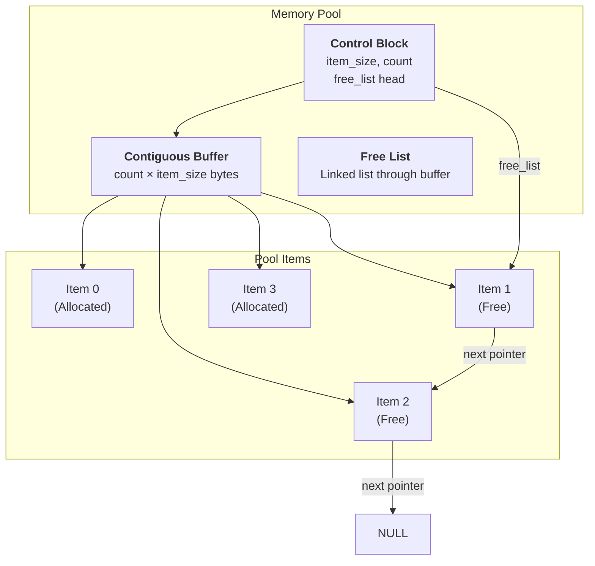
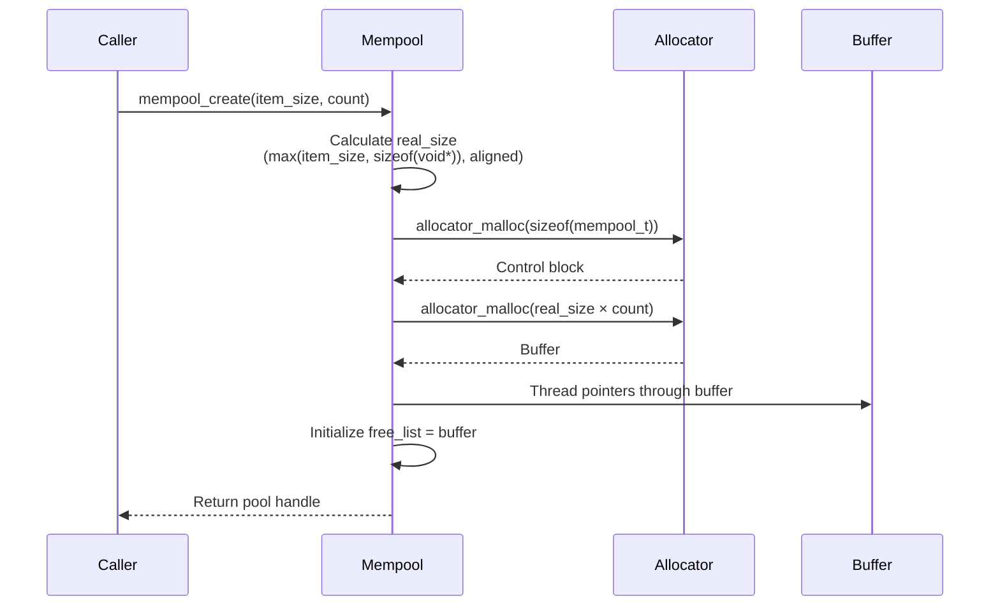
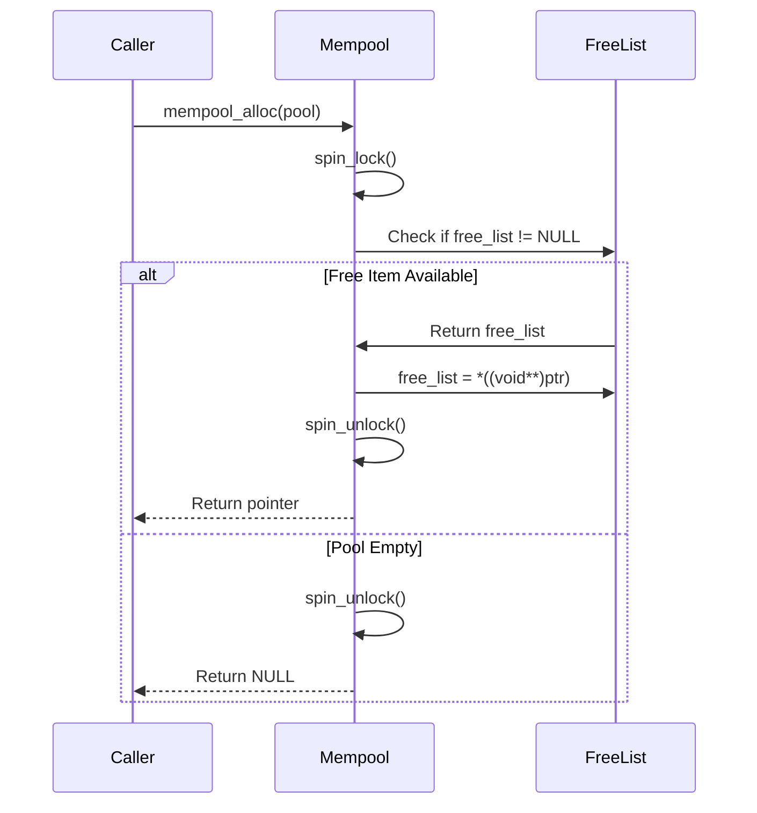
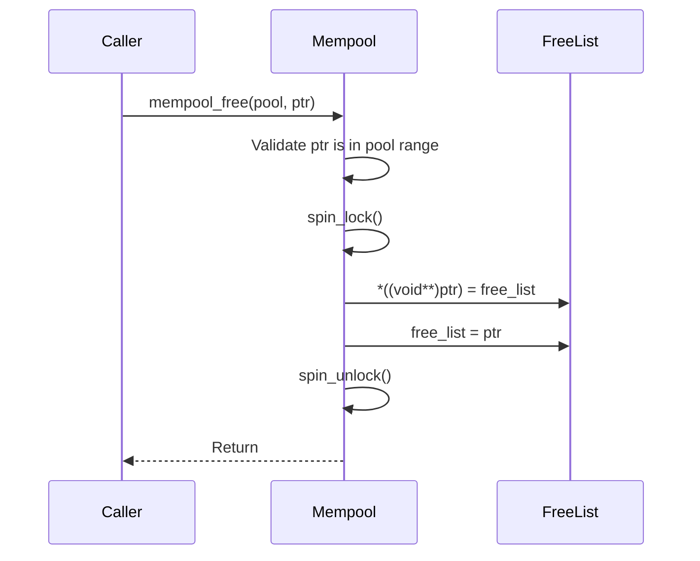

# Memory Pool Architecture

## Table of Contents

- [Overview](#overview)
  - [Key Features](#key-features)
- [Architecture](#architecture)
- [Data Structures](#data-structures)
  - [Memory Pool Structure](#memory-pool-structure)
  - [Free List Organization](#free-list-organization)
- [Algorithms](#algorithms)
  - [Pool Creation](#pool-creation)
  - [Allocation](#allocation)
  - [Deallocation](#deallocation)
- [Concurrency & Thread Safety](#concurrency--thread-safety)
- [Performance Analysis](#performance-analysis)
  - [Time Complexity](#time-complexity)
  - [Space Complexity](#space-complexity)
  - [Fragmentation Analysis](#fragmentation-analysis)
- [Use Cases](#use-cases)
- [Example Scenarios](#example-scenarios)
  - [Scenario 1: Fixed-Size Buffer Pool](#scenario-1-fixed-size-buffer-pool)
  - [Scenario 2: Timer Pool](#scenario-2-timer-pool)
- [API Reference](#api-reference)
- [Appendix: Code Snippets](#appendix-code-snippets)

---

## Overview

The soRTOS memory pool provides a **fixed-size memory allocator** that pre-allocates a contiguous block of memory and divides it into equal-sized items. This eliminates fragmentation and provides O(1) allocation/deallocation performance, making it ideal for real-time systems.

Memory pools are particularly useful for:
*   **Fixed-Size Objects:** Allocating objects of the same size repeatedly
*   **Buffer Pools:** Managing fixed-size buffers (e.g., network packets)
*   **Timer Pools:** Pre-allocating timer structures
*   **Real-Time Guarantees:** Deterministic allocation time

### Key Features

*   **O(1) Performance:** Constant-time allocation and deallocation
*   **Zero Fragmentation:** All items are the same size
*   **Thread Safe:** Protected by spinlock
*   **Bounded Memory:** Predictable memory usage
*   **Fast:** Simple linked list operations

---

## Architecture



---

## Data Structures

### Memory Pool Structure

```c
struct mempool {
    void        *buffer;        /* Contiguous memory block */
    size_t      item_size;      /* Size of one item (aligned) */
    size_t      count;          /* Total capacity */
    void        *free_list;     /* Head of the free list */
    spinlock_t  lock;           /* Protection lock */
};
```

**Key Fields:**

*   **`buffer`**: Pointer to the pre-allocated contiguous memory block
*   **`item_size`**: Size of each item (aligned to pointer size)
*   **`count`**: Total number of items in the pool
*   **`free_list`**: Head pointer of the free list (NULL-terminated linked list)
*   **`lock`**: Spinlock protecting pool operations

### Free List Organization

The free list is implemented by **embedding pointers within the free items themselves**:

```c
/* Free item layout */
struct free_item {
    void *next;  /* Pointer to next free item (or NULL) */
    /* ... remaining space available for user data ... */
};
```

**Visual Representation:**

```
Pool with 4 items (item_size = 64 bytes):

Buffer Layout:
[Item 0: Allocated] [Item 1: Free] [Item 2: Free] [Item 3: Allocated]
                     ↑next→Item 2    ↑next→NULL

Free List:
free_list → Item 1 → Item 2 → NULL
```

**Key Insight:** When an item is free, its first `sizeof(void*)` bytes are used as a pointer to the next free item. When allocated, this space is available to the user.

---

## Algorithms

### Pool Creation



**Implementation:**

```c
mempool_t* mempool_create(size_t item_size, size_t count) {
    /* Ensure item_size is at least pointer-sized and aligned */
    size_t real_size = item_size;
    if (real_size < sizeof(void*)) {
        real_size = sizeof(void*);
    }
    real_size = ALIGN(real_size);

    /* Allocate control block */
    mempool_t *pool = allocator_malloc(sizeof(mempool_t));
    if (!pool) return NULL;

    /* Allocate buffer */
    pool->buffer = allocator_malloc(real_size * count);
    if (!pool->buffer) {
        allocator_free(pool);
        return NULL;
    }

    pool->item_size = real_size;
    pool->count = count;
    spinlock_init(&pool->lock);

    /* Initialize free list by threading pointers */
    uint8_t *ptr = (uint8_t*)pool->buffer;
    pool->free_list = ptr;

    for (size_t i = 0; i < count - 1; i++) {
        void **next_link = (void**)ptr;
        *next_link = (ptr + real_size);  /* Link to next item */
        ptr += real_size;
    }
    
    /* Last item points to NULL */
    *((void**)ptr) = NULL;

    return pool;
}
```

**Pointer Threading Example:**

For a pool with 4 items (real_size = 64):

```
Initial state:
Buffer: [Item 0] [Item 1] [Item 2] [Item 3]

After threading:
Item 0: next = &Item 1
Item 1: next = &Item 2
Item 2: next = &Item 3
Item 3: next = NULL

free_list = &Item 0
```

### Allocation



**Implementation:**

```c
void* mempool_alloc(mempool_t *pool) {
    if (!pool) return NULL;

    uint32_t flags = spin_lock(&pool->lock);

    void *ptr = pool->free_list;
    if (ptr) {
        /* Move head to next free item */
        pool->free_list = *((void**)ptr);
    }

    spin_unlock(&pool->lock, flags);
    return ptr;
}
```

**Allocation Example:**

```
Before allocation:
free_list → Item 1 → Item 2 → NULL

After mempool_alloc():
free_list → Item 2 → NULL
Return: Item 1 (now allocated)
```

### Deallocation



**Implementation:**

```c
void mempool_free(mempool_t *pool, void *ptr) {
    if (!pool || !ptr) return;

    /* Validate pointer is within pool range */
    uintptr_t start = (uintptr_t)pool->buffer;
    uintptr_t end = start + (pool->count * pool->item_size);
    uintptr_t p = (uintptr_t)ptr;

    if (p < start || p >= end) return;

    uint32_t flags = spin_lock(&pool->lock);

    /* Push onto head of free list */
    *((void**)ptr) = pool->free_list;
    pool->free_list = ptr;

    spin_unlock(&pool->lock, flags);
}
```

**Deallocation Example:**

```
Before deallocation:
free_list → Item 2 → NULL
Item 1 is allocated

After mempool_free(pool, Item 1):
free_list → Item 1 → Item 2 → NULL
```

---

## Concurrency & Thread Safety

The memory pool is protected by a **spinlock**:

```c
struct mempool {
    spinlock_t lock;  /* Protects all operations */
    /* ... */
};
```

**Critical Sections:**

*   **Allocation:** Locked to prevent race conditions
*   **Deallocation:** Locked to prevent corruption of free list
*   **Validation:** Pointer range check is done outside lock (read-only)

**Safety Guarantees:**

*   **Thread Safe:** Multiple tasks can allocate/free simultaneously
*   **ISR Safe:** Spinlocks can be used from interrupt context
*   **No Double-Free Protection:** Caller must ensure items aren't freed twice

---

## Performance Analysis

### Time Complexity

| Operation | Complexity | Notes |
|:----------|:-----------|:------|
| `mempool_create` | $O(N)$ | N = count (threads pointers) |
| `mempool_alloc` | $O(1)$ | Single pointer dereference |
| `mempool_free` | $O(1)$ | Single pointer assignment |
| `mempool_delete` | $O(1)$ | Two free operations |

### Space Complexity

| Structure | Space | Notes |
|:----------|:------|:------|
| Control block | $O(1)$ | Fixed size: `sizeof(mempool_t)` |
| Buffer | $O(N \times S)$ | N = count, S = item_size |
| Free list overhead | $0$ | Uses embedded pointers |
| **Total** | $O(N \times S)$ | Linear in pool size |

**Example:**
- Pool: 100 items × 64 bytes = 6,400 bytes
- Control block: ~32 bytes
- **Total: ~6.4 KB**

### Fragmentation Analysis

**Internal Fragmentation:**

If `item_size` is smaller than `sizeof(void*)`, the pool automatically increases it:

```c
if (real_size < sizeof(void*)) {
    real_size = sizeof(void*);
}
```

**Waste per item:** `real_size - item_size` (if item_size < sizeof(void*))

**External Fragmentation:**

**Zero external fragmentation!** All items are the same size, so any free item can satisfy any allocation request.

**Fragmentation Ratio:**

$$
\text{Fragmentation} = \frac{\text{Free Items}}{\text{Total Items}}
$$

A high ratio indicates the pool is underutilized, but there's no fragmentation penalty.

---

## Use Cases

**1. Network Packet Buffers:**

```c
#define PACKET_SIZE 256
#define NUM_PACKETS 32

mempool_t *packet_pool = mempool_create(PACKET_SIZE, NUM_PACKETS);

void *packet = mempool_alloc(packet_pool);
/* Use packet... */
mempool_free(packet_pool, packet);
```

**2. Timer Structures:**

```c
/* Timer pool (used by timer.c) */
timer_pool = mempool_create(sizeof(sw_timer_t), max_timers);
```

**3. Fixed-Size Message Buffers:**

```c
typedef struct {
    uint32_t type;
    uint8_t data[64];
} message_t;

mempool_t *msg_pool = mempool_create(sizeof(message_t), 16);
```

---

## Example Scenarios

### Scenario 1: Fixed-Size Buffer Pool

**Setup:**
- Pool: 4 items, 64 bytes each
- Tasks allocating and freeing buffers

**Timeline:**

```
t=0: Pool created
    free_list → Item 0 → Item 1 → Item 2 → Item 3 → NULL

t=1: Task A allocates
    mempool_alloc(pool)
    → Return: Item 0
    → free_list → Item 1 → Item 2 → Item 3 → NULL

t=2: Task B allocates
    mempool_alloc(pool)
    → Return: Item 1
    → free_list → Item 2 → Item 3 → NULL

t=3: Task A frees Item 0
    mempool_free(pool, Item 0)
    → free_list → Item 0 → Item 2 → Item 3 → NULL

t=4: Task C allocates
    mempool_alloc(pool)
    → Return: Item 0 (LIFO: most recently freed)
    → free_list → Item 2 → Item 3 → NULL
```

**Key Observation:** LIFO (Last-In-First-Out) allocation provides better cache locality.

### Scenario 2: Timer Pool

**Setup:**
- Timer subsystem uses a memory pool for timer structures
- Prevents heap fragmentation from frequent timer create/delete

**Code:**

```c
/* In timer.c */
static mempool_t *timer_pool = NULL;

void timer_service_init(uint32_t max_timers) {
    timer_pool = mempool_create(sizeof(sw_timer_t), max_timers);
}

sw_timer_t* timer_create(...) {
    sw_timer_t *tmr = mempool_alloc(timer_pool);
    /* Initialize timer... */
    return tmr;
}

void timer_delete(sw_timer_t *timer) {
    timer_stop(timer);
    mempool_free(timer_pool, timer);
}
```

**Benefits:**
- No heap fragmentation
- O(1) allocation/deallocation
- Bounded memory usage

---

## API Reference

| Function | Description | Thread Safe? | Time Complexity |
|:---------|:------------|:-------------|:----------------|
| `mempool_create` | Create a memory pool | No (call at init) | $O(N)$ |
| `mempool_alloc` | Allocate an item | Yes | $O(1)$ |
| `mempool_free` | Free an item | Yes | $O(1)$ |
| `mempool_delete` | Delete pool | Yes | $O(1)$ |

**Function Signatures:**

```c
mempool_t* mempool_create(size_t item_size, size_t count);
void* mempool_alloc(mempool_t *pool);
void mempool_free(mempool_t *pool, void *ptr);
void mempool_delete(mempool_t *pool);
```

---

## Appendix: Code Snippets

### Creating and Using a Pool

```c
/* Create a pool for 32-byte buffers */
mempool_t *buffer_pool = mempool_create(32, 10);

/* Allocate a buffer */
void *buf = mempool_alloc(buffer_pool);
if (buf) {
    /* Use buffer... */
    memcpy(buf, data, 32);
    
    /* Free when done */
    mempool_free(buffer_pool, buf);
}

/* Clean up */
mempool_delete(buffer_pool);
```

### Pool for Custom Structures

```c
typedef struct {
    uint32_t id;
    uint8_t data[60];
} my_struct_t;

mempool_t *struct_pool = mempool_create(sizeof(my_struct_t), 20);

my_struct_t *obj = (my_struct_t*)mempool_alloc(struct_pool);
if (obj) {
    obj->id = 42;
    /* Use obj... */
    mempool_free(struct_pool, obj);
}
```

### Handling Pool Exhaustion

```c
void *buf = mempool_alloc(pool);
if (!buf) {
    /* Pool is empty - handle error */
    logger_log("Pool exhausted!", 0, 0);
    return;
}
/* Use buf... */
```

### Calculating Pool Size

```c
/* Determine pool size based on requirements */
size_t item_size = 128;  /* Bytes per item */
size_t max_items = 50;   /* Maximum concurrent items */

mempool_t *pool = mempool_create(item_size, max_items);

/* Total memory: item_size × max_items + sizeof(mempool_t) */
size_t total_memory = item_size * max_items + sizeof(mempool_t);
```
