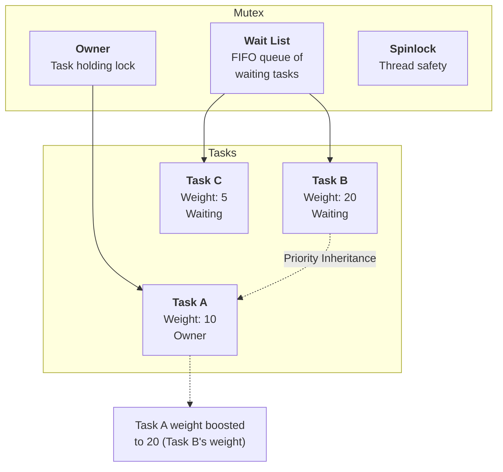
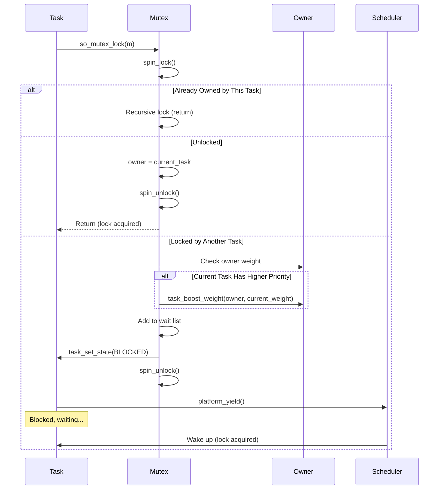
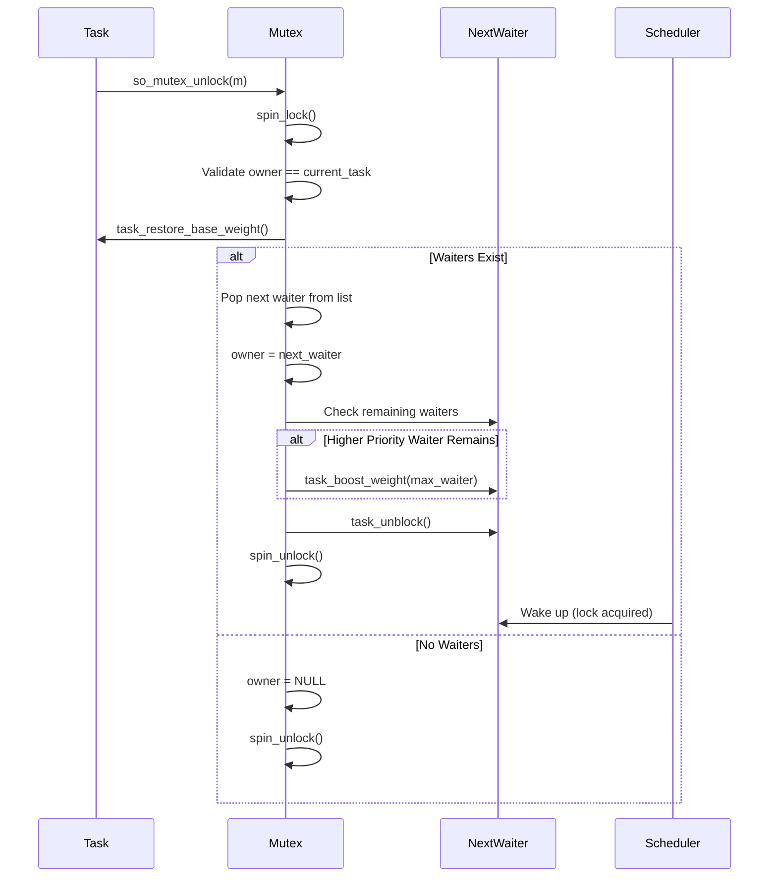

# Mutex Architecture

## Table of Contents

- [Overview](#overview)
  - [Key Features](#key-features)
- [Architecture](#architecture)
- [Data Structures](#data-structures)
  - [Mutex Structure](#mutex-structure)
  - [Wait Node Integration](#wait-node-integration)
- [Algorithms](#algorithms)
  - [Lock Acquisition](#lock-acquisition)
  - [Lock Release](#lock-release)
  - [Priority Inheritance](#priority-inheritance)
- [Concurrency & Thread Safety](#concurrency--thread-safety)
- [Performance Analysis](#performance-analysis)
  - [Time Complexity](#time-complexity)
  - [Space Complexity](#space-complexity)
- [Example Scenarios](#example-scenarios)
  - [Scenario 1: Basic Mutex Usage](#scenario-1-basic-mutex-usage)
  - [Scenario 2: Priority Inheritance](#scenario-2-priority-inheritance)
  - [Scenario 3: Recursive Locking](#scenario-3-recursive-locking)
- [API Reference](#api-reference)
- [Appendix: Code Snippets](#appendix-code-snippets)

---

## Overview

The soRTOS mutex provides a **mutual exclusion lock** with **priority inheritance** to prevent priority inversion. It ensures that only one task can hold the lock at a time, and automatically boosts the priority of the lock holder when a higher-priority task is waiting.

Mutexes are particularly useful for:
*   **Critical Sections:** Protecting shared resources
*   **Data Structures:** Ensuring atomic access to data
*   **Device Drivers:** Serializing hardware access
*   **Real-Time Systems:** Preventing priority inversion

### Key Features

*   **Mutual Exclusion:** Only one task can hold the lock
*   **Priority Inheritance:** Automatically prevents priority inversion
*   **Recursive Locking:** Same task can lock multiple times
*   **Zero-Malloc Blocking:** Uses embedded wait nodes
*   **Direct Handoff:** Lock ownership transferred directly to next waiter

---

## Architecture



---

## Data Structures

### Mutex Structure

```c
typedef struct {
    spinlock_t lock;      /* Protection lock */
    void *owner;          /* Task holding the lock (NULL if unlocked) */
    wait_node_t *wait_head;  /* Head of waiting tasks list */
    wait_node_t *wait_tail;  /* Tail of waiting tasks list */
} so_mutex_t;
```

**Key Fields:**

*   **`owner`**: Pointer to the task currently holding the mutex (NULL if unlocked)
*   **`wait_head` / `wait_tail`**: FIFO queue of tasks waiting for the lock
*   **`lock`**: Spinlock protecting mutex operations

### Wait Node Integration

Tasks use their embedded `wait_node_t` to block on mutexes:

```c
typedef struct wait_node {
    void *task;              /* Backpointer to owning task */
    struct wait_node *next;  /* Link for wait queues */
} wait_node_t;
```

**Zero-Malloc Design:** Each task has a pre-allocated wait node, eliminating dynamic allocation during blocking.

---

## Algorithms

### Lock Acquisition



**Implementation:**

```c
void so_mutex_lock(so_mutex_t *m) {
    task_t *current_task = task_get_current();
    wait_node_t *node = task_get_wait_node(current_task);

    while(1) {
        uint32_t flags = spin_lock(&m->lock);
        
        /* Check if we already own it (recursive) */
        if (m->owner == current_task) {
            spin_unlock(&m->lock, flags);
            return;
        }
        
        /* If unlocked, take ownership */
        if (m->owner == NULL) {
            m->owner = current_task;
            spin_unlock(&m->lock, flags);
            return;
        }

        /* Boost owner if we have higher priority */
        task_t *owner = (task_t*)m->owner;
        uint8_t curr_w = task_get_weight(current_task);
        if (curr_w > task_get_weight(owner)) {
            task_boost_weight(owner, curr_w);
        }

        /* Add to wait queue and block */
        _add_to_wait_list(&m->wait_head, &m->wait_tail, node);
        task_set_state(current_task, TASK_BLOCKED);

        spin_unlock(&m->lock, flags);
        platform_yield();
    }
}
```

**Key Points:**

*   **Recursive Locking:** Same task can lock multiple times (no deadlock)
*   **Priority Inheritance:** Owner's weight is boosted to highest waiter's weight
*   **Blocking:** Task blocks and yields CPU if lock is held

### Lock Release



**Implementation:**

```c
void so_mutex_unlock(so_mutex_t *m) {
    uint32_t flags = spin_lock(&m->lock);

    /* Only the owner can unlock */
    task_t *current = task_get_current();
    if(m->owner != current) {
        spin_unlock(&m->lock, flags);
        return;
    }

    /* Restore original priority */
    task_restore_base_weight(current);

    /* If tasks are waiting, perform direct handoff */
    void *next_task = _pop_from_wait_list(&m->wait_head, &m->wait_tail);
    if (next_task) {
        task_t *next = (task_t*)next_task;
        
        /* Pass ownership directly */
        m->owner = next;
        
        /* Check if new owner needs priority boost from remaining waiters */
        uint8_t max_waiter = _get_max_waiter_weight(m->wait_head);
        if (max_waiter > task_get_weight(next)) {
            task_boost_weight(next, max_waiter);
        }
        
        task_unblock(next);
    } else {
        /* No one waiting, clear ownership */
        m->owner = NULL;
    }

    spin_unlock(&m->lock, flags);
}
```

**Key Points:**

*   **Direct Handoff:** Lock ownership transferred directly to next waiter (no unlock/lock cycle)
*   **Priority Restoration:** Owner's weight is restored to base weight
*   **Cascading Boost:** New owner may need priority boost from remaining waiters

### Priority Inheritance

Priority inheritance prevents **priority inversion**, where a high-priority task is blocked by a low-priority task holding a resource.

**Algorithm:**

1. When a high-priority task blocks on a mutex held by a low-priority task:
   ```c
   if (curr_w > task_get_weight(owner)) {
       task_boost_weight(owner, curr_w);
   }
   ```

2. When the lock is released, the owner's weight is restored:
   ```c
   task_restore_base_weight(current);
   ```

3. The new owner may need a boost if higher-priority tasks are still waiting:
   ```c
   uint8_t max_waiter = _get_max_waiter_weight(m->wait_head);
   if (max_waiter > task_get_weight(next)) {
       task_boost_weight(next, max_waiter);
   }
   ```

**Visual Example:**

```
Initial State:
- Task L (Low, weight=1): Holds mutex
- Task M (Medium, weight=5): Running
- Task H (High, weight=10): Ready

Timeline:
t=0: Task H tries to lock → blocked
    → Task L weight boosted to 10
    → Task L now runs (preempts Task M)

t=1: Task L releases lock
    → Task L weight restored to 1
    → Task H acquires lock and runs
```

---

## Concurrency & Thread Safety

The mutex is protected by a **spinlock**:

```c
typedef struct {
    spinlock_t lock;  /* Protects all operations */
    /* ... */
} so_mutex_t;
```

**Critical Sections:**

*   **Lock acquisition:** Locked to atomically check owner and add to wait list
*   **Lock release:** Locked to atomically transfer ownership
*   **Priority inheritance:** Weight changes are protected

**Safety Guarantees:**

*   **Thread Safe:** Multiple tasks can compete for the lock
*   **ISR Safe:** Spinlocks can be used from interrupt context (though mutex operations from ISRs are not recommended)
*   **Deadlock Prevention:** Recursive locking prevents self-deadlock

---

## Performance Analysis

### Time Complexity

| Operation | Complexity | Notes |
|:----------|:-----------|:------|
| `so_mutex_init` | $O(1)$ | Simple initialization |
| `so_mutex_lock` (uncontended) | $O(1)$ | Direct acquisition |
| `so_mutex_lock` (contended) | $O(1)$ | Add to wait list, block |
| `so_mutex_unlock` (no waiters) | $O(1)$ | Clear owner |
| `so_mutex_unlock` (with waiters) | $O(N)$ | N = number of waiters (to find max weight) |

**Note:** The $O(N)$ complexity in unlock is acceptable because:
*   Typically, few tasks wait on a single mutex
*   The operation is fast (just pointer chasing)
*   Priority inheritance requires checking all waiters

### Space Complexity

| Structure | Space | Notes |
|:----------|:------|:------|
| Mutex | $O(1)$ | Fixed size structure |
| Per waiting task | $O(1)$ | Uses embedded wait node |
| Total | $O(1)$ | No dynamic allocation |

---

## Example Scenarios

### Scenario 1: Basic Mutex Usage

**Setup:**
- Shared resource protected by mutex
- Multiple tasks accessing the resource

**Code:**

```c
so_mutex_t resource_mutex;

void task_a(void *arg) {
    so_mutex_lock(&resource_mutex);
    /* Critical section */
    access_shared_resource();
    so_mutex_unlock(&resource_mutex);
}

void task_b(void *arg) {
    so_mutex_lock(&resource_mutex);
    /* Critical section */
    access_shared_resource();
    so_mutex_unlock(&resource_mutex);
}
```

**Timeline:**

```
t=0: Task A locks mutex
    → owner = Task A

t=1: Task B tries to lock
    → Blocked, added to wait list

t=2: Task A unlocks
    → owner = Task B (direct handoff)
    → Task B wakes and runs
```

### Scenario 2: Priority Inversion

**Setup:**
- Task L (weight=1): Holds mutex
- Task M (weight=5): Medium priority
- Task H (weight=10): High priority, needs mutex

**Without Priority Inheritance:**

```
t=0: Task L holds mutex
t=1: Task H tries to lock → blocked
t=2: Task M preempts Task L
t=3: Task M runs for a long time
t=4: Task L finally runs and releases mutex
t=5: Task H acquires mutex

Problem: Task H waited for Task M (priority inversion!)
```

**With Priority Inheritance:**

```
t=0: Task L holds mutex
t=1: Task H tries to lock → blocked
    → Task L weight boosted to 10
t=2: Task L runs (preempts Task M)
t=3: Task L releases mutex quickly
t=4: Task H acquires mutex

Solution: Task H only waited for Task L (correct!)
```

### Scenario 3: Recursive Locking

**Setup:**
- Task locks mutex, then calls a function that also locks the same mutex

**Code:**

```c
void helper_function(void) {
    so_mutex_lock(&mutex);  /* Recursive lock */
    /* Do work... */
    so_mutex_unlock(&mutex);
}

void main_task(void *arg) {
    so_mutex_lock(&mutex);
    helper_function();  /* Safe: same task */
    so_mutex_unlock(&mutex);
}
```

**Behavior:**
- First lock: Task acquires mutex
- Recursive lock: Returns immediately (already owner)
- First unlock: Does nothing (still locked)
- Second unlock: Actually releases mutex

---

## API Reference

| Function | Description | Thread Safe? | Time Complexity |
|:---------|:------------|:-------------|:----------------|
| `so_mutex_init` | Initialize mutex | No (call at init) | $O(1)$ |
| `so_mutex_lock` | Acquire lock | Yes | $O(1)$ |
| `so_mutex_unlock` | Release lock | Yes | $O(1)$ or $O(N)$ |

**Function Signatures:**

```c
void so_mutex_init(so_mutex_t *m);
void so_mutex_lock(so_mutex_t *m);
void so_mutex_unlock(so_mutex_t *m);
```

---

## Appendix: Code Snippets

### Basic Usage

```c
/* Initialize mutex */
so_mutex_t my_mutex;
so_mutex_init(&my_mutex);

/* Task 1 */
void task1(void *arg) {
    so_mutex_lock(&my_mutex);
    /* Critical section */
    shared_data++;
    so_mutex_unlock(&my_mutex);
}

/* Task 2 */
void task2(void *arg) {
    so_mutex_lock(&my_mutex);
    /* Critical section */
    shared_data--;
    so_mutex_unlock(&my_mutex);
}
```

### Protecting a Shared Resource

```c
static int counter = 0;
static so_mutex_t counter_mutex;

void increment_counter(void) {
    so_mutex_lock(&counter_mutex);
    counter++;
    so_mutex_unlock(&counter_mutex);
}

void decrement_counter(void) {
    so_mutex_lock(&counter_mutex);
    counter--;
    so_mutex_unlock(&counter_mutex);
}
```

### Error Handling

```c
/* Mutex operations don't return errors, but you can check owner */
void try_lock_with_timeout(so_mutex_t *m, uint32_t timeout_ticks) {
    uint32_t start = platform_get_ticks();
    
    while (platform_get_ticks() - start < timeout_ticks) {
        /* Try to lock (non-blocking check would need different API) */
        so_mutex_lock(m);
        /* If we get here, we have the lock */
        return;
    }
    
    /* Timeout - handle error */
}
```

### Priority Inheritance in Action

```c
/* Low priority task */
void low_priority_task(void *arg) {
    so_mutex_lock(&shared_mutex);
    /* Long operation... */
    task_sleep_ticks(100);
    so_mutex_unlock(&shared_mutex);
}

/* High priority task */
void high_priority_task(void *arg) {
    so_mutex_lock(&shared_mutex);  /* Will boost low task's priority */
    /* Quick operation... */
    so_mutex_unlock(&shared_mutex);
}
```
