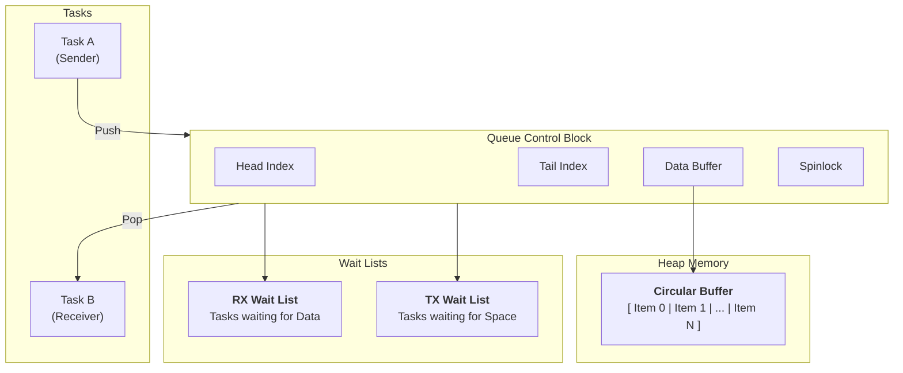
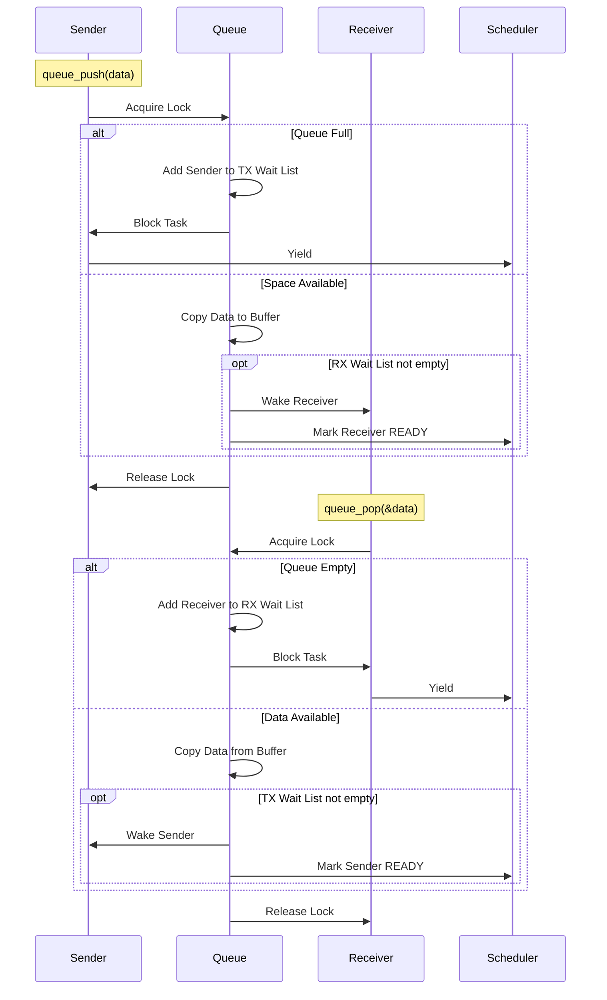

# Queue Architecture

## Table of Contents

- [Overview](#overview)
  - [Key Features](#key-features)
- [Architecture](#architecture)
- [Data Structures](#data-structures)
  - [The Queue Control Block](#the-queue-control-block)
  - [Circular Buffer](#circular-buffer)
  - [Zero-Malloc Blocking (Wait Lists)](#zero-malloc-blocking-wait-lists)
- [Queue Operations](#queue-operations)
  - [High-Level Flow](#high-level-flow)
  - [Push Operation (Blocking)](#push-operation-blocking)
  - [Pop Operation (Blocking)](#pop-operation-blocking)
  - [ISR Operations (Non-Blocking)](#isr-operations-non-blocking)
  - [Batch Operations](#batch-operations)
- [Concurrency & Thread Safety](#concurrency--thread-safety)
  - [Spinlocks](#spinlocks)
  - [Interrupt Safety](#interrupt-safety)
- [Performance Analysis](#performance-analysis)
  - [Time Complexity](#time-complexity)
  - [Space Complexity](#space-complexity)
- [Optimization Techniques](#optimization-techniques)
- [API Reference](#api-reference)
- [Example Scenarios](#example-scenarios)
  - [Scenario 1: Task-to-Task Communication](#scenario-1-task-to-task-communication)
  - [Scenario 2: ISR-to-Task Communication](#scenario-2-isr-to-task-communication)
- [Appendix: Code Snippets](#appendix-code-snippets)

---

## Overview

The soRTOS queue provides a **thread-safe, blocking, First-In-First-Out (FIFO)** mechanism for inter-task communication. It allows tasks to send and receive fixed-size data items safely, bridging the gap between tasks and Interrupt Service Routines (ISRs).

### Key Features
*   **Thread Safety:** Protected by fine-grained spinlocks.
*   **Blocking Semantics:** Tasks sleep efficiently when the queue is full (senders) or empty (receivers).
*   **Zero-Malloc Blocking:** Uses embedded `wait_node_t` in tasks to avoid dynamic allocation during blocking.
*   **ISR Safe:** Dedicated non-blocking API for use in interrupt handlers.
*   **Batch Support:** Optimized block transfers for high throughput.

---

## Architecture



---

## Data Structures

### The Queue Control Block

The queue is defined by the `queue_t` structure, which manages the buffer and synchronization primitives.

```c
struct queue {
    void *buffer;                   /* Pointer to allocated data storage */
    size_t item_size;               /* Size of a single item */
    size_t capacity;                /* Max items */
    size_t count;                   /* Current items */
    size_t head;                    /* Read index */
    size_t tail;                    /* Write index */
    
    wait_node_t *rx_wait_head;      /* Tasks waiting to receive */
    wait_node_t *tx_wait_head;      /* Tasks waiting to send */

    spinlock_t lock;                /* Queue-specific lock */
};
```

### Circular Buffer

Data is stored in a contiguous memory block treated as a ring. Indices wrap around using modular arithmetic:

$$
\text{next\_index} = (\text{current\_index} + 1) \pmod{\text{capacity}}
$$

### Zero-Malloc Blocking (Wait Lists)

To ensure deterministic behavior and avoid memory allocation in critical paths (like `queue_push` when full), the queue utilizes the **embedded wait node** concept found in the scheduler.

*   **RX Wait List:** A linked list of tasks blocked on `queue_pop` (Queue Empty).
*   **TX Wait List:** A linked list of tasks blocked on `queue_push` (Queue Full).

When a task blocks, its pre-allocated `wait_node` is linked into the appropriate list inside the queue structure.

---

## Queue Operations

### High-Level Flow



### Push Operation (Blocking)

1.  **Lock:** Acquire queue spinlock.
2.  **Check Capacity:**
    *   If `count < capacity`:
        *   `memcpy` data to `buffer[tail]`.
        *   Update `tail` and `count`.
        *   **Wake:** If `rx_wait_list` has tasks, pop the head and call `task_unblock()`.
        *   Unlock and return `0`.
    *   If `count == capacity`:
        *   Add current task to `tx_wait_list`.
        *   Set state to `TASK_BLOCKED`.
        *   Unlock and `platform_yield()`.
        *   *On wake-up, retry loop.*

### Pop Operation (Blocking)

1.  **Lock:** Acquire queue spinlock.
2.  **Check Count:**
    *   If `count > 0`:
        *   `memcpy` data from `buffer[head]`.
        *   Update `head` and `count`.
        *   **Wake:** If `tx_wait_list` has tasks, pop the head and call `task_unblock()`.
        *   Unlock and return `0`.
    *   If `count == 0`:
        *   Add current task to `rx_wait_list`.
        *   Set state to `TASK_BLOCKED`.
        *   Unlock and `platform_yield()`.
        *   *On wake-up, retry loop.*

### ISR Operations (Non-Blocking)

ISRs cannot block or yield. The `_from_isr` variants:
1.  Acquire spinlock.
2.  Check condition (Full/Empty).
3.  If operation is impossible, return `-1` immediately.
4.  If possible, perform copy and wake waiting tasks (waking tasks from ISR is safe).
5.  Release spinlock.

### Batch Operations

`queue_push_arr` allows pushing multiple items efficiently.
*   Handles buffer wrapping (may require two `memcpy` calls).
*   Wakes multiple receivers if necessary.
*   Blocks if insufficient space for the *entire* batch (or partial, depending on implementation logic - code shows it writes chunks and blocks on full).

---

## Concurrency & Thread Safety

### Spinlocks

Each queue has its own `spinlock_t`. This ensures that:
1.  Multiple tasks cannot corrupt the buffer indices.
2.  ISRs and Tasks do not race.
3.  Wait list manipulation is atomic.

### Interrupt Safety

*   **Locking:** Spinlocks mask interrupts (on supported architectures) or rely on atomic instructions, making them safe for ISR use.
*   **No Malloc:** Push/Pop operations never allocate memory, preventing reentrancy issues with the allocator.

---

## Performance Analysis

### Time Complexity

| Operation | Complexity | Notes |
|:----------|:-----------|:------|
| `queue_push` | $O(1)$ | Fixed size copy + pointer math |
| `queue_pop` | $O(1)$ | Fixed size copy + pointer math |
| `queue_peek` | $O(1)$ | Read only |
| `queue_push_arr` | $O(N)$ | N = number of items (memcpy) |
| Blocking overhead | $O(1)$ | Linked list insertion |

### Space Complexity

*   **Fixed Overhead:** `sizeof(queue_t)` (small).
*   **Dynamic Buffer:** `capacity * item_size`.
*   **Per-Task Overhead:** `0` (uses existing `task_t` nodes).

---

## Optimization Techniques

### 1. Zero-Copy Blocking
By using the `wait_node` embedded in the `task_t` struct, the queue avoids `malloc` and `free` during blocking/unblocking. This makes the blocking path deterministic and cache-friendly.

### 2. Batch Processing
`queue_push_arr` minimizes lock contention by acquiring the lock once for a large chunk of data, rather than once per item.

### 3. Circular Buffer Math
Indices are updated using modulo arithmetic, which is efficient.
```c
q->tail = (q->tail + 1) % q->capacity;
```

---

## API Reference

| Function | Description | Blocking? | ISR Safe? |
|:---|:---|:---|:---|
| `queue_create` | Allocates queue and buffer | No | No |
| `queue_delete` | Frees resources | No | No |
| `queue_push` | Pushes item to back | **Yes** | No |
| `queue_pop` | Pops item from front | **Yes** | No |
| `queue_peek` | Reads front without removing | No | No |
| `queue_push_from_isr` | Pushes item | No | **Yes** |
| `queue_pop_from_isr` | Pops item | No | **Yes** |
| `queue_push_arr` | Pushes multiple items | **Yes** | No |
| `queue_reset` | Clears data, wakes writers | No | No |

---

## Example Scenarios

### Scenario 1: Task-to-Task Communication

**Setup:**
*   Task A (Sensor Reader) produces data.
*   Task B (Processor) consumes data.

```c
/* Shared Queue */
queue_t *sensor_q = queue_create(sizeof(int), 10);

void task_a(void *arg) {
    int val = 0;
    while(1) {
        val = read_sensor();
        /* Blocks if queue is full */
        queue_push(sensor_q, &val);
        task_sleep_ticks(10);
    }
}

void task_b(void *arg) {
    int val;
    while(1) {
        /* Blocks if queue is empty */
        queue_pop(sensor_q, &val);
        process_data(val);
    }
}
```

### Scenario 2: ISR-to-Task Communication

**Setup:**
*   UART ISR receives bytes.
*   CLI Task processes command lines.

```c
/* UART ISR */
void uart_rx_handler(uint8_t byte) {
    /* Non-blocking push */
    queue_push_from_isr(cli_rx_queue, &byte);
}

/* CLI Task */
void cli_task(void *arg) {
    uint8_t byte;
    while(1) {
        /* Blocks waiting for user input */
        queue_pop(cli_rx_queue, &byte);
        handle_input(byte);
    }
}
```

---

## Appendix: Code Snippets

### Blocking Push Implementation
```c
int queue_push(queue_t *q, const void *item) {
    /* ... setup ... */
    while (1) {
        uint32_t flags = spin_lock(&q->lock);

        if (q->count < q->capacity) {
            /* Copy data */
            uint8_t *target = (uint8_t*)q->buffer + (q->tail * q->item_size);
            utils_memcpy(target, item, q->item_size);
            q->tail = (q->tail + 1) % q->capacity;
            q->count++;

            /* Wake Receiver */
            void *task = _pop_from_wait_list(&q->rx_wait_head, &q->rx_wait_tail);
            if (task) task_unblock((task_t*)task);

            spin_unlock(&q->lock, flags);
            return 0;
        }

        /* Queue Full: Block */
        _add_to_wait_list(&q->tx_wait_head, &q->tx_wait_tail, node);
        task_set_state(current, TASK_BLOCKED);
        spin_unlock(&q->lock, flags);
        
        platform_yield();
    }
}
```

### Wait List Management
```c
static void _add_to_wait_list(wait_node_t **head, wait_node_t **tail, wait_node_t *node) {
    node->next = NULL;
    if (*tail) {
        (*tail)->next = node;
    } else {
        *head = node;
    }
    *tail = node;
}
```