# Scheduler Architecture

## Table of Contents

- [Overview](#overview)
  - [Key Features](#key-features)
- [Architecture](#architecture)
- [Mathematical Foundation](#mathematical-foundation)
  - [Virtual Runtime (vruntime)](#virtual-runtime-vruntime)
  - [Basic Formula](#basic-formula)
  - [Weight-Based Time Allocation](#weight-based-time-allocation)
  - [Time Slice Calculation](#time-slice-calculation)
  - [Virtual Runtime Update](#virtual-runtime-update)
  - [Handling Overflow](#handling-overflow)
- [Scheduling Algorithm](#scheduling-algorithm)
  - [High-Level Flow](#high-level-flow)
  - [Detailed Steps](#detailed-steps)
- [Data Structures](#data-structures)
  - [The Ready Queue (Min-Heap)](#the-ready-queue-min-heap)
  - [Sleep List](#sleep-list)
  - [Zero-Malloc Blocking (The Wait Node)](#zero-malloc-blocking-the-wait-node)
- [Task Lifecycle](#task-lifecycle)
  - [Lifecycle Phases (Alternative View)](#lifecycle-phases-alternative-view)
  - [State Descriptions](#state-descriptions)
  - [State Transitions](#state-transitions)
- [SMP Synchronization](#smp-synchronization)
  - [Locking Hierarchy](#locking-hierarchy)
  - [Lock Ordering Rules](#lock-ordering-rules)
  - [Critical Sections](#critical-sections)
- [Advanced Features](#advanced-features)
  - [Priority Inheritance](#priority-inheritance)
  - [Vruntime Synchronization](#vruntime-synchronization)
  - [Load Balancing (Future Enhancement)](#load-balancing-future-enhancement)
- [Performance Analysis](#performance-analysis)
  - [Time Complexity Summary](#time-complexity-summary)
  - [Space Complexity](#space-complexity)
  - [Fairness Guarantee](#fairness-guarantee)
- [Optimization Techniques](#optimization-techniques)
- [Configuration Parameters](#configuration-parameters)
  - [Tuning Guidelines](#tuning-guidelines)
- [Example Scenarios](#example-scenarios)
  - [Scenario 1: Three Tasks with Different Weights](#scenario-1-three-tasks-with-different-weights)
  - [Scenario 2: Task Blocking and Wake-up with Vruntime Synchronization](#scenario-2-task-blocking-and-wake-up-with-vruntime-synchronization)
  - [Scenario 3: Priority Inversion Prevention](#scenario-3-priority-inversion-prevention)
- [Debugging and Profiling](#debugging-and-profiling)
  - [Stack Overflow Detection](#stack-overflow-detection)
  - [Runtime Statistics](#runtime-statistics)
  - [Heap Validation](#heap-validation)
- [Appendix: Code Snippets](#appendix-code-snippets)

---

## Overview
The soRTOS scheduler is a **preemptive, weighted fair scheduler** designed for **Symmetric Multi-Processing (SMP)**. It implements a variant of **Completely Fair Scheduling (CFS)**, similar to the Linux kernel, ensuring that all ready tasks receive a CPU share proportional to their weight.

### Key features:
*   **Time Complexity:** $O(\log N)$ for task insertion/selection (Min-Heap).
*   **Space Complexity:** $O(1)$ dynamic overhead (uses static/embedded nodes).
*   **Fairness:** Uses virtual runtime (`vruntime`) to prevent starvation while respecting weights.
*   **SMP Support:** Per-CPU runqueues with affinity support.

---

## Architecture


---

## Mathematical Foundation

### Virtual Runtime (vruntime)

The core of the fair scheduler is the **virtual runtime** concept. Each task's `vruntime` represents the amount of CPU time it has consumed, normalized by its weight.

#### Basic Formula

$$
\Delta vruntime = \frac{\Delta t_{physical} \times W_{default}}{W_{task}}
$$

Where:
- $\Delta vruntime$ = Increase in virtual runtime
- $\Delta t_{physical}$ = Physical CPU time consumed (in ticks)
- $W_{default}$ = Default weight (typically 1024 in Linux, configurable in soRTOS)
- $W_{task}$ = Task's assigned weight

#### Weight-Based Time Allocation

For a system with $N$ tasks where task $i$ has weight $w_i$, the share of CPU time for task $i$ is:

$$
\text{CPU Share}_i = \frac{w_i}{\sum_{j=1}^{N} w_j}
$$

**Example:**
- Task A: weight = 2
- Task B: weight = 1
- Task C: weight = 1

Total weight = 4

- Task A receives: $\frac{2}{4} = 50\%$ CPU time
- Task B receives: $\frac{1}{4} = 25\%$ CPU time
- Task C receives: $\frac{1}{4} = 25\%$ CPU time

#### Time Slice Calculation (as implemented)

In this scheduler, **time slice is linear in weight**:

$$
\text{Time Slice}_i = \text{BASE\_SLICE\_TICKS} \times w_i
$$

This gives CPU share proportional to weight, and it also makes the **vruntime step per full slice roughly constant**:

$$
\Delta vruntime = \frac{\Delta t \times \text{VRUNTIME\_SCALER}}{w_i}
\quad\text{with}\quad
\Delta t = \text{BASE\_SLICE\_TICKS} \times w_i
\Rightarrow
\Delta vruntime \approx \text{BASE\_SLICE\_TICKS} \times \text{VRUNTIME\_SCALER}
$$

So after each runnable task consumes a full slice, their vruntimes stay close (fairness), while heavier tasks simply run longer each time (more throughput).

**In the code (simplified from `task_create()` and `schedule_next_task()`):**
```c
/* slice is weight-scaled */
task->time_slice = task->weight * BASE_SLICE_TICKS;

/* when switching away, charge what actually ran */
uint32_t max_slice = task->weight * BASE_SLICE_TICKS;
uint32_t ticks_ran = max_slice - task->time_slice;
if (ticks_ran == 0) ticks_ran = 1; /* prevent free yields */

task->vruntime += (uint64_t)(ticks_ran * VRUNTIME_SCALER) / task->weight;
task->time_slice = max_slice; /* replenish */
```

> Note: This differs from Linux CFS’s typical “scheduler period / total_weight” time-slice formula. Here, the effective “round length” grows with the number of runnable tasks:  
> `round_ticks ≈ BASE_SLICE_TICKS × Σ(weights of runnable tasks)`.

#### Virtual Runtime Update

When a task runs for $\Delta t$ ticks:

$$
vruntime_{new} = vruntime_{old} + \Delta vruntime
$$

This ensures tasks with higher weights advance their `vruntime` more slowly, allowing them to run more frequently.

#### Handling Overflow

Virtual runtime uses 64-bit unsigned integers, which can overflow. The scheduler handles this using **modular arithmetic**:

$$
\mathrm{VRUNTIME\_LT}(a, b) \equiv (\mathrm{int64\_t})(a - b) < 0
$$

In C implementation:
```c
#define VRUNTIME_LT(a, b)   ((int64_t)((a) - (b)) < 0)
```

This comparison works correctly even when values wrap around the 64-bit boundary by treating the unsigned subtraction result as a signed integer, which preserves the ordering relationship.

---

## Scheduling Algorithm

### High-Level Flow

```mermaid
sequenceDiagram
    participant HW as Hardware Timer
    participant ISR as Tick ISR
    participant Sched as Scheduler
    participant Sleep as Sleep List
    participant Heap as Ready Heap
    participant Task as Running Task

    Note over HW: Every system tick
    HW->>ISR: Timer Interrupt
    ISR->>Sched: scheduler_tick()
    
    Note over Sched,Sleep: Step 1: Wake sleeping tasks
    Sched->>Sleep: process_sleep_list()
    Sleep-->>Sched: Wake tasks with expired timers
    
    alt Tasks woken up
        Sched->>Heap: Insert woken tasks
        Note over Heap: vruntime synchronized
    end
    
    Note over Sched,Task: Step 2: Update current task
    Sched->>Task: time_slice--
    
    alt time_slice == 0
        Note over Task: Time slice expired
        Task->>Task: vruntime += Δvruntime
        Task->>Heap: Re-insert task
        Sched->>Heap: heap_pop_min()
        Heap-->>Sched: Next task (lowest vruntime)
        Sched->>Sched: trigger_context_switch()
    else time_slice > 0
        Note over Sched,Heap: Step 3: Check preemption
        Sched->>Heap: Check root vruntime
        
        alt heap_min < current_vruntime
            Note over Sched: Higher priority task ready
            Task->>Heap: Re-insert current task
            Sched->>Heap: heap_pop_min()
            Heap-->>Sched: Higher priority task
            Sched->>Sched: trigger_context_switch()
        else heap_min >= current_vruntime
            Note over Task: Continue running
        end
    end
    
    alt Current is idle AND heap not empty
        Note over Sched: Always preempt idle
        Sched->>Heap: heap_pop_min()
        Heap-->>Sched: Real task
        Sched->>Sched: trigger_context_switch()
    end
```



### Detailed Steps

1. **Task Selection:**
   - Always select the READY task with the **lowest `vruntime`** from the per-CPU min-heap.

2. **Time Slice Allocation:**
   - Each task’s slice is **weight-scaled**:
     ```c
     max_slice = task->weight * BASE_SLICE_TICKS;
     task->time_slice = max_slice;
     ```

3. **Runtime Tracking (per tick):**
   - On every system tick (`scheduler_tick()`), decrement the running task’s `time_slice`.
   - If the slice hits zero, request a reschedule.

4. **Vruntime Charging (on switch/yield/preempt):**
   - When switching away from a running task (`schedule_next_task()`), charge the task for what it actually ran:
     ```c
     ticks_ran = (weight * BASE_SLICE_TICKS) - time_slice;
     if (ticks_ran == 0) ticks_ran = 1; /* prevent free yields */

     vruntime += (ticks_ran * VRUNTIME_SCALER) / weight;
     time_slice = weight * BASE_SLICE_TICKS; /* replenish */
     ```

5. **Re-insertion:**
   - If the task is not idle and is still runnable, re-insert it into the heap with its updated `vruntime` (`O(log N)`).

6. **Preemption Check:**
   - On tick, preempt if a READY task has lower `vruntime` than the current task:
     ```c
     if (VRUNTIME_LT(min_ready_vruntime, curr->vruntime)) 
        reschedule = 1;
     ```
   - Special case: **idle must always be preempted** if the heap is non-empty.

7. **Sleep/Wake Handling:**
   - Sleeping tasks are moved to a sorted sleep list.
   - When waking/unblocking, clamp the task’s `vruntime` up to the current minimum to prevent “sleep monopoly”:
     ```c
     if (VRUNTIME_LT(task->vruntime, min_vruntime)) task->vruntime = min_vruntime;
        heap_insert(task);
     ```

---

## Data Structures

### The Ready Queue (Min-Heap)

The ready queue is implemented as a **binary min-heap** stored in an array for cache efficiency.

#### Heap Properties

For a heap stored in array `H[]`:
- **Parent of node $i$:** $\lfloor \frac{i-1}{2} \rfloor$
- **Left child of node $i$:** $2i + 1$
- **Right child of node $i$:** $2i + 2$

#### Invariant

$$
\forall i > 0: H[\lfloor \frac{i-1}{2} \rfloor].vruntime \leq H[i].vruntime
$$

#### Operations

**Insert (Heap-Up):**


Time complexity: $O(\log N)$

**Extract-Min (Heap-Down):**


Time complexity: $O(\log N)$

**Remove from middle:**


Time complexity: $O(\log N)$

#### Cache Optimization

Array-based heap provides better cache locality than pointer-based trees:
- Sequential memory access
- Predictable memory layout
- Better prefetching by CPU

### Sleep List

The sleep list is a **sorted singly-linked list** ordered by wake-up time.


#### Insertion Algorithm

```c
if (list_empty || new_task->wake_time < head->wake_time) {
    insert_at_head();
} else {
    // Find insertion point
    while (curr->next && curr->next->wake_time < new_task->wake_time) {
        curr = curr->next;
    }
    insert_after(curr);
}
```

Time complexity: $O(N)$ worst case, but typically $O(1)$ if tasks sleep for similar durations.

#### Wake-up Processing

```c
void process_sleep_list(uint32_t current_tick) {
    while (head != NULL && head->wake_time <= current_tick) {
        task = remove_head();
        wake_task(task);
    }
}
```

Time complexity: $O(K)$ where $K$ is the number of tasks to wake.

### Zero-Malloc Blocking (The Wait Node)

To ensure deterministic behavior and avoid memory allocation in critical paths, every task contains an embedded `wait_node_t`.

```c
typedef struct wait_node {
    void *task;           // Backpointer to owning task
    struct wait_node *next;  // Link for wait queues
} wait_node_t;

typedef struct task_struct {
    // ... other fields ...
    wait_node_t wait_node;  // Embedded, no malloc needed
} task_t;
```

#### Benefits

1.  **Deterministic Memory:** No allocation failures during blocking operations
2.  **Cache Locality:** Wait node is part of task structure
3.  **No Fragmentation:** No dynamic allocation/deallocation
4.  **Real-Time Guarantees:** Blocking is $O(1)$ time and space

#### Usage Pattern

```c
// When blocking on a mutex:
task_t *task = get_current_task();
wait_node_t *node = &task->wait_node;  // No malloc!
node->task = task;
node->next = mutex->wait_list;
mutex->wait_list = node;
```

---

## Task Lifecycle


### State Descriptions

| State | Description | In Heap? | In Sleep List? |
|:------|:------------|:---------|:---------------|
| `UNUSED` | Task slot available in pool | No | No |
| `READY` | Waiting to be scheduled | **Yes** | No |
| `RUNNING` | Currently executing on CPU | No | No |
| `BLOCKED` | Waiting for resource (mutex, queue) | No | Maybe (if timeout) |
| `SLEEPING` | Waiting for time or notification | No | **Yes** |
| `ZOMBIE` | Exited, awaiting cleanup | No | No |

### State Transitions


---

## SMP Synchronization

### Locking Hierarchy


### Lock Ordering Rules

1.  **Never hold multiple CPU locks simultaneously** (prevents deadlock)
2.  **Global lock can be acquired while holding a CPU lock** (for zombie management)
3.  **Task-specific operations use the CPU lock of the task's affinity**

### Critical Sections

#### Task Creation
```c
// Acquire global lock for pool allocation
spin_lock(&g_sched.lock);
task = allocate_from_pool();
assign_cpu_affinity(task);
spin_unlock(&g_sched.lock);

// Acquire CPU lock for scheduling
cpu = task->cpu_id;
spin_lock(&cpu_sched[cpu].lock);
heap_insert(&cpu_sched[cpu], task);
spin_unlock(&cpu_sched[cpu].lock);
```

#### Task Notification (Cross-CPU)
```c
// Find task by ID (global)
target = find_task(task_id);

// Lock target's CPU, not caller's CPU
cpu = target->cpu_id;
spin_lock(&cpu_sched[cpu].lock);
target->notify_val |= value;
unblock_task(target);
spin_unlock(&cpu_sched[cpu].lock);
```

---

## Advanced Features

### Priority Inheritance

**Priority Inversion** occurs when a high-priority task is blocked waiting for a resource held by a low-priority task, but the low-priority task is preempted by a medium-priority task. This effectively causes the high-priority task to wait for the medium-priority task, violating the intended priority policy.

**Priority Inheritance** solves this by temporarily boosting the weight (priority) of the task holding the resource to match the highest weight of any task waiting for that resource. This ensures the lock holder runs quickly to release the resource.

In soRTOS, when a low-weight task holds a resource needed by a high-weight task, temporary weight boosting prevents priority inversion.


Implementation:
```c
void task_boost_weight(task_t *t, uint8_t weight) {
    if (weight > t->weight) {
        t->weight = weight;  // Temporarily increase
    }
}

void task_restore_base_weight(task_t *t) {
    t->weight = t->base_weight;  // Restore original
}
```

### Vruntime Synchronization

When a task wakes from sleep, its `vruntime` may be far behind the current minimum. To prevent it from monopolizing the CPU, we synchronize:

$$
vruntime_{task} = \max(vruntime_{task}, vruntime_{min})
$$

```c
uint64_t min_v = get_min_vruntime();
if (task->vruntime < min_v) {
    task->vruntime = min_v;
}
```

### Load Balancing (Future Enhancement)

For true SMP efficiency, periodic load balancing can migrate tasks between CPUs:

$$
\mathrm{Load}_{\mathrm{CPU}_i} = \sum_{j \in \mathrm{Ready}_{\mathrm{CPU}_i}} w_j
$$

Migration threshold:
$$
|\mathrm{Load}_{\mathrm{CPU}_i} - \mathrm{Load}_{\mathrm{CPU}_k}| > \mathrm{Threshold}
$$

---

## Performance Analysis

### Time Complexity Summary

| Operation | Complexity | Notes |
|:----------|:-----------|:------|
| Get next task | $O(1)$ | Root of heap |
| Insert task into ready queue | $O(\log N)$ | Heap insert |
| Remove task from ready queue | $O(\log N)$ | Heap remove |
| Update task vruntime | $O(1)$ | Simple arithmetic |
| Process sleep list | $O(K)$ | K = tasks to wake |
| Task creation | $O(\log N)$ | Pool alloc + heap insert |
| Task deletion | $O(\log N)$ | Heap remove + cleanup |
| Context switch | $O(\log N)$ | Remove old + insert new |

### Space Complexity

| Structure | Space | Notes |
|:----------|:------|:------|
| Task pool | $O(M)$ | M = MAX_TASKS (static) |
| Ready heap | $O(N)$ | N = ready tasks (pointers only) |
| Sleep list | $O(K)$ | K = sleeping tasks (pointers only) |
| Per-task overhead | $O(1)$ | Fixed size structure |
| Total dynamic overhead | $O(1)$ | No malloc during runtime |

### Fairness Guarantee

Over a scheduling period $P$, each task $i$ receives:

$$
\text{CPU Time}_i = P \times \frac{w_i}{\sum_{j=1}^{N} w_j} \pm \epsilon
$$

Where $\epsilon$ is bounded by the maximum time slice duration.

**Proof of Fairness:**
- Tasks are ordered by `vruntime`
- Lower `vruntime` → higher priority
- Running increases `vruntime` inversely proportional to weight
- Therefore, tasks converge to fair allocation over time

---

## Optimization Techniques

### 1. Cache Locality

**Array-based heap** instead of pointer-based tree:
- Sequential memory access patterns
- Better CPU cache utilization
- Prefetching advantages

### 2. Embedded Wait Nodes

**No dynamic allocation** during blocking:
- Predictable memory usage
- No allocation failures
- Faster blocking operations

### 3. Modular Arithmetic for Overflow

**Safe 64-bit comparison** without branches:
```c
#define VRUNTIME_LT(a, b) ((int64_t)((a) - (b)) < 0)
```

This handles wrap-around correctly without conditional logic.

### 4. Bitmap for ID Allocation

**O(1) ID lookup** using 64-bit bitmaps:
```c
#define BITMAP_IDX(id)  ((size_t)((id) - 1) / 64)
#define BITMAP_BIT(id)  ((size_t)((id) - 1) % 64)
```

### 5. Spinlock-Based Synchronization

**Lock-free where possible**, spin-locks otherwise:
- No priority inversion from sleeping locks
- Suitable for short critical sections
- SMP-safe with minimal overhead

---

## Configuration Parameters

Tunable parameters in `project_config.h` (names match the implementation):

| Macro | Example | Description |
|:------|:--------|:------------|
| `MAX_CPUS` | 4 | Number of processor cores |
| `MAX_TASKS` | 32 | Maximum concurrent tasks (static pool size) |
| `BASE_SLICE_TICKS` | 10 | Base slice unit; task slice = `weight * BASE_SLICE_TICKS` |
| `VRUNTIME_SCALER` | 1024 | Scaling constant used in vruntime charging |
| `GARBAGE_COLLECTION_TICKS` | 1000 | How often the idle task triggers zombie cleanup |
| `STACK_CANARY` | `0xDEADBEEF` | Marker for stack overflow detection |

### Tuning Guidelines

**If you want lower latency / faster interactivity:**
- Decrease `BASE_SLICE_TICKS` (shorter slices → more frequent switches)

**If you want higher throughput / fewer context switches:**
- Increase `BASE_SLICE_TICKS` (longer slices → fewer switches)

**Notes:**
- `VRUNTIME_SCALER` does **not** change fairness; it only scales the numeric `vruntime` values.
- The effective “round length” grows with runnable load: `round_ticks ≈ BASE_SLICE_TICKS × Σ(weights)`.

---

## Example Scenarios

### Scenario 1: Three Tasks with Different Weights

**Setup:**
- Task A: weight = 4
- Task B: weight = 2
- Task C: weight = 1

In the implementation, each task’s slice is:

$$
\text{slice} = \text{weight} \times \text{BASE\_SLICE\_TICKS}
$$

So (assuming `BASE_SLICE_TICKS = 10` just for an easy-to-read example):

| Task | Weight | Slice (ticks) | CPU Share (ideal) |
|:-----|:-------|:--------------|:------------------|
| A | 4 | 40 | 57.1% |
| B | 2 | 20 | 28.6% |
| C | 1 | 10 | 14.3% |

**One “round” length:** `40 + 20 + 10 = 70 ticks`

#### Execution Timeline

Round 1:
- `t=0..40`   → A runs
- `t=40..60`  → B runs
- `t=60..70`  → C runs

Round 2:
- `t=70..110` → A runs
- `t=110..130`→ B runs
- `t=130..140`→ C runs

Visually:
```
0         40        60   70        110       130  140
|---- A ----|-- B --|C|---- A ----|-- B --|C| ...
```

#### Why the order is stable (with full slices)

Charging uses:
$$
\Delta vruntime = \frac{\Delta t \times \text{VRUNTIME\_SCALER}}{\text{weight}}
$$

If each task consumes a full slice:
- A: $\Delta t=40$ → $\Delta v = (40 \cdot s)/4 = 10s$
- B: $\Delta t=20$ → $\Delta v = (20 \cdot s)/2 = 10s$
- C: $\Delta t=10$ → $\Delta v = (10 \cdot s)/1 = 10s$

So every task advances by the same vruntime step per round (ties are broken by heap ordering/insertion order), while CPU time share stays proportional to weight.

**Key observations:**
1. CPU share follows the weight ratio (4:2:1).
2. Fairness comes from keeping vruntime values close.
3. If a task yields early, it’s charged less (`ticks_ran` smaller), so it can become runnable again sooner (expected behavior).

### Scenario 2: Task Blocking and Wake-up with Vruntime Synchronization

**Problem:** When a task sleeps or blocks for a long time, its vruntime falls far behind. If not synchronized, it would monopolize the CPU upon waking.

**Setup:**
- Task A: Currently running, vruntime = 1000
- Task B: Blocked on mutex for a long time, old vruntime = 500
- System minimum vruntime: 1000 (from heap root)

Wake-up steps (text):

1. Task A unlocks the mutex.
2. Scheduler unblocks Task B.
3. Scheduler reads `min_vruntime` from the ready-heap root (current fairness baseline).
4. If `taskB.vruntime < min_vruntime`, clamp it up:
   $$
   vruntime_{wake} = \max(vruntime_{task}, vruntime_{min})
   $$
5. Insert Task B back into the ready heap. It now competes fairly instead of “catching up” by monopolizing the CPU.

**Why Synchronization Matters:**

Without synchronization:
```
Task B vruntime: 500
Task A vruntime: 1000
→ Task B would run for (1000-500) = 500 ticks before Task A gets CPU!
→ Unfair monopoly by sleeping task
```

With synchronization:
```
Task B vruntime: 500 → synchronized to 1000
Task A vruntime: 1000
→ Both tasks compete fairly based on current weights
→ No monopoly, fair scheduling resumes
```

**Vruntime Synchronization Formula:**

$$
vruntime_{wake} = \max(vruntime_{task}, vruntime_{min})
$$

Where:
- $vruntime_{task}$ = Task's old vruntime (before blocking)
- $vruntime_{min}$ = Current minimum vruntime in system (heap root)

**Implementation:**
```c
void task_unblock(task_t *task) {
    // Get current minimum vruntime from heap
    uint64_t min_vruntime = get_min_vruntime();
    
    // Synchronize if task fell too far behind
    if (VRUNTIME_LT(task->vruntime, min_vruntime)) {
        task->vruntime = min_vruntime;
    }
    
    // Insert into ready heap
    heap_insert(task);
}
```

### Scenario 3: Priority Inversion Prevention

Priority inversion occurs when a high-weight task is blocked by a low-weight task holding a resource, while a medium-weight task preempts the low-weight task.

**Setup:**
- Low Task: weight = 1, holds mutex
- Medium Task: weight = 5
- High Task: weight = 10, needs mutex

**Without Priority Inheritance:**

Timeline (ticks):
- `t=0..50`   → Low runs and **holds mutex**
- `t=50..250` → Medium runs and **preempts Low**
- `t=100..300`→ High becomes ready but stays **BLOCKED** (mutex held by Low)
- `t=250..300`→ Low finally runs again and **releases mutex**
- `t=300..400`→ High runs

**Analysis:** High-priority task blocked for 200 ticks waiting for low-priority task, which was preempted by medium-priority task. This is priority inversion!

**Total high-priority wait time: 200 ticks** (blocked by medium-priority task!)

**With Priority Inheritance:**

Timeline (ticks):
- `t=0..50`   → Low runs and **holds mutex**
- `t=50`      → High needs mutex → Low **inherits/boosts** to weight 10
- `t=50..150` → Low runs boosted and **releases mutex**
- `t=150..250`→ High runs
- `t=250..350`→ Medium runs (after the critical path is unblocked)

**Analysis:** Low-priority task inherited high-priority weight (10), completed quickly, released lock. High-priority task only waited 100 ticks instead of 200.

**Total high-priority wait time: 100 ticks** (only blocked by boosted low-priority task)

**Improvement: 50% reduction in blocking time!**

**Comparison Table:**

| Metric | Without Inheritance | With Inheritance | Improvement |
|:-------|:-------------------|:-----------------|:------------|
| High task wait time | 200 ticks | 100 ticks | **50% faster** |
| Low task completion | 300 ticks | 150 ticks | **50% faster** |
| Medium task start | 50 ticks | 150 ticks | Delayed (correct!) |
| Total system time | 400 ticks | 350 ticks | **12.5% faster** |

#### Implementation Details

```c
// When High Task blocks on mutex held by Low Task:
void mutex_block_with_inheritance(mutex_t *mutex, task_t *high_task) {
    task_t *lock_holder = mutex->owner;
    
    // Boost lock holder to blocker's weight
    if (high_task->weight > lock_holder->weight) {
        task_boost_weight(lock_holder, high_task->weight);
    }
    
    // Block the high priority task
    task_block(high_task);
}

// When Low Task releases mutex:
void mutex_unlock(mutex_t *mutex) {
    task_t *lock_holder = mutex->owner;
    
    // Restore original weight
    task_restore_base_weight(lock_holder);
    
    // Wake next waiter
    task_t *next = mutex->wait_list;
    if (next) {
        task_unblock(next);
    }
}
```

---

## Debugging and Profiling

### Stack Overflow Detection

Each task's stack is canary-protected:
```c
*((uint32_t*)task->stack_ptr) = STACK_CANARY;

void task_check_stack_overflow(void) {
    for (each task) {
        if (*((uint32_t*)task->stack_ptr) != STACK_CANARY) {
            panic("Stack overflow detected!");
        }
    }
}
```

### Runtime Statistics

Track per-task metrics:
```c
typedef struct {
    uint64_t total_cpu_ticks;    // Total CPU time consumed
    uint64_t last_switch_tick;   // Last context switch time
    uint64_t vruntime;           // Current virtual runtime
    uint32_t context_switches;   // Number of preemptions
} task_stats_t;
```

### Heap Validation

Verify heap integrity in debug builds:
```c
void validate_heap(scheduler_cpu_t *ctx) {
    for (int i = 0; i < ctx->heap_size; i++) {
        int parent = (i - 1) / 2;
        if (i > 0) {
            assert(ctx->ready_heap[parent]->vruntime <= 
                   ctx->ready_heap[i]->vruntime);
        }
    }
}
```

---

## Appendix: Code Snippets (matching the implementation)

### Initializing Time Slice (weight-scaled)
```c
/* Called on task creation */
t->weight     = (weight == 0) ? 1 : weight;
t->base_weight = t->weight;
t->time_slice = t->weight * BASE_SLICE_TICKS;
```

### Charging Vruntime on Switch
```c
/* Called when switching away from a running task */
uint32_t max_slice = t->weight * BASE_SLICE_TICKS;
uint32_t ticks_ran = max_slice - t->time_slice;
if (ticks_ran == 0) ticks_ran = 1; /* prevent free yields */

t->vruntime += (uint64_t)(ticks_ran * VRUNTIME_SCALER) / t->weight;
t->time_slice = max_slice; /* replenish */
```

### Preemption Check (tick-side)
```c
uint32_t scheduler_tick(void) {
    /* ... */
    if (curr && !curr->is_idle) {
        if (curr->time_slice > 0) curr->time_slice--;
        if (curr->time_slice == 0) need_resched = 1;
    }

    if (curr && curr->is_idle && heap_size > 0) {
        need_resched = 1; /* always preempt idle if work exists */
    } else if (curr && VRUNTIME_LT(min_ready_vruntime, curr->vruntime)) {
        need_resched = 1; /* fair preemption */
    }
    /* ... */
}
```