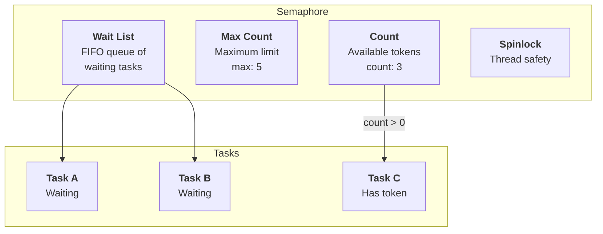

# Semaphore Architecture

## Table of Contents

- [Overview](#overview)
  - [Key Features](#key-features)
- [Architecture](#architecture)
- [Data Structures](#data-structures)
  - [Semaphore Structure](#semaphore-structure)
  - [Wait Node Integration](#wait-node-integration)
- [Algorithms](#algorithms)
  - [Wait Operation](#wait-operation)
  - [Signal Operation](#signal-operation)
  - [Broadcast Operation](#broadcast-operation)
- [Concurrency & Thread Safety](#concurrency--thread-safety)
- [Performance Analysis](#performance-analysis)
  - [Time Complexity](#time-complexity)
  - [Space Complexity](#space-complexity)
- [Use Cases](#use-cases)
- [Example Scenarios](#example-scenarios)
  - [Scenario 1: Binary Semaphore (Mutex-like)](#scenario-1-binary-semaphore-mutex-like)
  - [Scenario 2: Counting Semaphore](#scenario-2-counting-semaphore)
  - [Scenario 3: Broadcast Semaphore](#scenario-3-broadcast-semaphore)

- [Appendix: Code Snippets](#appendix-code-snippets)

---

## Overview

The soRTOS semaphore provides a **counting semaphore** that allows multiple tasks to coordinate access to a shared resource. Unlike a mutex, a semaphore can have multiple tokens available, making it suitable for resource pools and producer-consumer scenarios.

Semaphores are particularly useful for:
*   **Resource Pools:** Managing a pool of available resources
*   **Producer-Consumer:** Coordinating between producers and consumers
*   **Rate Limiting:** Limiting the number of concurrent operations
*   **Binary Semaphores:** Mutex-like behavior with max_count=1

### Key Features

*   **Counting Semaphore:** Supports multiple available tokens
*   **Bounded Count:** Maximum count prevents unbounded growth
*   **FIFO Wake-up:** Tasks are woken in order of waiting
*   **Broadcast Support:** Wake all waiting tasks simultaneously
*   **Zero-Malloc Blocking:** Uses embedded wait nodes

---

## Architecture



---

## Data Structures

### Semaphore Structure

```c
typedef struct {
    volatile uint32_t count;    /* Current number of available resources */
    uint32_t max_count;         /* Maximum limit for count */
    wait_node_t *wait_head;     /* Head of waiting tasks list */
    wait_node_t *wait_tail;     /* Tail of waiting tasks list */
    spinlock_t lock;            /* Protection lock */
} so_sem_t;
```

**Key Fields:**

*   **`count`**: Current number of available tokens (volatile for ISR access)
*   **`max_count`**: Maximum value that `count` can reach
*   **`wait_head` / `wait_tail`**: FIFO queue of tasks waiting for tokens
*   **`lock`**: Spinlock protecting semaphore operations

### Wait Node Integration

Tasks use their embedded `wait_node_t` to block on semaphores:

```c
typedef struct wait_node {
    void *task;              /* Backpointer to owning task */
    struct wait_node *next;  /* Link for wait queues */
} wait_node_t;
```

---

## Algorithms

### Wait Operation

**Logic Flow:**

1.  **Acquire Lock:** `spin_lock(&s->lock)`
2.  **Check Count:**
    *   **If `count > 0`:**
        *   Decrement count: `s->count--`
        *   Release lock: `spin_unlock(&s->lock)`
        *   **Return (Success)**
    *   **If `count == 0`:**
        *   Add current task to `wait_list`
        *   Set task state to **BLOCKED**
        *   Release lock: `spin_unlock(&s->lock)`
        *   Yield CPU: `platform_yield()`
        *   *... Task sleeps until signaled ...*
        *   **Return (After Wakeup)**


**Key Points:**

*   **Atomic Check-and-Decrement:** Count is checked and decremented atomically
*   **Blocking:** Task blocks if count is 0
*   **Retry Loop:** Task retries after being woken (in case of spurious wake-up)

### Signal Operation

**Logic Flow:**

1.  **Acquire Lock:** `spin_lock(&s->lock)`
2.  **Check Waiters:**
    *   **If `wait_list` is not empty:**
        *   Pop the first waiting task
        *   Unblock the task: `task_unblock(task)`
    *   **If `wait_list` is empty:**
        *   Increment count: `s->count++` (only if `count < max_count`)
3.  **Release Lock:** `spin_unlock(&s->lock)`


**Key Points:**

*   **FIFO Wake-up:** First waiting task is woken
*   **Bounded Count:** Count is capped at `max_count`
*   **Wake Before Increment:** Task is woken, then count is incremented (the woken task will decrement it)

### Broadcast Operation

**Logic Flow:**

1.  **Acquire Lock:** `spin_lock(&s->lock)`
2.  **Wake All:**
    *   Loop for each task in `wait_list`:
        *   Pop task
        *   Unblock task: `task_unblock(task)`
        *   Increment count: `s->count++` (only if `count < max_count`)
3.  **Release Lock:** `spin_unlock(&s->lock)`


**Key Points:**

*   **Wake All:** All waiting tasks are woken
*   **Count Increment:** Count is incremented for each woken task (up to max)
*   **Race Condition:** Woken tasks may compete for tokens, some may block again

---

## Concurrency & Thread Safety

The semaphore is protected by a **spinlock**:

```c
typedef struct {
    spinlock_t lock;  /* Protects all operations */
    /* ... */
} so_sem_t;
```

**Critical Sections:**

*   **Wait:** Locked to atomically check count and add to wait list
*   **Signal:** Locked to atomically wake task and increment count
*   **Broadcast:** Locked to atomically wake all tasks

**Safety Guarantees:**

*   **Thread Safe:** Multiple tasks can wait/signal simultaneously
*   **ISR Safe:** Spinlocks can be used from interrupt context
*   **Atomic Operations:** Count changes are atomic

---

## Performance Analysis

### Time Complexity

| Operation | Complexity | Notes |
|:----------|:-----------|:------|
| `so_sem_init` | $O(1)$ | Simple initialization |
| `so_sem_wait` (count > 0) | $O(1)$ | Decrement and return |
| `so_sem_wait` (count == 0) | $O(1)$ | Add to wait list, block |
| `so_sem_signal` | $O(1)$ | Wake one task, increment count |
| `so_sem_broadcast` | $O(N)$ | N = number of waiting tasks |

### Space Complexity

| Structure | Space | Notes |
|:----------|:------|:------|
| Semaphore | $O(1)$ | Fixed size structure |
| Per waiting task | $O(1)$ | Uses embedded wait node |
| Total | $O(1)$ | No dynamic allocation |

---

## Use Cases

**1. Binary Semaphore (Mutex-like):**

```c
so_sem_t binary_sem;
so_sem_init(&binary_sem, 1, 1);  /* Initial=1, Max=1 */

/* Task 1 */
so_sem_wait(&binary_sem);
/* Critical section */
so_sem_signal(&binary_sem);

/* Task 2 */
so_sem_wait(&binary_sem);
/* Critical section */
so_sem_signal(&binary_sem);
```

**2. Resource Pool:**

```c
#define MAX_CONNECTIONS 10

so_sem_t connection_pool;
so_sem_init(&connection_pool, MAX_CONNECTIONS, MAX_CONNECTIONS);

void handle_request(void) {
    so_sem_wait(&connection_pool);  /* Acquire connection */
    /* Use connection... */
    so_sem_signal(&connection_pool);  /* Release connection */
}
```

**3. Producer-Consumer:**

```c
so_sem_t items_available;  /* Count of items in buffer */
so_sem_t space_available;  /* Count of free spaces */

void producer(void *arg) {
    while (1) {
        produce_item();
        so_sem_wait(&space_available);
        add_to_buffer();
        so_sem_signal(&items_available);
    }
}

void consumer(void *arg) {
    while (1) {
        so_sem_wait(&items_available);
        remove_from_buffer();
        so_sem_signal(&space_available);
        consume_item();
    }
}
```

---

## Example Scenarios

### Scenario 1: Binary Semaphore (Mutex-like)

**Setup:**
- Binary semaphore: initial=1, max=1
- Two tasks competing for resource

**Timeline:**

```
t=0: Semaphore created
    count = 1

t=1: Task A waits
    so_sem_wait() → count = 0, return

t=2: Task B waits
    so_sem_wait() → count = 0, block

t=3: Task A signals
    so_sem_signal() → wake Task B, count = 1
    → Task B wakes, decrements count to 0

t=4: Task B signals
    so_sem_signal() → count = 1
```

### Scenario 2: Counting Semaphore

**Setup:**
- Counting semaphore: initial=3, max=5
- Multiple tasks acquiring resources

**Timeline:**

```
t=0: Semaphore created
    count = 3

t=1: Task A waits → count = 2
t=2: Task B waits → count = 1
t=3: Task C waits → count = 0
t=4: Task D waits → count = 0, block

t=5: Task A signals → wake Task D, count = 1
    → Task D wakes, decrements count to 0

t=6: Task E signals → count = 1 (no waiters)
t=7: Task F signals → count = 2
t=8: Task G signals → count = 3
t=9: Task H signals → count = 4
t=10: Task I signals → count = 5 (capped at max)
```

### Scenario 3: Broadcast Semaphore

**Setup:**
- Semaphore: initial=0, max=10
- Multiple tasks waiting
- One task broadcasts

**Timeline:**

```
t=0: Semaphore created
    count = 0

t=1: Task A waits → block
t=2: Task B waits → block
t=3: Task C waits → block
    Wait list: [A, B, C]

t=4: Task D broadcasts
    so_sem_broadcast()
    → Wake A, count = 1
    → Wake B, count = 2
    → Wake C, count = 3
    → All tasks wake up

t=5: Tasks A, B, C compete
    → A decrements count to 2
    → B decrements count to 1
    → C decrements count to 0
```

---


## Appendix: Code Snippets

### Basic Usage

```c
/* Initialize semaphore */
so_sem_t my_sem;
so_sem_init(&my_sem, 0, 10);  /* Start with 0, max 10 */

/* Task 1: Producer */
void producer_task(void *arg) {
    while (1) {
        produce_item();
        so_sem_signal(&my_sem);  /* Signal item available */
    }
}

/* Task 2: Consumer */
void consumer_task(void *arg) {
    while (1) {
        so_sem_wait(&my_sem);  /* Wait for item */
        consume_item();
    }
}
```

### Binary Semaphore

```c
/* Mutex-like behavior */
so_sem_t mutex_sem;
so_sem_init(&mutex_sem, 1, 1);  /* Binary semaphore */

void critical_section(void) {
    so_sem_wait(&mutex_sem);
    /* Critical code... */
    so_sem_signal(&mutex_sem);
}
```

### Resource Pool

```c
#define POOL_SIZE 5

so_sem_t resource_pool;
so_sem_init(&resource_pool, POOL_SIZE, POOL_SIZE);

void use_resource(void) {
    so_sem_wait(&resource_pool);  /* Acquire resource */
    /* Use resource... */
    so_sem_signal(&resource_pool);  /* Release resource */
}
```

### Broadcast Pattern

```c
/* Wake all waiting tasks */
so_sem_t event_sem;
so_sem_init(&event_sem, 0, UINT32_MAX);

void notify_all(void) {
    so_sem_broadcast(&event_sem);  /* Wake everyone */
}

void waiting_task(void *arg) {
    so_sem_wait(&event_sem);  /* Wait for event */
    /* Process event... */
}
```
