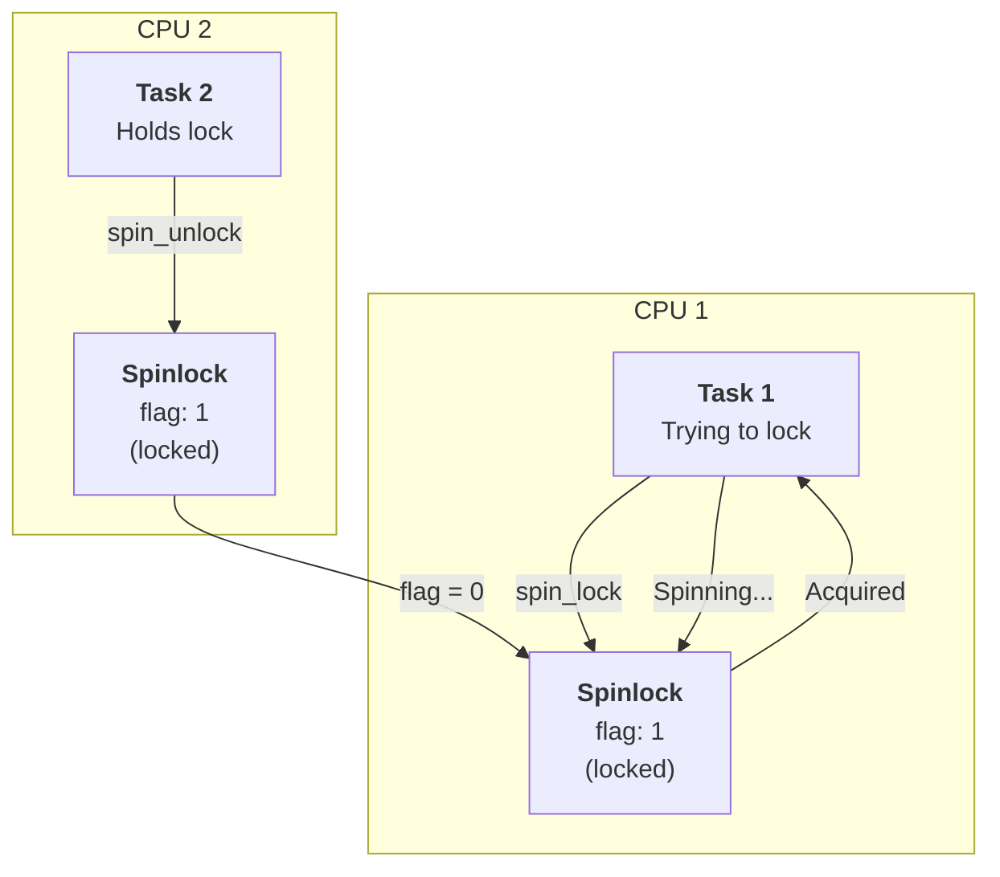
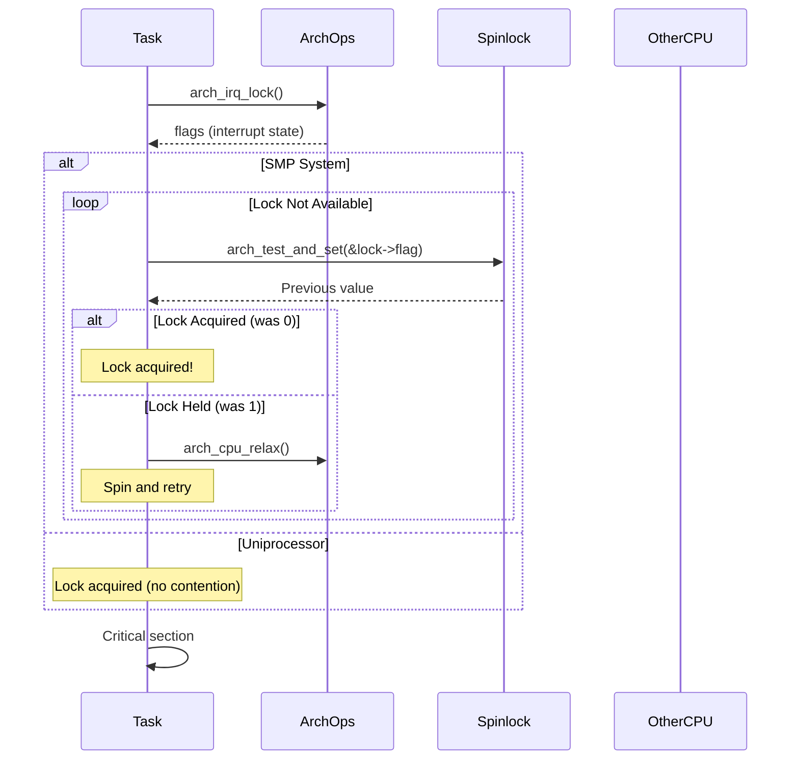
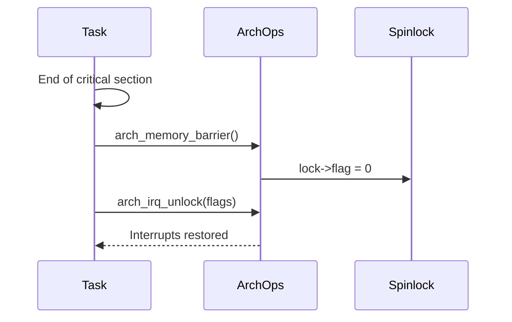

# Spinlock Architecture

## Table of Contents

- [Overview](#overview)
  - [Key Features](#key-features)
- [Architecture](#architecture)
- [Data Structures](#data-structures)
  - [Spinlock Structure](#spinlock-structure)
- [Algorithms](#algorithms)
  - [Lock Acquisition](#lock-acquisition)
  - [Lock Release](#lock-release)
- [Concurrency & Thread Safety](#concurrency--thread-safety)
  - [SMP Support](#smp-support)
  - [Interrupt Safety](#interrupt-safety)
- [Performance Analysis](#performance-analysis)
  - [Time Complexity](#time-complexity)
  - [Space Complexity](#space-complexity)
- [Use Cases](#use-cases)
- [Example Scenarios](#example-scenarios)
  - [Scenario 1: Protecting Shared Data](#scenario-1-protecting-shared-data)
  - [Scenario 2: ISR and Task Synchronization](#scenario-2-isr-and-task-synchronization)
- [API Reference](#api-reference)
- [Appendix: Code Snippets](#appendix-code-snippets)

---

## Overview

The soRTOS spinlock provides a **low-level synchronization primitive** for protecting critical sections in both uniprocessor and multiprocessor systems. Unlike mutexes, spinlocks do not block tasks; instead, they spin (busy-wait) until the lock becomes available.

Spinlocks are particularly useful for:
*   **Short Critical Sections:** Protecting brief operations that complete quickly
*   **ISR Synchronization:** Synchronizing between interrupts and tasks
*   **SMP Systems:** Providing mutual exclusion across multiple CPU cores
*   **Low-Level Code:** Foundation for higher-level synchronization primitives

### Key Features

*   **Busy-Wait:** Spins until lock is available (no task blocking)
*   **ISR Safe:** Can be used from interrupt context
*   **SMP Support:** Works correctly on multiprocessor systems
*   **Interrupt Disabling:** Disables interrupts locally during lock hold
*   **Memory Barriers:** Ensures correct memory ordering

---

## Architecture



---

## Data Structures

### Spinlock Structure

```c
typedef struct {
    volatile uint32_t flag;  /* Lock flag: 0 = unlocked, 1 = locked */
} spinlock_t;
```

**Key Fields:**

*   **`flag`**: Volatile 32-bit flag indicating lock state
  - `0` = Unlocked (available)
  - `1` = Locked (held by a task/CPU)

**Volatile Keyword:** The `volatile` keyword ensures the compiler doesn't optimize away reads/writes, which is critical for correct lock behavior.

---

## Algorithms

### Lock Acquisition



**Implementation:**

```c
static inline uint32_t spin_lock(spinlock_t *lock) {
    /* Always disable local interrupts first */
    uint32_t flags = arch_irq_lock();
    
#if defined(CONFIG_SMP)
    /* Atomic spin wait on SMP */
    while (arch_test_and_set(&lock->flag)) {
        arch_cpu_relax();  /* Hint to CPU for power efficiency */
    }
#else
    (void)lock;  /* Uniprocessor: no contention possible */
#endif
    
    return flags;  /* Return interrupt state for unlock */
}
```

**Key Points:**

*   **Interrupt Disabling:** Interrupts are disabled locally before acquiring lock
*   **Test-and-Set:** On SMP, uses atomic test-and-set instruction
*   **CPU Relax:** Hints to CPU to reduce power during spin
*   **Return Flags:** Returns interrupt state for restoration on unlock

### Lock Release



**Implementation:**

```c
static inline void spin_unlock(spinlock_t *lock, uint32_t flags) {
#if defined(CONFIG_SMP)
    /* Release lock with memory barrier */
    arch_memory_barrier(); 
    lock->flag = 0;
#else
    (void)lock;  /* Uniprocessor: no-op */
#endif
    
    /* Restore interrupts */
    arch_irq_unlock(flags);
}
```

**Key Points:**

*   **Memory Barrier:** Ensures all writes complete before releasing lock
*   **Flag Clear:** Sets flag to 0 (unlocked)
*   **Interrupt Restoration:** Restores interrupt state from lock acquisition

---

## Concurrency & Thread Safety

### SMP Support

On **Symmetric Multiprocessing (SMP)** systems, spinlocks use hardware atomic instructions:

```c
#if defined(CONFIG_SMP)
    while (arch_test_and_set(&lock->flag)) {
        arch_cpu_relax();
    }
#endif
```

**Hardware Primitives:**

*   **`arch_test_and_set()`**: Atomic test-and-set instruction (e.g., `LDREX/STREX` on ARM)
*   **`arch_cpu_relax()`**: CPU hint instruction (e.g., `YIELD` on ARM, `PAUSE` on x86)
*   **`arch_memory_barrier()`**: Memory barrier instruction (e.g., `DMB` on ARM)

### Interrupt Safety

Spinlocks disable interrupts locally during lock hold:

```c
uint32_t flags = spin_lock(&lock);
/* Critical section - interrupts disabled */
spin_unlock(&lock, flags);  /* Interrupts restored */
```

**Why Disable Interrupts?**

*   **Prevents Deadlock:** ISR can't acquire lock held by task
*   **Atomicity:** Ensures critical section isn't interrupted
*   **Correctness:** Prevents race conditions between ISR and task

**Important:** Keep critical sections short! Long critical sections with interrupts disabled can cause missed interrupts and poor real-time performance.

---

## Performance Analysis

### Time Complexity

| Operation | Complexity | Notes |
|:----------|:-----------|:------|
| `spinlock_init` | $O(1)$ | Simple initialization |
| `spin_lock` (uncontended) | $O(1)$ | Direct acquisition |
| `spin_lock` (contended) | $O(\infty)$ | Spins until available (busy-wait) |
| `spin_unlock` | $O(1)$ | Simple flag clear |

**Note:** The $O(\infty)$ complexity for contended locks is intentional - spinlocks are designed for short critical sections where spinning is faster than task switching.

### Space Complexity

| Structure | Space | Notes |
|:----------|:------|:------|
| Spinlock | 4 bytes | Single `uint32_t` flag |
| Total | $O(1)$ | Constant space |

---

## Use Cases

**1. Protecting Shared Data:**

```c
static int counter = 0;
static spinlock_t counter_lock;

void increment_counter(void) {
    uint32_t flags = spin_lock(&counter_lock);
    counter++;
    spin_unlock(&counter_lock, flags);
}
```

**2. ISR Synchronization:**

```c
static volatile int rx_count = 0;
static spinlock_t rx_lock;

void uart_isr(void) {
    uint32_t flags = spin_lock(&rx_lock);
    rx_count++;
    spin_unlock(&rx_lock, flags);
}

void task_process_rx(void *arg) {
    uint32_t flags = spin_lock(&rx_lock);
    int count = rx_count;
    rx_count = 0;
    spin_unlock(&rx_lock, flags);
    
    /* Process count... */
}
```

**3. Foundation for Higher-Level Primitives:**

Spinlocks are used internally by:
*   Mutexes
*   Semaphores
*   Queues
*   Event groups
*   Allocator

---

## Example Scenarios

### Scenario 1: Protecting Shared Data

**Setup:**
- Multiple tasks accessing shared counter
- Spinlock protects the counter

**Code:**

```c
static int shared_counter = 0;
static spinlock_t counter_lock;

void task_a(void *arg) {
    while (1) {
        uint32_t flags = spin_lock(&counter_lock);
        shared_counter++;
        int value = shared_counter;
        spin_unlock(&counter_lock, flags);
        
        printf("Task A: counter = %d\n", value);
        task_sleep_ticks(100);
    }
}

void task_b(void *arg) {
    while (1) {
        uint32_t flags = spin_lock(&counter_lock);
        shared_counter--;
        int value = shared_counter;
        spin_unlock(&counter_lock, flags);
        
        printf("Task B: counter = %d\n", value);
        task_sleep_ticks(150);
    }
}
```

**Timeline:**

```
t=0: Task A locks, counter = 1
t=1: Task A unlocks
t=2: Task B locks, counter = 0
t=3: Task B unlocks
t=4: Task A locks, counter = 1
```

### Scenario 2: ISR and Task Synchronization

**Setup:**
- UART ISR receives bytes
- Task processes received bytes
- Spinlock protects shared buffer

**Code:**

```c
#define BUFFER_SIZE 64
static uint8_t rx_buffer[BUFFER_SIZE];
static volatile int rx_head = 0;
static volatile int rx_tail = 0;
static spinlock_t rx_lock;

void uart_rx_isr(void) {
    uint8_t byte = *UART_DR;
    
    uint32_t flags = spin_lock(&rx_lock);
    int next_head = (rx_head + 1) % BUFFER_SIZE;
    if (next_head != rx_tail) {
        rx_buffer[rx_head] = byte;
        rx_head = next_head;
    }
    spin_unlock(&rx_lock, flags);
}

void uart_task(void *arg) {
    while (1) {
        uint32_t flags = spin_lock(&rx_lock);
        uint8_t byte = 0;
        if (rx_tail != rx_head) {
            byte = rx_buffer[rx_tail];
            rx_tail = (rx_tail + 1) % BUFFER_SIZE;
        }
        spin_unlock(&rx_lock, flags);
        
        if (byte != 0) {
            process_byte(byte);
        } else {
            task_sleep_ticks(10);
        }
    }
}
```

---

## API Reference

| Function | Description | ISR Safe? | Time Complexity |
|:---------|:------------|:----------|:----------------|
| `spinlock_init` | Initialize spinlock | Yes | $O(1)$ |
| `spin_lock` | Acquire lock | Yes | $O(1)$ or $O(\infty)$ |
| `spin_unlock` | Release lock | Yes | $O(1)$ |

**Function Signatures:**

```c
static inline void spinlock_init(spinlock_t *lock);
static inline uint32_t spin_lock(spinlock_t *lock);
static inline void spin_unlock(spinlock_t *lock, uint32_t flags);
```

**Note:** These are `static inline` functions, so they're defined in the header file and compiled into the calling code.

---

## Appendix: Code Snippets

### Basic Usage

```c
/* Initialize spinlock */
spinlock_t my_lock;
spinlock_init(&my_lock);

/* Acquire lock */
uint32_t flags = spin_lock(&my_lock);

/* Critical section */
shared_data++;
access_resource();

/* Release lock */
spin_unlock(&my_lock, flags);
```

### Protecting a Critical Section

```c
static int critical_counter = 0;
static spinlock_t crit_lock;

void increment_critical(void) {
    uint32_t flags = spin_lock(&crit_lock);
    critical_counter++;
    spin_unlock(&crit_lock, flags);
}

void read_critical(int *value) {
    uint32_t flags = spin_lock(&crit_lock);
    *value = critical_counter;
    spin_unlock(&crit_lock, flags);
}
```

### ISR Synchronization

```c
static volatile uint32_t isr_counter = 0;
static spinlock_t isr_lock;

void timer_isr(void) {
    uint32_t flags = spin_lock(&isr_lock);
    isr_counter++;
    spin_unlock(&isr_lock, flags);
}

void task_read_isr_count(void *arg) {
    uint32_t flags = spin_lock(&isr_lock);
    uint32_t count = isr_counter;
    isr_counter = 0;  /* Reset */
    spin_unlock(&isr_lock, flags);
    
    printf("ISR fired %u times\n", count);
}
```

### Nested Critical Sections

```c
/* Avoid nested locks if possible, but if needed: */
static spinlock_t lock1, lock2;

void nested_critical(void) {
    uint32_t flags1 = spin_lock(&lock1);
    /* ... */
    uint32_t flags2 = spin_lock(&lock2);
    /* ... */
    spin_unlock(&lock2, flags2);
    /* ... */
    spin_unlock(&lock1, flags1);
}
```

**Warning:** Be careful with nested locks to avoid deadlock. Always acquire locks in the same order.

### Best Practices

```c
/* GOOD: Short critical section */
void good_example(void) {
    uint32_t flags = spin_lock(&lock);
    shared_var++;  /* Quick operation */
    spin_unlock(&lock, flags);
}

/* BAD: Long critical section */
void bad_example(void) {
    uint32_t flags = spin_lock(&lock);
    for (int i = 0; i < 1000; i++) {
        process_data();  /* Long operation - interrupts disabled! */
    }
    spin_unlock(&lock, flags);
}

/* BETTER: Use mutex for long operations */
void better_example(void) {
    so_mutex_lock(&mutex);
    for (int i = 0; i < 1000; i++) {
        process_data();  /* Task can be preempted */
    }
    so_mutex_unlock(&mutex);
}
```
