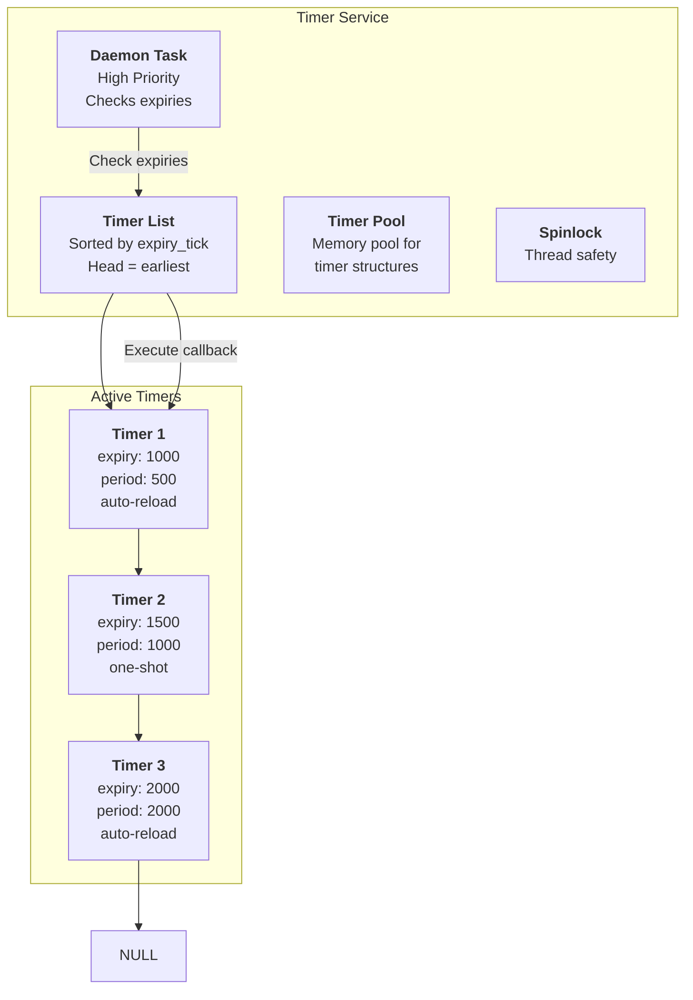
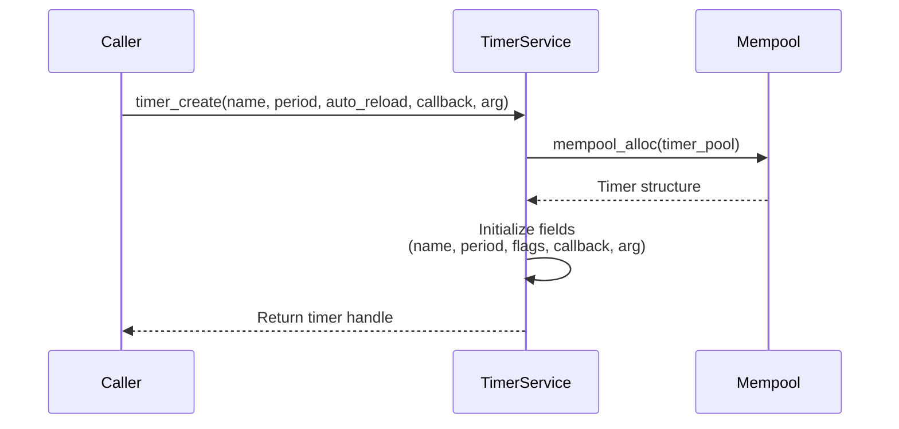
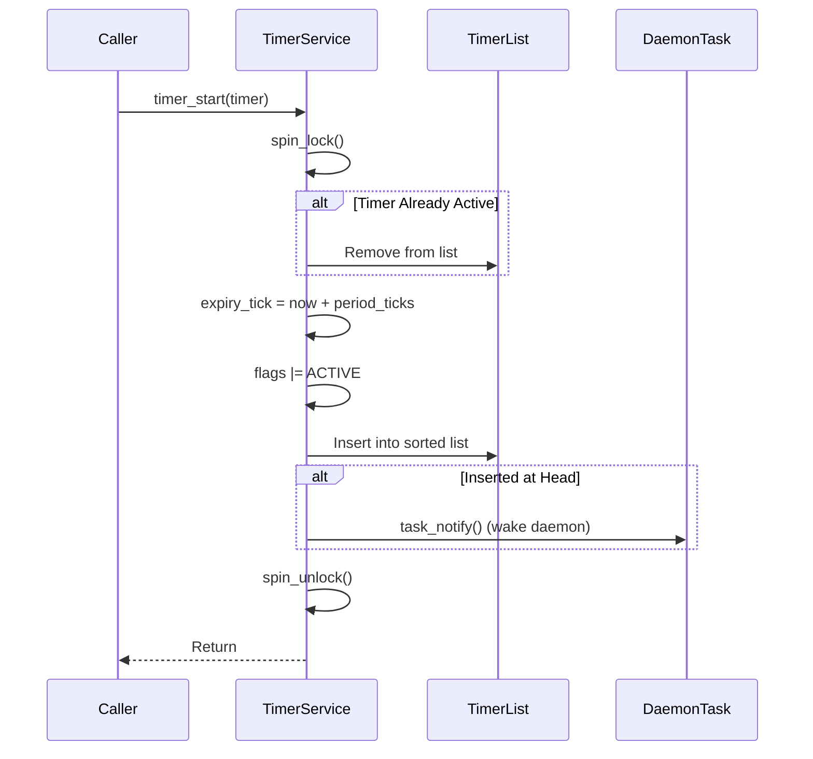
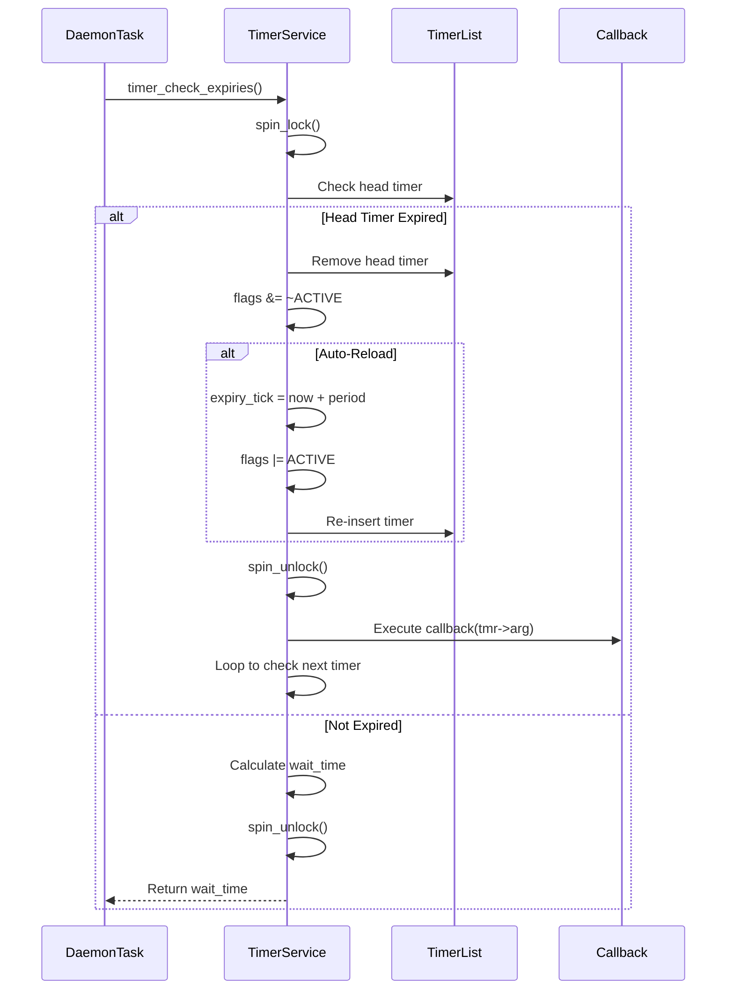

# Software Timer Architecture

## Table of Contents

- [Overview](#overview)
  - [Key Features](#key-features)
- [Architecture](#architecture)
- [Data Structures](#data-structures)
  - [Timer Structure](#timer-structure)
  - [Timer List Organization](#timer-list-organization)
- [Algorithms](#algorithms)
  - [Timer Creation](#timer-creation)
  - [Timer Start](#timer-start)
  - [Timer Expiry Check](#timer-expiry-check)
  - [Auto-Reload Timers](#auto-reload-timers)
- [Concurrency & Thread Safety](#concurrency--thread-safety)
- [Performance Analysis](#performance-analysis)
  - [Time Complexity](#time-complexity)
  - [Space Complexity](#space-complexity)
- [Configuration Parameters](#configuration-parameters)
- [Example Scenarios](#example-scenarios)
  - [Scenario 1: One-Shot Timer](#scenario-1-one-shot-timer)
  - [Scenario 2: Periodic Timer](#scenario-2-periodic-timer)
  - [Scenario 3: Multiple Timers](#scenario-3-multiple-timers)
- [API Reference](#api-reference)
- [Appendix: Code Snippets](#appendix-code-snippets)

---

## Overview

The soRTOS software timer provides a **high-precision timer service** that allows tasks to schedule callbacks to be executed at specific times in the future. Timers are managed by a dedicated daemon task, ensuring accurate timing even when the system is under load.

Software timers are particularly useful for:
*   **Periodic Tasks:** Execute code at regular intervals
*   **Timeouts:** Implement timeout mechanisms
*   **Scheduling:** Schedule future events
*   **Debouncing:** Delay processing until events stabilize

### Key Features

*   **One-Shot and Periodic:** Support both one-time and repeating timers
*   **High Precision:** Tick-based timing with millisecond accuracy
*   **Memory Pool:** Uses memory pool to prevent heap fragmentation
*   **Sorted List:** Timers stored in sorted order for efficient expiry checking
*   **Daemon Task:** Dedicated high-priority task manages all timers
*   **ISR Safe:** Timer operations can be called from interrupt context

---

## Architecture



---

## Data Structures

### Timer Structure

```c
struct sw_timer {
    struct sw_timer *next;      /* Link for sorted list */
    uint32_t expiry_tick;       /* System tick when timer expires */
    uint32_t period_ticks;      /* Period for auto-reload timers */
    const char *name;           /* Debug name */
    timer_callback_t callback;  /* Function to call on expiry */
    void *arg;                  /* Argument for callback */
    uint8_t flags;              /* TIMER_FLAG_AUTORELOAD, TIMER_FLAG_ACTIVE */
};
```

**Key Fields:**

*   **`expiry_tick`**: System tick count when the timer expires
*   **`period_ticks`**: Period for periodic timers (used for auto-reload)
*   **`callback`**: Function pointer called when timer expires
*   **`arg`**: User-provided argument passed to callback
*   **`flags`**: Bit flags for timer state

**Flag Definitions:**

```c
#define TIMER_FLAG_AUTORELOAD   (1 << 0)  /* Periodic timer */
#define TIMER_FLAG_ACTIVE       (1 << 1)  /* Timer is active */
```

### Timer List Organization

Timers are stored in a **sorted linked list** ordered by `expiry_tick`:

```c
static sw_timer_t *timer_list_head = NULL;  /* Earliest timer first */
```

**List Properties:**

*   **Sorted:** Head contains the timer that expires soonest
*   **Insertion:** O(N) worst case, but typically O(1) if inserting at head
*   **Expiry Check:** O(1) to check if head timer expired

**Visual Representation:**

```
Timer List (sorted by expiry_tick):
head → [Timer A: expiry=1000] → [Timer B: expiry=1500] → [Timer C: expiry=2000] → NULL
         ↑ Earliest
```

---

## Algorithms

### Timer Creation



**Implementation:**

```c
sw_timer_t* timer_create(const char *name, 
                        uint32_t period_ticks, 
                        uint8_t auto_reload, 
                        timer_callback_t callback, 
                        void *arg) {
    sw_timer_t *tmr = mempool_alloc(timer_pool);
    if (!tmr) return NULL;
    
    tmr->name = name;
    tmr->period_ticks = period_ticks;
    tmr->flags = auto_reload ? TIMER_FLAG_AUTORELOAD : 0;
    tmr->callback = callback;
    tmr->arg = arg;
    tmr->next = NULL;
    
    return tmr;
}
```

### Timer Start



**Implementation:**

```c
int timer_start(sw_timer_t *timer) {
    uint32_t flags = spin_lock(&timer_lock);
    
    /* If already active, remove from list first */
    if (timer->flags & TIMER_FLAG_ACTIVE) {
        timer_remove(timer);
    }
    
    /* Calculate expiry time */
    timer->expiry_tick = platform_get_ticks() + timer->period_ticks;
    timer->flags |= TIMER_FLAG_ACTIVE;
    
    /* Check if this is the earliest timer */
    uint8_t is_head = 0;
    if (timer_list_head == NULL || 
        (int32_t)(timer->expiry_tick - timer_list_head->expiry_tick) < 0) {
        is_head = 1;
    }
    
    timer_insert(timer);
    
    spin_unlock(&timer_lock, flags);
    
    /* If we inserted at head, wake daemon to reschedule */
    if (is_head && timer_task_id != 0) {
        task_notify(timer_task_id, 1);
    }
    
    return 0;
}
```

**Sorted Insertion:**

```c
static void timer_insert(sw_timer_t *tmr) {
    sw_timer_t **curr = &timer_list_head;
    
    /* Find insertion point (sorted by expiry_tick) */
    while (*curr != NULL) {
        if ((int32_t)(tmr->expiry_tick - (*curr)->expiry_tick) < 0) {
            break;  /* Insert before this timer */
        }
        curr = &(*curr)->next;
    }
    
    tmr->next = *curr;
    *curr = tmr;
}
```

### Timer Expiry Check



**Implementation:**

```c
uint32_t timer_check_expiries(void) {
    while (1) {
        uint32_t now = platform_get_ticks();
        
        uint32_t flags = spin_lock(&timer_lock);
        sw_timer_t *curr = timer_list_head;
        
        if (curr != NULL) {
            /* Check if expired */
            if ((int32_t)(now - curr->expiry_tick) >= 0) {
                /* Timer expired */
                sw_timer_t *tmr = curr;
                
                /* Remove from list */
                timer_list_head = tmr->next;
                tmr->next = NULL;
                tmr->flags &= ~TIMER_FLAG_ACTIVE;
                
                /* If auto-reload, restart it */
                if (tmr->flags & TIMER_FLAG_AUTORELOAD) {
                    tmr->expiry_tick = now + tmr->period_ticks;
                    tmr->flags |= TIMER_FLAG_ACTIVE;
                    timer_insert(tmr);
                }
                
                spin_unlock(&timer_lock, flags);
                
                /* Execute callback (outside critical section) */
                if (tmr->callback) {
                    tmr->callback(tmr->arg);
                }
                
                /* Loop again to check next timer */
                continue;
            } else {
                /* Not expired yet, calculate wait time */
                uint32_t next_wake = curr->expiry_tick - now;
                spin_unlock(&timer_lock, flags);
                return next_wake;
            }
        }
        
        spin_unlock(&timer_lock, flags);
        return UINT32_MAX;  /* No timers */
    }
}
```

### Auto-Reload Timers

Periodic timers automatically restart after expiring:

```c
if (tmr->flags & TIMER_FLAG_AUTORELOAD) {
    tmr->expiry_tick = now + tmr->period_ticks;
    tmr->flags |= TIMER_FLAG_ACTIVE;
    timer_insert(tmr);  /* Re-insert into sorted list */
}
```

**Behavior:**

*   **One-Shot:** Timer fires once, then becomes inactive
*   **Auto-Reload:** Timer fires, then automatically restarts with the same period

---

## Concurrency & Thread Safety

The timer service is protected by a **spinlock**:

```c
static spinlock_t timer_lock;
```

**Critical Sections:**

*   **Timer start/stop:** Locked to prevent race conditions
*   **Expiry check:** Locked to atomically check and remove timers
*   **List manipulation:** All list operations are protected

**Safety Guarantees:**

*   **Thread Safe:** Multiple tasks can create/start/stop timers
*   **ISR Safe:** Timer operations can be called from interrupt context
*   **Callback Safety:** Callbacks execute outside the lock (no deadlock risk)

**Daemon Task:**

The daemon task runs at high priority and uses `task_notify_wait()` to sleep until the next timer expires:

```c
static void timer_task_entry(void *arg) {
    while (1) {
        uint32_t wait_time = timer_check_expiries();
        task_notify_wait(1, wait_time);  /* Sleep until next expiry or notification */
    }
}
```

---

## Performance Analysis

### Time Complexity

| Operation | Complexity | Notes |
|:----------|:-----------|:------|
| `timer_create` | $O(1)$ | Memory pool allocation |
| `timer_start` | $O(N)$ | N = number of active timers (sorted insertion) |
| `timer_stop` | $O(N)$ | N = number of active timers (list removal) |
| `timer_check_expiries` | $O(K)$ | K = number of expired timers |
| `timer_delete` | $O(N)$ | Stop + pool free |

**Note:** The $O(N)$ complexity for start/stop is acceptable because:
*   Typically, few timers are active simultaneously
*   Insertion is often O(1) if timer expires soonest (inserted at head)
*   The operation is fast (just pointer manipulation)

### Space Complexity

| Structure | Space | Notes |
|:----------|:------|:------|
| Timer structure | 32 bytes | `sizeof(sw_timer_t)` |
| Timer pool | $O(M \times 32)$ | M = max_timers |
| Timer list | $O(N)$ | N = active timers (pointers only) |
| **Total** | $O(M)$ | Bounded by pool size |

**Example:**
- Pool: 32 timers × 32 bytes = 1,024 bytes
- **Total: ~1 KB**

---

## Configuration Parameters

Tunable parameters in `config/project_config.h`:

| Macro | Default | Description |
|:------|:--------|:------------|
| `TIMER_DEFAULT_POOL_SIZE` | 32 | Default number of timers in pool |

**Tuning Guidelines:**

**For Memory-Constrained Systems:**
```c
timer_service_init(16);  /* Smaller pool */
```

**For High Timer Usage:**
```c
timer_service_init(64);  /* Larger pool */
```

---

## Example Scenarios

### Scenario 1: One-Shot Timer

**Setup:**
- Timer fires once after 1000 ticks
- Callback prints a message

**Code:**

```c
void timeout_callback(void *arg) {
    printf("Timeout occurred!\n");
}

void setup_timeout(void) {
    sw_timer_t *timer = timer_create("timeout", 1000, 0, timeout_callback, NULL);
    timer_start(timer);
    /* Timer will fire once after 1000 ticks */
}
```

**Timeline:**

```
t=0: Timer started, expiry_tick = 1000
t=1000: Timer expires, callback executed
t=1001: Timer inactive (one-shot)
```

### Scenario 2: Periodic Timer

**Setup:**
- Timer fires every 500 ticks
- Callback updates a counter

**Code:**

```c
static int counter = 0;

void periodic_callback(void *arg) {
    counter++;
    printf("Counter: %d\n", counter);
}

void setup_periodic(void) {
    sw_timer_t *timer = timer_create("periodic", 500, 1, periodic_callback, NULL);
    timer_start(timer);
    /* Timer will fire every 500 ticks */
}
```

**Timeline:**

```
t=0: Timer started, expiry_tick = 500
t=500: Timer expires, callback executed, expiry_tick = 1000
t=1000: Timer expires, callback executed, expiry_tick = 1500
t=1500: Timer expires, callback executed, expiry_tick = 2000
... (continues indefinitely)
```

### Scenario 3: Multiple Timers

**Setup:**
- Timer A: 1000 ticks, periodic
- Timer B: 1500 ticks, one-shot
- Timer C: 500 ticks, periodic

**Timeline:**

```
t=0: All timers started
    List: [C:500] → [A:1000] → [B:1500] → NULL

t=500: Timer C expires, restarts (expiry=1000)
    List: [A:1000] → [C:1000] → [B:1500] → NULL

t=1000: Timer A expires, restarts (expiry=2000)
    List: [C:1000] → [B:1500] → [A:2000] → NULL

t=1000: Timer C expires, restarts (expiry=1500)
    List: [B:1500] → [C:1500] → [A:2000] → NULL

t=1500: Timer B expires (one-shot, removed)
    List: [C:1500] → [A:2000] → NULL

t=1500: Timer C expires, restarts (expiry=2000)
    List: [A:2000] → [C:2000] → NULL
```

---

## API Reference

| Function | Description | Thread Safe? | Time Complexity |
|:---------|:------------|:-------------|:----------------|
| `timer_service_init` | Initialize timer service | No (call at startup) | $O(1)$ |
| `timer_create` | Create timer | Yes | $O(1)$ |
| `timer_start` | Start timer | Yes | $O(N)$ |
| `timer_stop` | Stop timer | Yes | $O(N)$ |
| `timer_delete` | Delete timer | Yes | $O(N)$ |
| `timer_check_expiries` | Check for expired timers | Yes | $O(K)$ |
| `timer_get_name` | Get timer name | Yes | $O(1)$ |
| `timer_get_period` | Get timer period | Yes | $O(1)$ |
| `timer_is_active` | Check if active | Yes | $O(1)$ |

**Function Signatures:**

```c
void timer_service_init(uint32_t max_timers);
sw_timer_t* timer_create(const char *name, uint32_t period_ticks, 
                        uint8_t auto_reload, timer_callback_t callback, void *arg);
int timer_start(sw_timer_t *timer);
int timer_stop(sw_timer_t *timer);
void timer_delete(sw_timer_t *timer);
uint32_t timer_check_expiries(void);
const char* timer_get_name(sw_timer_t *timer);
uint32_t timer_get_period(sw_timer_t *timer);
uint8_t timer_is_active(sw_timer_t *timer);
```

---

## Appendix: Code Snippets

### Initialization

```c
/* Initialize timer service with 32 timers */
timer_service_init(32);
```

### One-Shot Timer

```c
void timeout_handler(void *arg) {
    printf("Timeout!\n");
}

sw_timer_t *timeout = timer_create("timeout", 1000, 0, timeout_handler, NULL);
timer_start(timeout);
```

### Periodic Timer

```c
void heartbeat_handler(void *arg) {
    printf("Heartbeat\n");
}

sw_timer_t *heartbeat = timer_create("heartbeat", 100, 1, heartbeat_handler, NULL);
timer_start(heartbeat);
```

### Timer with User Data

```c
typedef struct {
    int id;
    int count;
} timer_data_t;

void timer_handler(void *arg) {
    timer_data_t *data = (timer_data_t*)arg;
    data->count++;
    printf("Timer %d: count=%d\n", data->id, data->count);
}

timer_data_t data = { .id = 1, .count = 0 };
sw_timer_t *timer = timer_create("mytimer", 500, 1, timer_handler, &data);
timer_start(timer);
```

### Stopping and Restarting

```c
/* Stop timer */
timer_stop(timer);

/* Change period and restart */
timer->period_ticks = 2000;
timer_start(timer);
```

### Cleanup

```c
/* Delete timer (frees memory) */
timer_delete(timer);
```
