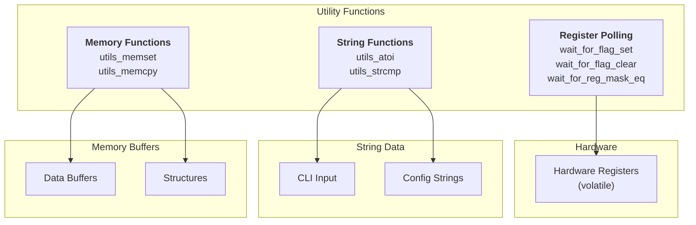

# Utility Functions Architecture

## Table of Contents

- [Overview](#overview)
  - [Key Features](#key-features)
- [Architecture](#architecture)
- [Function Reference](#function-reference)
  - [Register Polling Functions](#register-polling-functions)
  - [String Functions](#string-functions)
  - [Memory Functions](#memory-functions)
- [Performance Analysis](#performance-analysis)
  - [Time Complexity](#time-complexity)
  - [Space Complexity](#space-complexity)
- [Use Cases](#use-cases)
- [Example Scenarios](#example-scenarios)
  - [Scenario 1: Hardware Register Polling](#scenario-1-hardware-register-polling)
  - [Scenario 2: String Parsing](#scenario-2-string-parsing)
  - [Scenario 3: Memory Operations](#scenario-3-memory-operations)
- [API Reference](#api-reference)
- [Appendix: Code Snippets](#appendix-code-snippets)

---

## Overview

The soRTOS utility functions provide a collection of **low-level helper functions** for common operations such as register polling, string manipulation, and memory operations. These functions are designed to be lightweight and suitable for embedded systems.

Utility functions are particularly useful for:
*   **Hardware Access:** Polling hardware registers for status flags
*   **String Processing:** Parsing command-line arguments and user input
*   **Memory Management:** Copying and initializing memory buffers
*   **System Integration:** Common operations needed throughout the system

### Key Features

*   **Lightweight:** Minimal overhead, suitable for embedded systems
*   **No Dependencies:** Self-contained implementations
*   **ISR Safe:** All functions can be called from interrupt context
*   **Standard-Like:** Similar interfaces to standard C library functions

---

## Architecture



---

## Function Reference

### Register Polling Functions

These functions poll hardware registers until a condition is met or a timeout occurs.

#### `wait_for_flag_set`

Waits for specific bits in a register to be set (1).

```c
int wait_for_flag_set(volatile uint32_t *reg, uint32_t mask, uint32_t max_iter);
```

**Parameters:**
- `reg`: Pointer to the volatile register
- `mask`: Bitmask of bits to check
- `max_iter`: Maximum number of iterations before timeout

**Returns:**
- `0` on success (bits set)
- `-1` on timeout

**Example:**
```c
volatile uint32_t *status_reg = (volatile uint32_t*)0x40000000;
if (wait_for_flag_set(status_reg, 0x01, 1000) == 0) {
    /* Bit 0 is now set */
} else {
    /* Timeout */
}
```

#### `wait_for_flag_clear`

Waits for specific bits in a register to be cleared (0).

```c
int wait_for_flag_clear(volatile uint32_t *reg, uint32_t mask, uint32_t max_iter);
```

**Parameters:**
- `reg`: Pointer to the volatile register
- `mask`: Bitmask of bits to check
- `max_iter`: Maximum number of iterations before timeout

**Returns:**
- `0` on success (bits cleared)
- `-1` on timeout

**Example:**
```c
volatile uint32_t *control_reg = (volatile uint32_t*)0x40000004;
if (wait_for_flag_clear(control_reg, 0x80, 5000) == 0) {
    /* Bit 7 is now cleared */
} else {
    /* Timeout */
}
```

#### `wait_for_reg_mask_eq`

Waits for masked bits in a register to equal an expected value.

```c
int wait_for_reg_mask_eq(volatile uint32_t *reg, uint32_t mask, 
                         uint32_t expected, uint32_t max_iter);
```

**Parameters:**
- `reg`: Pointer to the volatile register
- `mask`: Bitmask to apply to register value
- `expected`: Expected value after masking
- `max_iter`: Maximum number of iterations before timeout

**Returns:**
- `0` on success (masked value equals expected)
- `-1` on timeout

**Example:**
```c
volatile uint32_t *state_reg = (volatile uint32_t*)0x40000008;
/* Wait for bits 3-5 to equal 0b101 */
if (wait_for_reg_mask_eq(state_reg, 0x38, 0x28, 10000) == 0) {
    /* Condition met */
} else {
    /* Timeout */
}
```

### String Functions

#### `utils_atoi`

Converts a string to an integer.

```c
int utils_atoi(const char *string);
```

**Parameters:**
- `string`: Null-terminated string containing digits

**Returns:**
- Converted integer value
- Stops parsing at first non-digit character

**Limitations:**
- Only handles non-negative integers
- No overflow checking
- Stops at first non-digit

**Example:**
```c
int value = utils_atoi("123");      /* Returns 123 */
int value2 = utils_atoi("456abc");  /* Returns 456 */
int value3 = utils_atoi("0");       /* Returns 0 */
```

#### `utils_strcmp`

Compares two strings.

```c
int utils_strcmp(const char *s1, const char *s2);
```

**Parameters:**
- `s1`: First string
- `s2`: Second string

**Returns:**
- `< 0` if s1 < s2
- `0` if s1 == s2
- `> 0` if s1 > s2

**Example:**
```c
if (utils_strcmp("hello", "world") < 0) {
    /* "hello" comes before "world" */
}

if (utils_strcmp(argv[1], "start") == 0) {
    /* Command is "start" */
}
```

### Memory Functions

#### `utils_memset`

Fills a block of memory with a specific value.

```c
void *utils_memset(void *s, int c, size_t n);
```

**Parameters:**
- `s`: Pointer to memory block
- `c`: Value to set (converted to unsigned char)
- `n`: Number of bytes to set

**Returns:**
- Pointer to the memory block (s)

**Example:**
```c
uint8_t buffer[100];
utils_memset(buffer, 0, sizeof(buffer));  /* Zero the buffer */
utils_memset(buffer, 0xFF, 50);            /* Set first 50 bytes to 0xFF */
```

#### `utils_memcpy`

Copies a block of memory.

```c
void *utils_memcpy(void *dest, const void *src, size_t n);
```

**Parameters:**
- `dest`: Destination memory block
- `src`: Source memory block
- `n`: Number of bytes to copy

**Returns:**
- Pointer to destination (dest)

**Warning:** Memory areas must not overlap. For overlapping memory, use `memmove` (not provided).

**Example:**
```c
uint8_t src[10] = {1, 2, 3, 4, 5, 6, 7, 8, 9, 10};
uint8_t dest[10];
utils_memcpy(dest, src, sizeof(src));  /* Copy entire array */
```

---

## Performance Analysis

### Time Complexity

| Function | Complexity | Notes |
|:----------|:-----------|:------|
| `wait_for_flag_set` | $O(N)$ | N = max_iter (worst case) |
| `wait_for_flag_clear` | $O(N)$ | N = max_iter (worst case) |
| `wait_for_reg_mask_eq` | $O(N)$ | N = max_iter (worst case) |
| `utils_atoi` | $O(M)$ | M = string length |
| `utils_strcmp` | $O(M)$ | M = min(s1 length, s2 length) |
| `utils_memset` | $O(N)$ | N = number of bytes |
| `utils_memcpy` | $O(N)$ | N = number of bytes |

### Space Complexity

All utility functions have $O(1)$ space complexity (no dynamic allocation).

---

## Use Cases

**1. Hardware Initialization:**

```c
void uart_init(void) {
    /* Enable UART */
    *UART_CR = 0x01;
    
    /* Wait for ready */
    if (wait_for_flag_set(UART_SR, UART_SR_READY, 1000) != 0) {
        /* Timeout - handle error */
        return;
    }
    
    /* UART is ready */
}
```

**2. CLI Command Parsing:**

```c
int cmd_handler(int argc, char **argv) {
    if (utils_strcmp(argv[0], "set") == 0) {
        int value = utils_atoi(argv[1]);
        /* Use value... */
    }
}
```

**3. Buffer Initialization:**

```c
typedef struct {
    uint8_t data[256];
    uint32_t flags;
} buffer_t;

buffer_t *buf = allocator_malloc(sizeof(buffer_t));
utils_memset(buf, 0, sizeof(buffer_t));  /* Zero-initialize */
```

---

## Example Scenarios

### Scenario 1: Hardware Register Polling

**Setup:**
- UART status register at address 0x40001000
- Bit 0 = TX ready, Bit 1 = RX ready

**Code:**

```c
volatile uint32_t *uart_sr = (volatile uint32_t*)0x40001000;

/* Wait for TX ready */
if (wait_for_flag_set(uart_sr, 0x01, 1000) == 0) {
    /* Can transmit now */
    *uart_dr = data;
} else {
    /* Timeout - UART not ready */
    logger_log("UART TX timeout", 0, 0);
}

/* Wait for RX data */
if (wait_for_flag_set(uart_sr, 0x02, 5000) == 0) {
    data = *uart_dr;
} else {
    /* No data received */
}
```

### Scenario 2: String Parsing

**Setup:**
- CLI command: "set speed 100"
- Parse command and value

**Code:**

```c
int cmd_set_speed(int argc, char **argv) {
    if (argc < 3) {
        return -1;  /* Not enough arguments */
    }
    
    if (utils_strcmp(argv[0], "set") == 0 &&
        utils_strcmp(argv[1], "speed") == 0) {
        int speed = utils_atoi(argv[2]);
        if (speed > 0 && speed <= 1000) {
            set_motor_speed(speed);
            return 0;
        }
    }
    
    return -1;
}
```

### Scenario 3: Memory Operations

**Setup:**
- Copy configuration data
- Initialize buffers

**Code:**

```c
/* Copy configuration */
typedef struct {
    uint32_t baud_rate;
    uint8_t parity;
    uint16_t timeout;
} uart_config_t;

uart_config_t default_config = {
    .baud_rate = 115200,
    .parity = 0,
    .timeout = 1000
};

uart_config_t current_config;
utils_memcpy(&current_config, &default_config, sizeof(uart_config_t));

/* Initialize receive buffer */
#define RX_BUFFER_SIZE 256
uint8_t rx_buffer[RX_BUFFER_SIZE];
utils_memset(rx_buffer, 0, RX_BUFFER_SIZE);
```

---

## API Reference

| Function | Description | ISR Safe? | Time Complexity |
|:---------|:------------|:----------|:----------------|
| `wait_for_flag_set` | Wait for bits to be set | Yes | $O(N)$ |
| `wait_for_flag_clear` | Wait for bits to be cleared | Yes | $O(N)$ |
| `wait_for_reg_mask_eq` | Wait for masked value | Yes | $O(N)$ |
| `utils_atoi` | String to integer | Yes | $O(M)$ |
| `utils_strcmp` | Compare strings | Yes | $O(M)$ |
| `utils_memset` | Fill memory | Yes | $O(N)$ |
| `utils_memcpy` | Copy memory | Yes | $O(N)$ |

**Function Signatures:**

```c
int wait_for_flag_set(volatile uint32_t *reg, uint32_t mask, uint32_t max_iter);
int wait_for_flag_clear(volatile uint32_t *reg, uint32_t mask, uint32_t max_iter);
int wait_for_reg_mask_eq(volatile uint32_t *reg, uint32_t mask, 
                         uint32_t expected, uint32_t max_iter);
int utils_atoi(const char *string);
int utils_strcmp(const char *s1, const char *s2);
void *utils_memset(void *s, int c, size_t n);
void *utils_memcpy(void *dest, const void *src, size_t n);
```

---

## Appendix: Code Snippets

### Register Polling

```c
/* Wait for device ready */
volatile uint32_t *dev_status = (volatile uint32_t*)DEVICE_STATUS_REG;
if (wait_for_flag_set(dev_status, DEV_READY_BIT, 10000) != 0) {
    /* Device not ready - handle error */
    return -1;
}

/* Device is ready, proceed */
```

### String Comparison

```c
/* Parse command */
if (utils_strcmp(cmd, "start") == 0) {
    start_system();
} else if (utils_strcmp(cmd, "stop") == 0) {
    stop_system();
} else if (utils_strcmp(cmd, "reset") == 0) {
    reset_system();
} else {
    printf("Unknown command: %s\n", cmd);
}
```

### Integer Parsing

```c
/* Parse numeric argument */
int value = utils_atoi(argv[1]);
if (value <= 0) {
    printf("Invalid value: %s\n", argv[1]);
    return -1;
}

/* Use value */
set_parameter(value);
```

### Memory Initialization

```c
/* Zero-initialize structure */
typedef struct {
    uint32_t field1;
    uint8_t field2[64];
} my_struct_t;

my_struct_t *obj = allocator_malloc(sizeof(my_struct_t));
utils_memset(obj, 0, sizeof(my_struct_t));
```

### Memory Copying

```c
/* Copy configuration */
uart_config_t src_config = { /* ... */ };
uart_config_t dest_config;
utils_memcpy(&dest_config, &src_config, sizeof(uart_config_t));
```

### Combined Operations

```c
/* Initialize and copy buffer */
#define BUFFER_SIZE 128
uint8_t template[BUFFER_SIZE];
uint8_t working[BUFFER_SIZE];

/* Initialize template */
utils_memset(template, 0xAA, BUFFER_SIZE);

/* Copy to working buffer */
utils_memcpy(working, template, BUFFER_SIZE);
```
