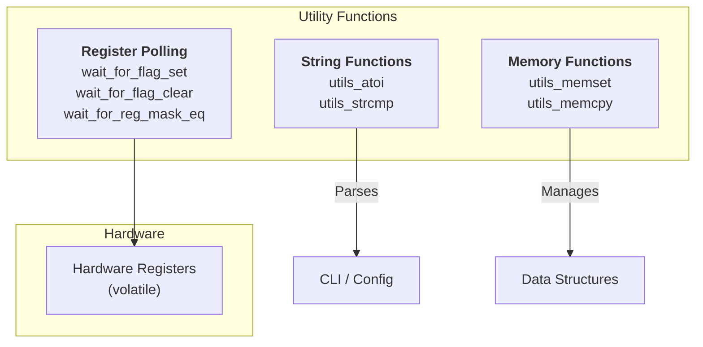

# Utility Functions Architecture

## Table of Contents

- [Overview](#overview)
- [Architecture](#architecture)
- [API Reference](#api-reference)
  - [Register Polling](#register-polling)
  - [String Operations](#string-operations)
  - [Memory Operations](#memory-operations)

---

## Overview

The soRTOS utility functions provide a collection of **low-level helper functions** designed for embedded systems. They focus on minimal overhead, zero dependencies, and safety in interrupt contexts (ISR).

### Key Features
* **Lightweight:** Minimal instruction count.
* **No Dependencies:** Self-contained implementations (no standard library requirements).
* **ISR Safe:** All functions can be safely called from interrupt service routines.

---

## Architecture



---


## API

### Register polling

All polling helpers return **0** on success and **-1** on timeout.

> **Timeout semantics:** the functions decrement `timeout_cycles` once per loop iteration and return `-1` if the condition is not met before it reaches 0.

#### `wait_for_flag_set`

Wait until **any** bit from `bit_mask` becomes 1:

```c
int wait_for_flag_set(volatile uint32_t *reg_addr,
                      uint32_t bit_mask,
                      uint32_t timeout_cycles);
```

- **Condition waited for:** `((*reg_addr) & bit_mask) != 0U`
- **Typical use:** “wait for ready/available” flags.

**Example**
```c
#define UART_SR_ADDR   (0x40001000U)
#define UART_DR_ADDR   (0x40001004U)
#define TX_READY_MASK  (1U << 0)

volatile uint32_t *uart_sr = (volatile uint32_t *)UART_SR_ADDR;
volatile uint32_t *uart_dr = (volatile uint32_t *)UART_DR_ADDR;

if (wait_for_flag_set(uart_sr, TX_READY_MASK, 1000U) == 0) {
    *uart_dr = 0xAAU;
} else {
    /* handle timeout */
}
```

#### `wait_for_flag_clear`

Wait until **all** bits from `bit_mask` become 0:

```c
int wait_for_flag_clear(volatile uint32_t *reg_addr,
                        uint32_t bit_mask,
                        uint32_t timeout_cycles);
```

- **Condition waited for:** `((*reg_addr) & bit_mask) == 0U`
- **Typical use:** “wait for not-busy / transfer done” flags.

#### `wait_for_reg_mask_eq`

Wait until a masked register value equals an expected value:

```c
int wait_for_reg_mask_eq(volatile uint32_t *reg_addr,
                         uint32_t bit_mask,
                         uint32_t expected_value,
                         uint32_t timeout_cycles);
```

- **Condition waited for:** `((*reg_addr) & bit_mask) == expected_value`

**Example**
```c
#define STATUS_ADDR   (0x40002000U)
#define STATE_MASK    (0x38U)   /* bits [5:3] */
#define STATE_READY   (0x28U)   /* 0b101 << 3 */

volatile uint32_t *status = (volatile uint32_t *)STATUS_ADDR;
(void)wait_for_reg_mask_eq(status, STATE_MASK, STATE_READY, 1000U);
```

---

### String

#### `utils_atoi`

Convert a sequence of decimal digits into an integer.
Parsing stops at the first non-digit character.

```c
int utils_atoi(const char *str);
```

- **Notes:** no sign handling, no whitespace skipping.

#### `utils_strcmp`

Compare two null-terminated strings.

```c
int utils_strcmp(const char *str1, const char *str2);
```

- Returns **`0`** if `str1` and `str2` are identical (same bytes up to and including the terminating `'\0'`).
- Returns a **negative** value (**`< 0`**) if `str1` is lexicographically *smaller* than `str2`.
- Returns a **positive** value (**`> 0`**) if `str1` is lexicographically *greater* than `str2`.

---

### Memory

These are minimal `memset`/`memcpy` replacements intended for environments without a full libc.

#### `utils_memset`

```c
void *utils_memset(void *dest, int value, size_t count);
```

- Fills `count` bytes at `dest` with `(unsigned char)value`.

#### `utils_memcpy`

```c
void *utils_memcpy(void *dest, const void *src, size_t count);
```

- Copies `count` bytes from `src` to `dest`.
- **Undefined behavior if regions overlap.**

---
