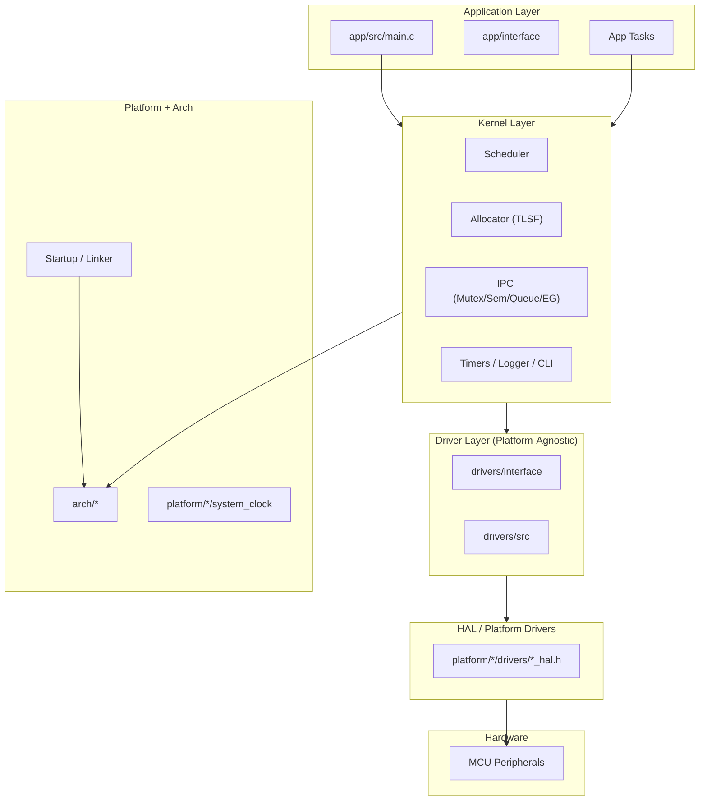

# soRTOS Overview

## Summary

soRTOS is a lightweight, preemptive RTOS written from scratch in C with a strong emphasis on separation of concerns:

* Application layer (`app/`)
* Platform-agnostic kernel (`kernel/`)
* Platform-agnostic drivers (`drivers/`)
* Platform HALs and board setup (`platform/`)
* Architecture-specific low-level code (`arch/`)

The project is designed to run both on embedded hardware (STM32L476RG) and as a native host simulation for development and unit testing.

---

## Architecture



---

## Build and Test

Native build and run:

```bash
make
./build/native/soRTOS.elf
```

Unit tests (native):

```bash
make test
```

STM32 build:

```bash
gmake PLATFORM=stm32l476rg
```

---

## Design Notes

* Kernel APIs are platform-agnostic; only HALs are platform-specific.
* Drivers expose clean interfaces in `drivers/interface` and delegate hardware access to HALs.
* The app layer mirrors this structure with `app/interface` and `app/src`.
