# Scheduler Architecture

## Overview
The soRTOS scheduler is a **preemptive, weighted fair scheduler** designed for **Symmetric Multi-Processing (SMP)**. It implements a variant of **Completely Fair Scheduling (CFS)**, similar to the Linux kernel, ensuring that all ready tasks receive a CPU share proportional to their weight.

Unlike traditional Real-Time Operating Systems (RTOS) that use strict priority levels (where a high-priority task always starves a low-priority one), soRTOS ensures that all ready tasks receive a CPU share proportional to their weight.

### Key features:
*   **Time Complexity:** $O(\log N)$ for task insertion/selection (Min-Heap).
*   **Space Complexity:** $O(1)$ dynamic overhead (uses static/embedded nodes).
*   **Fairness:** Uses virtual runtime (`vruntime`) to prevent starvation while respecting weights.
*   **SMP Support:** Per-CPU runqueues with affinity support.

---

## Architecture

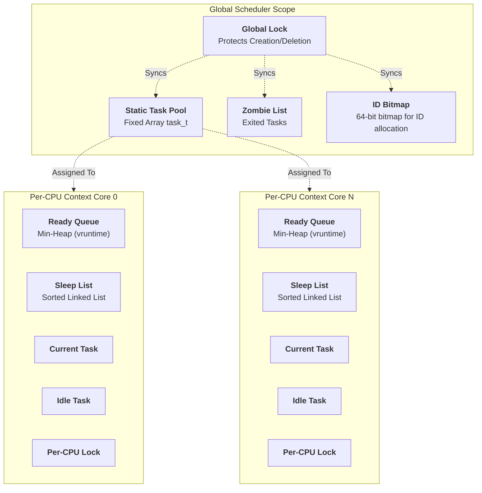

---

## Mathematical Foundation

### Virtual Runtime (vruntime)

The core of the fair scheduler is the **virtual runtime** concept. Each task's `vruntime` represents the amount of CPU time it has consumed, normalized by its weight.

#### Basic Formula

$$
\Delta vruntime = \frac{\Delta t_{physical} \times W_{default}}{W_{task}}
$$

Where:
- $\Delta vruntime$ = Increase in virtual runtime
- $\Delta t_{physical}$ = Physical CPU time consumed (in ticks)
- $W_{default}$ = Default weight (typically 1024 in Linux, configurable in soRTOS)
- $W_{task}$ = Task's assigned weight

#### Weight-Based Time Allocation

For a system with $N$ tasks where task $i$ has weight $w_i$, the share of CPU time for task $i$ is:

$$
\text{CPU Share}_i = \frac{w_i}{\sum_{j=1}^{N} w_j}
$$

**Example:**
- Task A: weight = 2
- Task B: weight = 1
- Task C: weight = 1

Total weight = 4

- Task A receives: $\frac{2}{4} = 50\%$ CPU time
- Task B receives: $\frac{1}{4} = 25\%$ CPU time
- Task C receives: $\frac{1}{4} = 25\%$ CPU time

#### Time Slice Calculation

The time slice (quantum) for a task is calculated based on its weight and the number of tasks:

$$
\text{Time Slice}_i = \text{Period} \times \frac{w_i}{\sum_{j=1}^{N} w_j}
$$

Where:
- $\text{Period}$ = Scheduling period (total time before all tasks run once)

**In the implementation:**
```c
#define SCHED_LATENCY_TICKS 100  // Scheduling period
time_slice = (SCHED_LATENCY_TICKS * task->weight) / total_weight;
```

#### Virtual Runtime Update

When a task runs for $\Delta t$ ticks:

$$
vruntime_{new} = vruntime_{old} + \Delta vruntime
$$

This ensures tasks with higher weights advance their `vruntime` more slowly, allowing them to run more frequently.

#### Handling Overflow

Virtual runtime uses 64-bit unsigned integers, which can overflow. The scheduler handles this using **modular arithmetic**:

$$
\mathrm{VRUNTIME\_LT}(a, b) \equiv (\mathrm{int64\_t})(a - b) < 0
$$

In C implementation:
```c
#define VRUNTIME_LT(a, b)   ((int64_t)((a) - (b)) < 0)
```

This comparison works correctly even when values wrap around the 64-bit boundary by treating the unsigned subtraction result as a signed integer, which preserves the ordering relationship.

---

## Scheduling Algorithm

### High-Level Flow

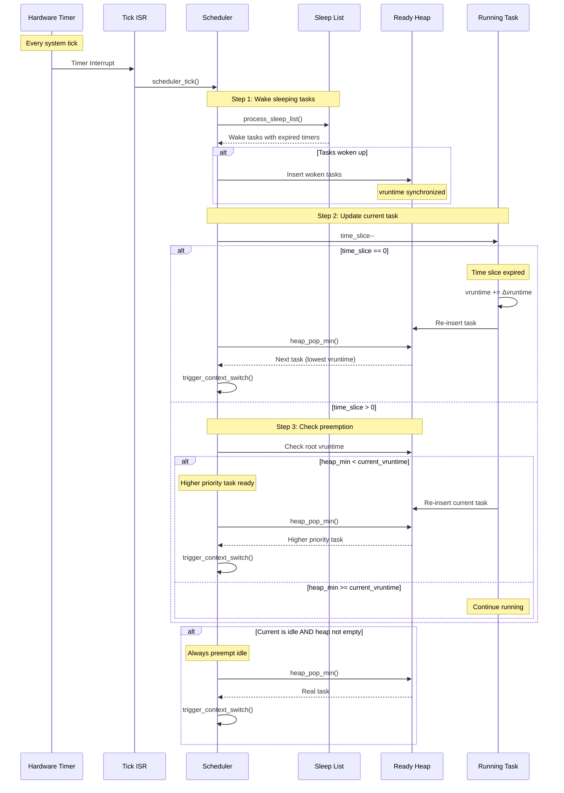

### Detailed Steps

1.  **Task Selection:**
    - The scheduler always selects the task with the **lowest `vruntime`** from the Min-Heap.
    - Time complexity: $O(1)$ (root of heap)

2.  **Time Slice Allocation:**
    - Each selected task receives a time slice proportional to its weight.
    - Formula: `time_slice = (SCHED_LATENCY_TICKS * weight) / total_weight`

3.  **Runtime Tracking:**
    - Every hardware tick decrements the running task's `time_slice`.
    - When `time_slice` reaches 0, the task's `vruntime` is updated:
      ```c
      vruntime += (time_consumed * NICE_0_WEIGHT) / task->weight;
      ```

4.  **Re-insertion:**
    - Task is re-inserted into the heap with updated `vruntime`.
    - Time complexity: $O(\log N)$

5.  **Preemption Check:**
    - On every tick and when a task wakes up, the scheduler checks if preemption is needed:
      ```c
      if (heap_min_vruntime < current_task->vruntime) {
          preempt_current_task();
      }
      ```

6.  **Sleep/Wake Handling:**
    - Sleeping tasks are removed from the heap and added to a sorted sleep list.
    - When woken, their `vruntime` is synchronized to prevent starvation:
      ```c
      if (task->vruntime < min_vruntime) {
          task->vruntime = min_vruntime;
      }
      ```

---

## Data Structures

### The Ready Queue (Min-Heap)

The ready queue is implemented as a **binary min-heap** stored in an array for cache efficiency.

#### Heap Properties

For a heap stored in array `H[]`:
- **Parent of node $i$:** $\lfloor \frac{i-1}{2} \rfloor$
- **Left child of node $i$:** $2i + 1$
- **Right child of node $i$:** $2i + 2$

#### Invariant

$$
\forall i > 0: H[\lfloor \frac{i-1}{2} \rfloor].vruntime \leq H[i].vruntime
$$

#### Operations

**Insert (Heap-Up):**
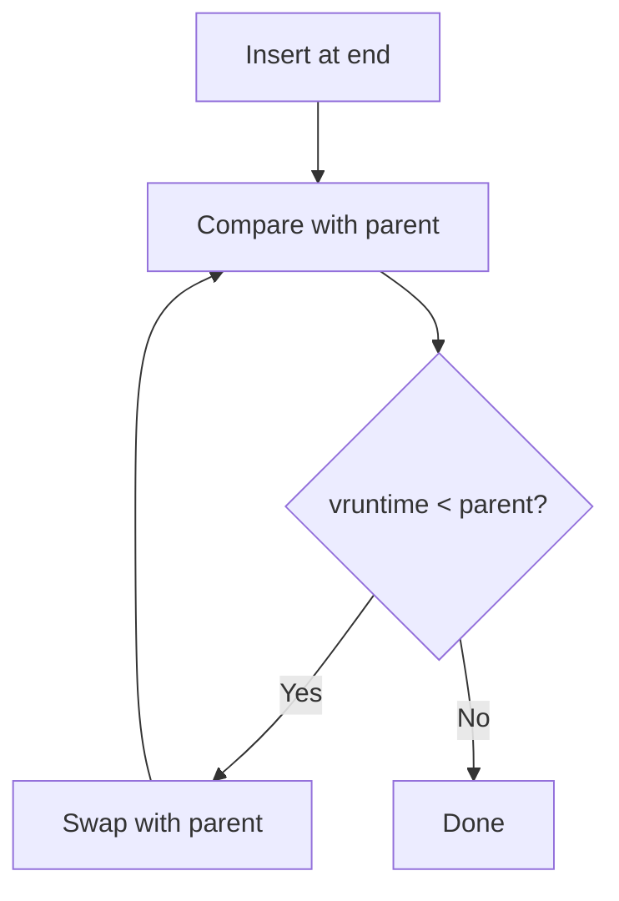

Time complexity: $O(\log N)$

**Extract-Min (Heap-Down):**
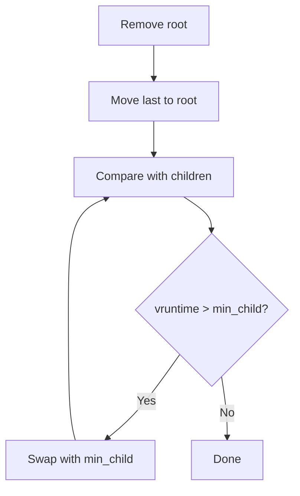

Time complexity: $O(\log N)$

**Remove from middle:**
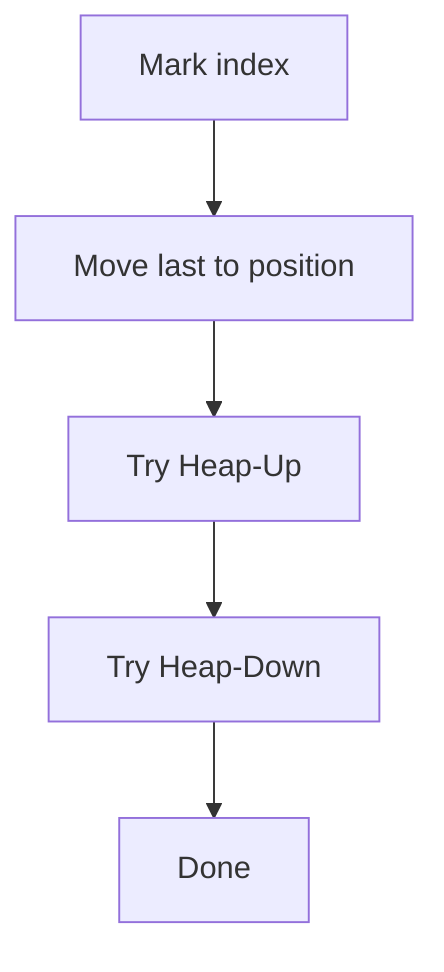

Time complexity: $O(\log N)$

#### Cache Optimization

Array-based heap provides better cache locality than pointer-based trees:
- Sequential memory access
- Predictable memory layout
- Better prefetching by CPU

### Sleep List

The sleep list is a **sorted singly-linked list** ordered by wake-up time.


#### Insertion Algorithm

```c
if (list_empty || new_task->wake_time < head->wake_time) {
    insert_at_head();
} else {
    // Find insertion point
    while (curr->next && curr->next->wake_time < new_task->wake_time) {
        curr = curr->next;
    }
    insert_after(curr);
}
```

Time complexity: $O(N)$ worst case, but typically $O(1)$ if tasks sleep for similar durations.

#### Wake-up Processing

```c
void process_sleep_list(uint32_t current_tick) {
    while (head != NULL && head->wake_time <= current_tick) {
        task = remove_head();
        wake_task(task);
    }
}
```

Time complexity: $O(K)$ where $K$ is the number of tasks to wake.

### Zero-Malloc Blocking (The Wait Node)

To ensure deterministic behavior and avoid memory allocation in critical paths, every task contains an embedded `wait_node_t`.

```c
typedef struct wait_node {
    void *task;           // Backpointer to owning task
    struct wait_node *next;  // Link for wait queues
} wait_node_t;

typedef struct task_struct {
    // ... other fields ...
    wait_node_t wait_node;  // Embedded, no malloc needed
} task_t;
```

#### Benefits

1.  **Deterministic Memory:** No allocation failures during blocking operations
2.  **Cache Locality:** Wait node is part of task structure
3.  **No Fragmentation:** No dynamic allocation/deallocation
4.  **Real-Time Guarantees:** Blocking is $O(1)$ time and space

#### Usage Pattern

```c
// When blocking on a mutex:
task_t *task = get_current_task();
wait_node_t *node = &task->wait_node;  // No malloc!
node->task = task;
node->next = mutex->wait_list;
mutex->wait_list = node;
```

---

## Task Lifecycle

```mermaid
stateDiagram-v2
    direction LR
    
    [*] --> UNUSED: System Init
    
    state "Task Creation" as Creation {
        UNUSED --> READY: task_create()<br/>Allocate from pool<br/>Initialize stack<br/>Set weight & vruntime
    }
    
    state "Active Scheduling" as Active {
        state "Runnable" as Run {
            READY --> RUNNING: Scheduler selects<br/>(lowest vruntime)
            RUNNING --> READY: Time slice expired<br/>OR preempted by<br/>lower vruntime task
        }
        
        state "Waiting" as Wait {
            RUNNING --> BLOCKED: Lock mutex<br/>Wait for queue<br/>Block on semaphore
            BLOCKED --> READY: Resource available<br/>OR timeout
            
            RUNNING --> SLEEPING: task_sleep()<br/>Wait with timeout<br/>Wait for notification
            SLEEPING --> READY: Timer expired<br/>Notification received<br/>Timeout
        }
    }
    
    state "Termination" as Term {
        RUNNING --> ZOMBIE: task_exit()<br/>Resources held
        ZOMBIE --> UNUSED: Garbage collection<br/>by idle task
    }
    
    note right of READY
        In Ready Heap
        Ordered by vruntime
        Waiting for CPU
    end note
    
    note right of RUNNING
        Executing on CPU
        time_slice counting down
        Not in any queue
    end note
    
    note right of BLOCKED
        Removed from heap
        In resource wait list
        May be in sleep list (timeout)
    end note
    
    note right of SLEEPING
        Removed from heap
        In sleep list (sorted by wake time)
        Can be woken early by notify
    end note
    
    note right of ZOMBIE
        Marked for deletion
        In zombie list
        Stack/resources not freed yet
    end note
```

### State Descriptions

| State | Description | In Heap? | In Sleep List? |
|:------|:------------|:---------|:---------------|
| `UNUSED` | Task slot available in pool | No | No |
| `READY` | Waiting to be scheduled | **Yes** | No |
| `RUNNING` | Currently executing on CPU | No | No |
| `BLOCKED` | Waiting for resource (mutex, queue) | No | Maybe (if timeout) |
| `SLEEPING` | Waiting for time or notification | No | **Yes** |
| `ZOMBIE` | Exited, awaiting cleanup | No | No |

### State Transitions

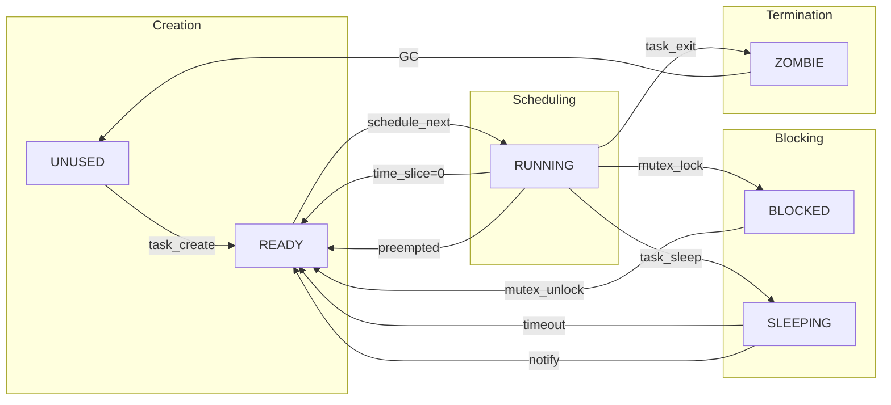

---

## SMP Synchronization

### Locking Hierarchy

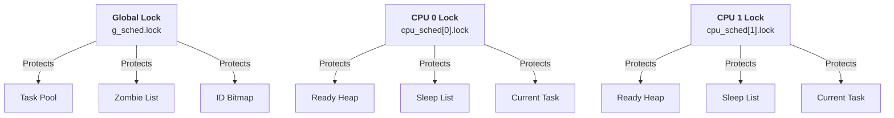

### Lock Ordering Rules

1.  **Never hold multiple CPU locks simultaneously** (prevents deadlock)
2.  **Global lock can be acquired while holding a CPU lock** (for zombie management)
3.  **Task-specific operations use the CPU lock of the task's affinity**

### Critical Sections

#### Task Creation
```c
// Acquire global lock for pool allocation
spin_lock(&g_sched.lock);
task = allocate_from_pool();
assign_cpu_affinity(task);
spin_unlock(&g_sched.lock);

// Acquire CPU lock for scheduling
cpu = task->cpu_id;
spin_lock(&cpu_sched[cpu].lock);
heap_insert(&cpu_sched[cpu], task);
spin_unlock(&cpu_sched[cpu].lock);
```

#### Task Notification (Cross-CPU)
```c
// Find task by ID (global)
target = find_task(task_id);

// Lock target's CPU, not caller's CPU
cpu = target->cpu_id;
spin_lock(&cpu_sched[cpu].lock);
target->notify_val |= value;
unblock_task(target);
spin_unlock(&cpu_sched[cpu].lock);
```

---

## Advanced Features

### Priority Inheritance

When a low-weight task holds a resource needed by a high-weight task, temporary weight boosting prevents priority inversion.

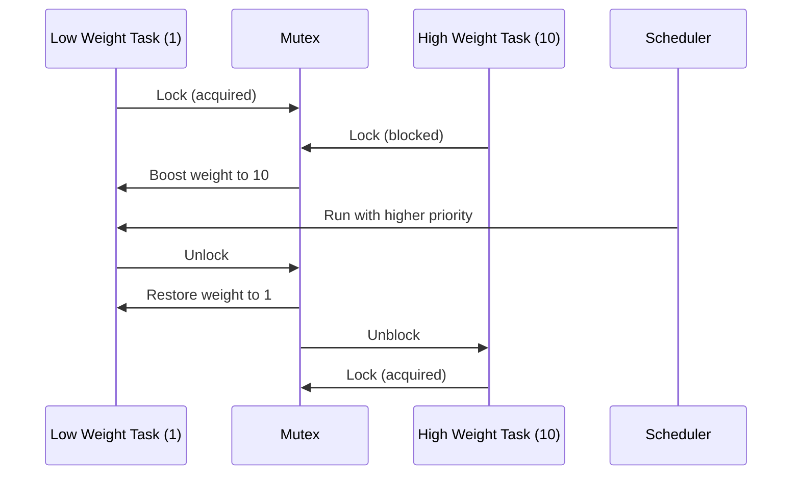

Implementation:
```c
void task_boost_weight(task_t *t, uint8_t weight) {
    if (weight > t->weight) {
        t->weight = weight;  // Temporarily increase
    }
}

void task_restore_base_weight(task_t *t) {
    t->weight = t->base_weight;  // Restore original
}
```

### Vruntime Synchronization

When a task wakes from sleep, its `vruntime` may be far behind the current minimum. To prevent it from monopolizing the CPU, we synchronize:

$$
vruntime_{task} = \max(vruntime_{task}, vruntime_{min})
$$

```c
uint64_t min_v = get_min_vruntime();
if (task->vruntime < min_v) {
    task->vruntime = min_v;
}
```

### Load Balancing (Future Enhancement)

For true SMP efficiency, periodic load balancing can migrate tasks between CPUs:

$$
\text{Load}_{CPU_i} = \sum_{j \in \text{Ready}_{CPU_i}} w_j
$$

Migration threshold:
$$
|\text{Load}_{CPU_i} - \text{Load}_{CPU_k}| > \text{Threshold}
$$

---

## Performance Analysis

### Time Complexity Summary

| Operation | Complexity | Notes |
|:----------|:-----------|:------|
| Get next task | $O(1)$ | Root of heap |
| Insert task into ready queue | $O(\log N)$ | Heap insert |
| Remove task from ready queue | $O(\log N)$ | Heap remove |
| Update task vruntime | $O(1)$ | Simple arithmetic |
| Process sleep list | $O(K)$ | K = tasks to wake |
| Task creation | $O(\log N)$ | Pool alloc + heap insert |
| Task deletion | $O(\log N)$ | Heap remove + cleanup |
| Context switch | $O(\log N)$ | Remove old + insert new |

### Space Complexity

| Structure | Space | Notes |
|:----------|:------|:------|
| Task pool | $O(M)$ | M = MAX_TASKS (static) |
| Ready heap | $O(N)$ | N = ready tasks (pointers only) |
| Sleep list | $O(K)$ | K = sleeping tasks (pointers only) |
| Per-task overhead | $O(1)$ | Fixed size structure |
| Total dynamic overhead | $O(1)$ | No malloc during runtime |

### Fairness Guarantee

Over a scheduling period $P$, each task $i$ receives:

$$
\text{CPU Time}_i = P \times \frac{w_i}{\sum_{j=1}^{N} w_j} \pm \epsilon
$$

Where $\epsilon$ is bounded by the maximum time slice duration.

**Proof of Fairness:**
- Tasks are ordered by `vruntime`
- Lower `vruntime` → higher priority
- Running increases `vruntime` inversely proportional to weight
- Therefore, tasks converge to fair allocation over time

---

## Optimization Techniques

### 1. Cache Locality

**Array-based heap** instead of pointer-based tree:
- Sequential memory access patterns
- Better CPU cache utilization
- Prefetching advantages

### 2. Embedded Wait Nodes

**No dynamic allocation** during blocking:
- Predictable memory usage
- No allocation failures
- Faster blocking operations

### 3. Modular Arithmetic for Overflow

**Safe 64-bit comparison** without branches:
```c
#define VRUNTIME_LT(a, b) ((int64_t)((a) - (b)) < 0)
```

This handles wrap-around correctly without conditional logic.

### 4. Bitmap for ID Allocation

**O(1) ID lookup** using 64-bit bitmaps:
```c
#define BITMAP_IDX(id)  ((size_t)((id) - 1) / 64)
#define BITMAP_BIT(id)  ((size_t)((id) - 1) % 64)
```

### 5. Spinlock-Based Synchronization

**Lock-free where possible**, spin-locks otherwise:
- No priority inversion from sleeping locks
- Suitable for short critical sections
- SMP-safe with minimal overhead

---

## Configuration Parameters

Tunable parameters in `project_config.h`:

| Macro | Default | Description |
|:------|:--------|:------------|
| `MAX_CPUS` | 4 | Number of processor cores to support |
| `MAX_TASKS` | 32 | Maximum concurrent tasks (static pool size) |
| `SCHED_LATENCY_TICKS` | 100 | Scheduling period for time slice calculation |
| `MIN_TIME_SLICE` | 5 | Minimum time slice per task |
| `NICE_0_WEIGHT` | 1024 | Default weight for vruntime calculation |
| `GARBAGE_COLLECTION_TICKS` | 1000 | How often idle task cleans up zombies |
| `STACK_CANARY` | `0xDEADBEEF` | Marker for stack overflow detection |

### Tuning Guidelines

**For high-priority responsiveness:**
- Decrease `SCHED_LATENCY_TICKS` (more frequent preemption)
- Increase `MIN_TIME_SLICE` (prevent thrashing)

**For throughput:**
- Increase `SCHED_LATENCY_TICKS` (longer time slices)
- Decrease context switch frequency

**For many tasks:**
- Adjust time slice calculation to prevent starvation
- Consider dynamic `SCHED_LATENCY_TICKS` based on task count

---

## Example Scenarios

### Scenario 1: Three Tasks with Different Weights

**Setup:**
- Task A: weight = 4
- Task B: weight = 2  
- Task C: weight = 1

**Expected behavior over 700 ticks:**

| Task | Weight | Time Slice | CPU Share | Expected Ticks |
|:-----|:-------|:-----------|:----------|:---------------|
| A | 4 | 57 | 57.1% | 400 |
| B | 2 | 29 | 28.6% | 200 |
| C | 1 | 14 | 14.3% | 100 |

**Execution Timeline:**

```mermaid
gantt
    title Weighted Fair Scheduling - Task Execution Pattern
    dateFormat X
    axisFormat %L ticks
    
    section Round 1
    Task A (w=4, slice=57)  :a1, 0, 57
    Task B (w=2, slice=29)  :b1, 57, 29
    Task C (w=1, slice=14)  :c1, 86, 14
    
    section Round 2
    Task A (w=4, slice=57)  :a2, 100, 57
    Task B (w=2, slice=29)  :b2, 157, 29
    Task C (w=1, slice=14)  :c2, 186, 14
    
    section Round 3
    Task A (w=4, slice=57)  :a3, 200, 57
    Task B (w=2, slice=29)  :b3, 257, 29
    Task C (w=1, slice=14)  :c3, 286, 14
    
    section Round 4
    Task A (w=4, slice=57)  :a4, 300, 57
    Task B (w=2, slice=29)  :b4, 357, 29
    Task C (w=1, slice=14)  :c4, 386, 14
```

**Virtual Runtime Evolution:**

Each task's vruntime increases at different rates based on weight. The table shows vruntime after each scheduling period:

| Round | Task A vruntime | Task B vruntime | Task C vruntime | Next to Run |
|:------|:----------------|:----------------|:----------------|:------------|
| Start | 0 | 0 | 0 | A (ties → first) |
| After A runs 57 ticks | **14.25** | 0 | 0 | B (min) |
| After B runs 29 ticks | 14.25 | **14.50** | 0 | C (min) |
| After C runs 14 ticks | 14.25 | 14.50 | **14.00** | A (min) |
| After A runs 57 ticks | **28.50** | 14.50 | 14.00 | C (min) |
| After C runs 14 ticks | 28.50 | 14.50 | **28.00** | B (min) |

*Note: vruntime calculation: `Δvruntime = (physical_ticks × 1024) / weight`*

**Key Observations:**
1. Task A runs 4× more frequently than Task C (weight ratio 4:1)
2. Task B runs 2× more frequently than Task C (weight ratio 2:1)
3. All tasks' vruntimes remain close together (fairness)
4. No task ever starves despite different weights

### Scenario 2: Task Blocking and Wake-up with Vruntime Synchronization

**Problem:** When a task sleeps or blocks for a long time, its vruntime falls far behind. If not synchronized, it would monopolize the CPU upon waking.

**Setup:**
- Task A: Currently running, vruntime = 1000
- Task B: Blocked on mutex for a long time, old vruntime = 500
- System minimum vruntime: 1000 (from heap root)

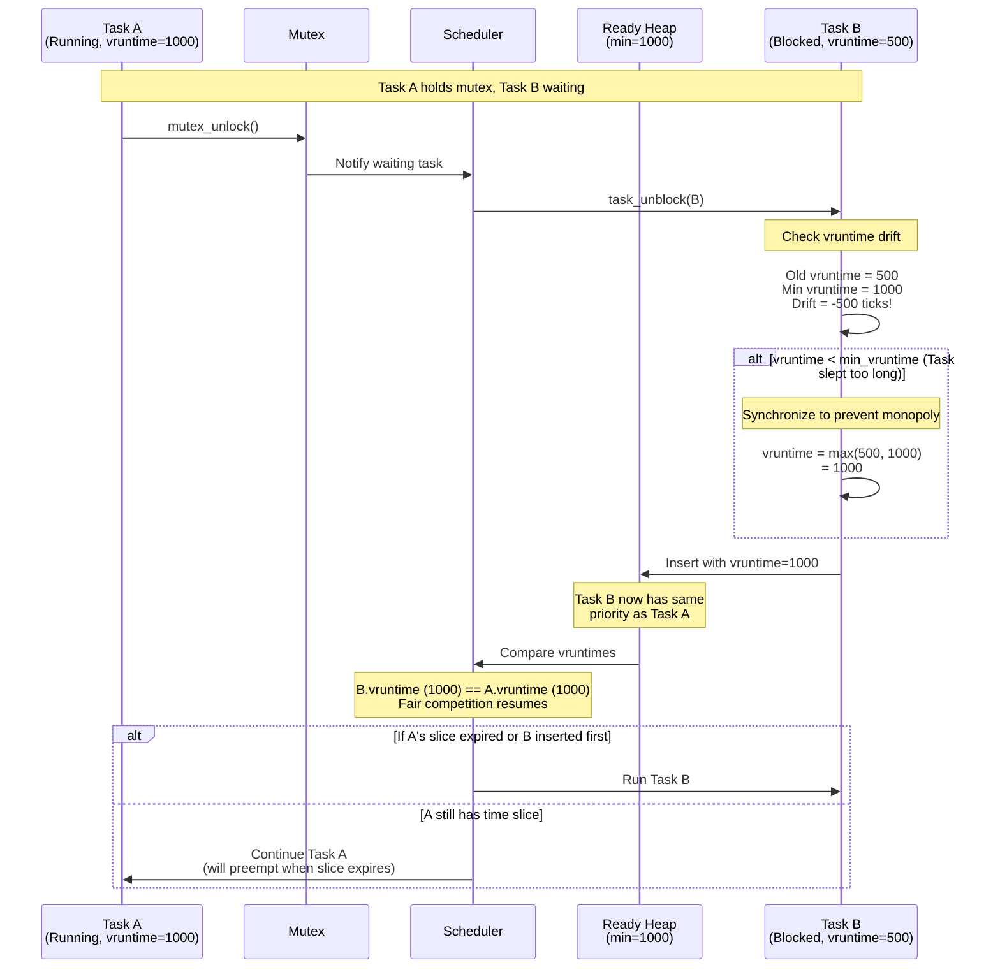

**Why Synchronization Matters:**

Without synchronization:
```
Task B vruntime: 500
Task A vruntime: 1000
→ Task B would run for (1000-500) = 500 ticks before Task A gets CPU!
→ Unfair monopoly by sleeping task
```

With synchronization:
```
Task B vruntime: 500 → synchronized to 1000
Task A vruntime: 1000
→ Both tasks compete fairly based on current weights
→ No monopoly, fair scheduling resumes
```

**Vruntime Synchronization Formula:**

$$
vruntime_{wake} = \max(vruntime_{task}, vruntime_{min})
$$

Where:
- $vruntime_{task}$ = Task's old vruntime (before blocking)
- $vruntime_{min}$ = Current minimum vruntime in system (heap root)

**Implementation:**
```c
void task_unblock(task_t *task) {
    // Get current minimum vruntime from heap
    uint64_t min_vruntime = get_min_vruntime();
    
    // Synchronize if task fell too far behind
    if (VRUNTIME_LT(task->vruntime, min_vruntime)) {
        task->vruntime = min_vruntime;
    }
    
    // Insert into ready heap
    heap_insert(task);
}
```

### Scenario 3: Priority Inversion Prevention

Priority inversion occurs when a high-weight task is blocked by a low-weight task holding a resource, while a medium-weight task preempts the low-weight task.

**Setup:**
- Low Task: weight = 1, holds mutex
- Medium Task: weight = 5
- High Task: weight = 10, needs mutex

**Without Priority Inheritance:**

```mermaid
gantt
    title Priority Inversion Problem (Without Inheritance)
    dateFormat X
    axisFormat %s ticks
    
    section Low Task (w=1)
    Acquires mutex          :milestone, m1, 0, 0
    Runs (holds lock)       :l1, 0, 50
    Preempted by Medium     :crit, 50, 1
    Blocked by Medium       :crit, 50, 200
    Runs again              :l2, 250, 50
    Releases mutex          :milestone, m2, 300, 0
    
    section Medium Task (w=5)
    Becomes ready           :milestone, m3, 50, 0
    Preempts Low            :active, 50, 200
    
    section High Task (w=10)
    Needs mutex             :milestone, m4, 100, 0
    Blocked waiting         :crit, 100, 200
    Acquires & runs         :done, 300, 100
```

**Total high-priority wait time: 200 ticks** (blocked by medium-priority task!)

**With Priority Inheritance:**

```mermaid
gantt
    title Priority Inheritance Solution
    dateFormat X
    axisFormat %s ticks
    
    section Low Task (w=1→10→1)
    Acquires mutex          :milestone, m1, 0, 0
    Runs (w=1)              :l1, 0, 50
    Weight boosted to 10    :milestone, m2, 50, 0
    Runs (boosted, w=10)    :done, 50, 100
    Releases mutex          :milestone, m3, 150, 0
    Weight restored to 1    :milestone, m4, 150, 0
    
    section Medium Task (w=5)
    Becomes ready           :milestone, m5, 50, 0
    Cannot preempt (Low boosted) :crit, 50, 100
    Runs after High done    :active, 250, 100
    
    section High Task (w=10)
    Needs mutex (boosts Low) :milestone, m6, 50, 0
    Blocked (short wait)    :crit, 50, 100
    Acquires & runs         :done, 150, 100
```

**Total high-priority wait time: 100 ticks** (only blocked by boosted low-priority task)

**Improvement: 50% reduction in blocking time!**

#### Implementation Details

```c
// When High Task blocks on mutex held by Low Task:
void mutex_block_with_inheritance(mutex_t *mutex, task_t *high_task) {
    task_t *lock_holder = mutex->owner;
    
    // Boost lock holder to blocker's weight
    if (high_task->weight > lock_holder->weight) {
        task_boost_weight(lock_holder, high_task->weight);
    }
    
    // Block the high priority task
    task_block(high_task);
}

// When Low Task releases mutex:
void mutex_unlock(mutex_t *mutex) {
    task_t *lock_holder = mutex->owner;
    
    // Restore original weight
    task_restore_base_weight(lock_holder);
    
    // Wake next waiter
    task_t *next = mutex->wait_list;
    if (next) {
        task_unblock(next);
    }
}
```

---

## Debugging and Profiling

### Stack Overflow Detection

Each task's stack is canary-protected:
```c
*((uint32_t*)task->stack_ptr) = STACK_CANARY;

void task_check_stack_overflow(void) {
    for (each task) {
        if (*((uint32_t*)task->stack_ptr) != STACK_CANARY) {
            panic("Stack overflow detected!");
        }
    }
}
```

### Runtime Statistics

Track per-task metrics:
```c
typedef struct {
    uint64_t total_cpu_ticks;    // Total CPU time consumed
    uint64_t last_switch_tick;   // Last context switch time
    uint64_t vruntime;           // Current virtual runtime
    uint32_t context_switches;   // Number of preemptions
} task_stats_t;
```

### Heap Validation

Verify heap integrity in debug builds:
```c
void validate_heap(scheduler_cpu_t *ctx) {
    for (int i = 0; i < ctx->heap_size; i++) {
        int parent = (i - 1) / 2;
        if (i > 0) {
            assert(ctx->ready_heap[parent]->vruntime <= 
                   ctx->ready_heap[i]->vruntime);
        }
    }
}
```

---

## Comparison with Other Schedulers

| Feature | soRTOS (CFS-based) | Traditional RTOS (Priority) | Linux CFS | FreeRTOS |
|:--------|:-------------------|:----------------------------|:----------|:---------|
| Fairness | ✓ Weighted fair | ✗ Strict priority | ✓ Weighted fair | ✗ Strict priority |
| Starvation Prevention | ✓ Guaranteed | ✗ Low priority starves | ✓ Guaranteed | ✗ Low priority starves |
| Time Complexity | O(log N) | O(1) or O(N) | O(log N) | O(N) |
| SMP Support | ✓ Per-CPU queues | Limited | ✓ Advanced | Limited |
| Real-time Guarantees | ✓ Bounded latency | ✓ Hard real-time | ✗ Soft real-time | ✓ Hard real-time |
| Memory Overhead | O(1) dynamic | O(1) | O(N) dynamic | O(1) |
| Priority Inheritance | ✓ Weight boosting | ✓ Priority boosting | ✓ | ✓ |

---

## Future Enhancements

1.  **Multi-core Load Balancing**
    - Periodic migration of tasks between CPUs
    - Steal tasks from overloaded CPUs

2.  **Deadline Scheduling (EDF)**
    - Add deadline field to tasks
    - Implement Earliest Deadline First alongside CFS

3.  **CPU Affinity Control**
    - Allow pinning tasks to specific CPUs
    - Soft affinity for cache optimization

4.  **Group Scheduling**
    - Hierarchical fairness across task groups
    - Container/process-level fairness

5.  **Energy-Aware Scheduling**
    - Prefer running tasks on already-active cores
    - Support CPU frequency scaling

---

## References

- Molnar, I. (2007). "CFS Scheduler Design." Linux Kernel Documentation.
- Love, R. (2010). "Linux Kernel Development" (3rd Edition). Addison-Wesley.
- Corbet, J., Rubini, A., Kroah-Hartman, G. (2005). "Linux Device Drivers" (3rd Edition). O'Reilly.
- Liu, C. L., & Layland, J. W. (1973). "Scheduling algorithms for multiprogramming in a hard-real-time environment." *Journal of the ACM*, 20(1), 46-61.

---

## Appendix: Code Snippets

### Calculating Time Slice
```c
uint32_t calculate_time_slice(task_t *task, uint32_t total_weight) {
    if (total_weight == 0) {
        return MIN_TIME_SLICE;
    }
    
    uint32_t slice = (SCHED_LATENCY_TICKS * task->weight) / total_weight;
    
    if (slice < MIN_TIME_SLICE) {
        slice = MIN_TIME_SLICE;
    }
    
    return slice;
}
```

### Updating Virtual Runtime
```c
void update_vruntime(task_t *task, uint32_t ticks_consumed) {
    uint64_t delta = (ticks_consumed * NICE_0_WEIGHT) / task->weight;
    task->vruntime += delta;
    task->total_cpu_ticks += ticks_consumed;
}
```

### Preemption Check
```c
int should_preempt(scheduler_cpu_t *ctx) {
    if (ctx->heap_size == 0) {
        return 0;  // No other tasks
    }
    
    if (ctx->curr->is_idle) {
        return 1;  // Always preempt idle
    }
    
    uint64_t min_vruntime = ctx->ready_heap[0]->vruntime;
    return VRUNTIME_LT(min_vruntime, ctx->curr->vruntime);
}
```