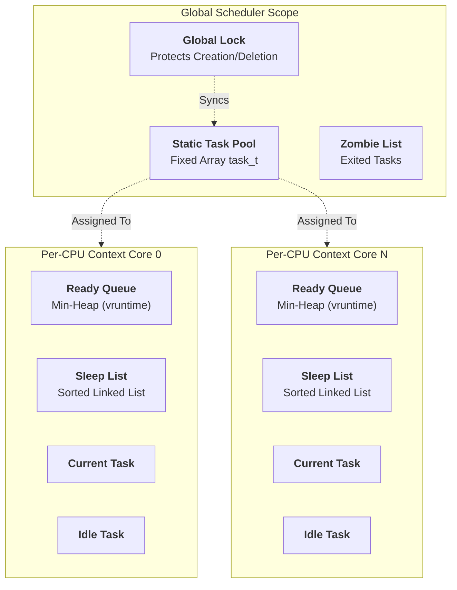
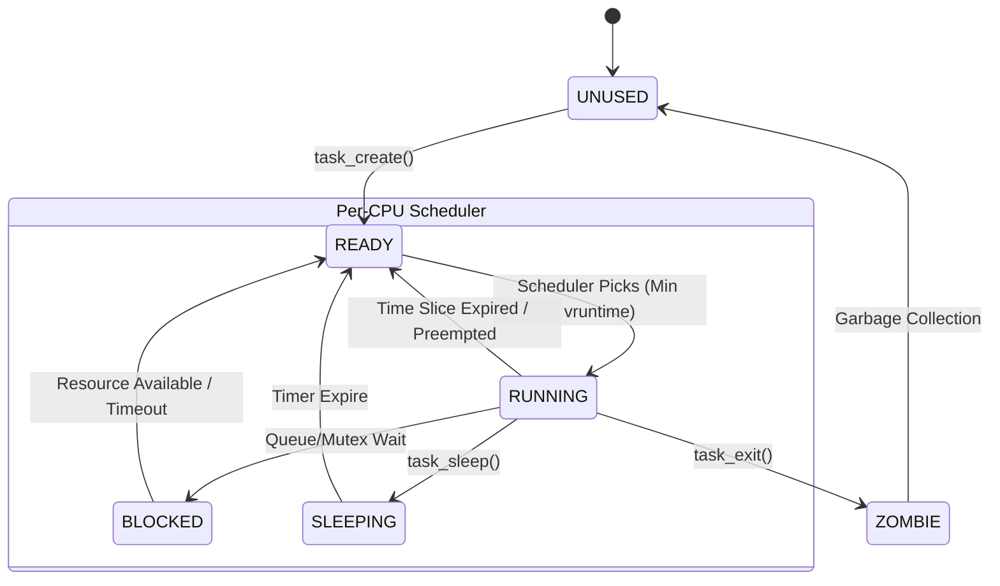

# Scheduler Architecture

## Overview
The soRTOS scheduler is a **preemptive, weighted fair scheduler** designed for **Symmetric Multi-Processing (SMP)**. It implements a variant of **Completely Fair Scheduling (CFS)**, similar to the Linux kernel, ensuring that all ready tasks receive a CPU share proportional to their weight.

### Key features:
*   **Time Complexity:** $O(\log N)$ for task insertion/selection (Min-Heap).
*   **Space Complexity:** $O(1)$ dynamic overhead (uses static/embedded nodes).
*   **Fairness:** Uses virtual runtime (`vruntime`) to prevent starvation.

## Architecture

## Scheduling Algorithm
The scheduler uses **Weighted Fair Queueing** to determine execution order:

1.  **Virtual Runtime (`vruntime`):** Each task maintains a counter called `vruntime` that represents how much CPU time it has consumed, scaled by its weight.
2.  **Selection Rule:** The scheduler always selects the task with the **lowest `vruntime`** from the local Min-Heap.
3.  **Time Slicing:** A hardware tick decrements the running task's slice.
4.  **Slice Expiry:** If the slice reaches 0, `vruntime` is updated, and the task is re-inserted into the Heap.
5.  **Preemption:** If a waking task has a lower `vruntime` than the current task, a context switch occurs immediately.

## Data Structures

### The Ready Queue (Min-Heap)
Tasks are stored in a binary **Min-Heap** structure.
*   **Lookup:** O(1) - The best task is always at the root.
*   **Insert/Remove:** O(log N).
*   **Optimization:** Uses an array-flattened tree for cache locality.

### Zero-Malloc Blocking (The Wait Node)
To ensure deterministic behavior, the kernel **never calls malloc** when a task blocks.
*   **Mechanism:** Every `task_t` contains a pre-allocated `wait_node_t` structure.
*   **Usage:** When a task blocks on a Mutex or Queue, its embedded node is linked directly into the resource's wait list.
*   **Benefit:** Blocking is always $O(1)$ memory overhead and cannot fail due to OOM (Out of Memory).

## Task Lifecycle

## Configuration
Tunable parameters in `project_config.h`:

| Macro | Description |
| :--- | :--- |
| `MAX_CPUS` | Number of processor cores to support. |
| `MAX_TASKS` | Maximum number of concurrent tasks (size of static pool). |
| `GARBAGE_COLLECTION_TICKS` | How often the Idle task cleans up Zombies. |
| `STACK_CANARY` | `0xDEADBEEF` marker for overflow detection. |